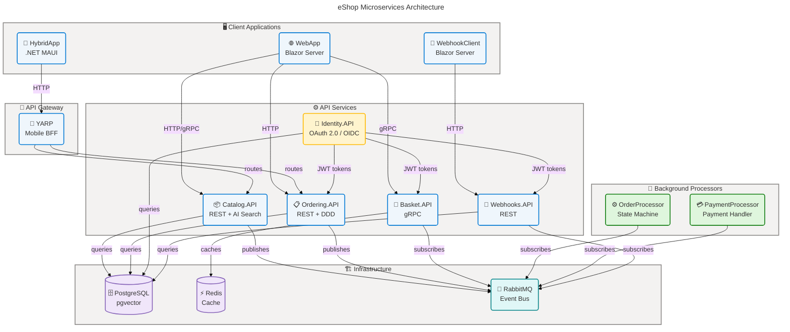

# eShop


A reference .NET application implementing an **e-commerce platform** using a cloud-native **microservices architecture**, built with **.NET 10** and orchestrated by **.NET Aspire**.

> [!NOTE]
> This project serves as a canonical example of building modern distributed systems with .NET, showcasing industry best practices for microservices, Domain-Driven Design, event-driven communication, and AI-powered features.

## Overview

**Overview**

eShop demonstrates how to architect and build a production-grade e-commerce application composed of multiple interdependent microservices. The platform enables product catalog browsing with AI-powered search, shopping cart management, complex order workflows, OAuth 2.0 authentication, webhook integrations, and cross-platform mobile support — all orchestrated through .NET Aspire for seamless local development and cloud deployment.

The application uses an **event-driven architecture** where services communicate asynchronously through **RabbitMQ integration events**, ensuring loose coupling and independent scalability. Each microservice owns its data store (PostgreSQL databases), follows **Domain-Driven Design** principles where appropriate, and exposes well-defined API contracts through HTTP REST or gRPC protocols.

## 📑 Table of Contents

- [Architecture](#architecture)
- [Features](#features)
- [Prerequisites](#prerequisites)
- [Quick Start](#quick-start)
- [Deployment](#deployment)
- [Usage](#usage)
- [Configuration](#configuration)
- [Project Structure](#project-structure)
- [Testing](#testing)
- [Contributing](#contributing)
- [License](#license)

## Architecture

**Overview**

The system follows a microservices architecture orchestrated by .NET Aspire, with services communicating through RabbitMQ integration events and exposing APIs via HTTP REST and gRPC. Each service owns its dedicated PostgreSQL database, and a **YARP reverse proxy** provides a **unified API gateway** for mobile clients.

The architecture separates concerns into distinct layers: client applications (Blazor web, .NET MAUI mobile), API services (Catalog, Basket, Ordering, Identity, Webhooks), background processors (OrderProcessor, PaymentProcessor), shared infrastructure (EventBus, ServiceDefaults), and backing services (PostgreSQL, Redis, RabbitMQ).



**Component Roles:**

| Component               | Role                                                        | Protocol      |
| ----------------------- | ----------------------------------------------------------- | ------------- |
| 🌐 **WebApp**           | Primary e-commerce storefront for browsers                  | Blazor Server |
| 📱 **HybridApp**        | Cross-platform mobile client (Android, iOS, macOS, Windows) | .NET MAUI     |
| 🔌 **YARP**             | Reverse proxy / mobile BFF aggregating API calls            | HTTP          |
| 🔐 **Identity.API**     | OAuth 2.0 / OpenID Connect provider with user management    | HTTP          |
| 📦 **Catalog.API**      | Product catalog with AI-powered vector search               | HTTP REST     |
| 🛒 **Basket.API**       | Shopping cart management with Redis-backed caching          | gRPC          |
| 📋 **Ordering.API**     | Order lifecycle management with DDD and state machine       | HTTP REST     |
| 🔗 **Webhooks.API**     | Webhook registration and delivery for external integrations | HTTP REST     |
| ⚙️ **OrderProcessor**   | Background orchestrator for order state transitions         | Event-driven  |
| 💳 **PaymentProcessor** | Background service for payment processing                   | Event-driven  |
| 🗄️ **PostgreSQL**       | Relational data store with pgvector for AI embeddings       | TCP           |
| ⚡ **Redis**            | In-memory cache for basket data                             | TCP           |
| 📨 **RabbitMQ**         | Message broker for asynchronous integration events          | AMQP          |

## Features

**Overview**

eShop provides a comprehensive set of e-commerce capabilities distributed across specialized microservices. Each service is **independently deployable**, owns its data, and communicates through well-defined contracts — enabling teams to develop, test, and scale services independently.

The platform combines traditional CRUD operations with advanced patterns including **Domain-Driven Design**, **CQRS** via MediatR, event sourcing through the **outbox pattern**, and **AI-powered product search** using vector embeddings — demonstrating how modern .NET applications can leverage cutting-edge technologies while maintaining clean architecture.

| Feature                     | Description                                                       | Service          | Status    |
| --------------------------- | ----------------------------------------------------------------- | ---------------- | --------- |
| 🛍️ Product Catalog          | Browse, search, and filter products by category and brand         | Catalog.API      | ✅ Stable |
| 🤖 AI-Powered Search        | Semantic product search using vector embeddings (pgvector)        | Catalog.API      | ✅ Stable |
| 🛒 Shopping Cart            | Add, update, and remove items with Redis-backed persistence       | Basket.API       | ✅ Stable |
| 📋 Order Management         | Full order lifecycle with DDD aggregates and state machine        | Ordering.API     | ✅ Stable |
| 🔐 Authentication           | OAuth 2.0 / OpenID Connect with multi-client support              | Identity.API     | ✅ Stable |
| 🔗 Webhooks                 | Register endpoints and receive order/product change notifications | Webhooks.API     | ✅ Stable |
| 💳 Payment Processing       | Configurable payment handler with success/failure event flows     | PaymentProcessor | ✅ Stable |
| 📨 Event-Driven Integration | Asynchronous service communication via RabbitMQ                   | EventBus         | ✅ Stable |
| 🌐 Blazor Web UI            | Responsive server-rendered e-commerce storefront                  | WebApp           | ✅ Stable |
| 📱 Cross-Platform Mobile    | Native mobile app for Android, iOS, macOS, and Windows            | HybridApp        | ✅ Stable |
| 📊 Distributed Tracing      | End-to-end observability with OpenTelemetry instrumentation       | ServiceDefaults  | ✅ Stable |
| 🔀 API Gateway              | YARP reverse proxy providing unified mobile BFF endpoint          | Mobile BFF       | ✅ Stable |

## Prerequisites

**Overview**

Running eShop requires the **.NET 10 SDK**, a **container runtime** for infrastructure services, and **.NET Aspire workload** for orchestration. The application uses .NET Aspire to automatically provision and configure PostgreSQL, Redis, and RabbitMQ containers — **no manual infrastructure setup is needed** for local development.

All infrastructure dependencies (databases, cache, message broker) are managed by .NET Aspire through container orchestration, so you only need **Docker Desktop** (or a compatible container runtime) installed and running before launching the application.

| Prerequisite             | Version                         | Purpose                                          |
| ------------------------ | ------------------------------- | ------------------------------------------------ |
| 🛠️ .NET SDK              | `10.0.100` or later             | Build and run .NET projects                      |
| 🐳 Docker Desktop        | Latest stable                   | Container runtime for infrastructure services    |
| ☁️ .NET Aspire Workload  | `13.1.2` or later               | Orchestrate distributed services                 |
| 💻 Visual Studio 2022    | `17.12+` (optional)             | IDE with Aspire tooling support                  |
| 💻 VS Code               | Latest (optional)               | Lightweight editor with C# Dev Kit               |
| 🔒 Duende IdentityServer | License required for production | OAuth 2.0 / OIDC provider (dev license included) |

> [!WARNING]
> Duende IdentityServer requires a [commercial license](https://duendesoftware.com/products/identityserver) for production use. A development and testing license is included in this project.

## Quick Start

**1. Install the .NET Aspire workload**

```bash
dotnet workload install aspire
```

Expected output:

```text
Successfully installed workload(s) aspire.
```

**2. Clone the repository**

```bash
git clone https://github.com/Evilazaro/eShop.git
cd eShop
```

**3. Ensure Docker Desktop is running**

Verify Docker is available:

```bash
docker info
```

Expected output:

```text
Client: Docker Engine - Community
 Version: ...
Server: Docker Engine - Community
 ...
```

**4. Run the application**

```bash
dotnet run --project src/eShop.AppHost
```

Expected output:

```text
Building...
info: Aspire.Hosting.DistributedApplication[0]
      Aspire version: 13.1.2
info: Aspire.Hosting.DistributedApplication[0]
      Distributed application starting.
info: Aspire.Hosting.DistributedApplication[0]
      Now listening on: https://localhost:17225
info: Aspire.Hosting.DistributedApplication[0]
      Login to the dashboard at: https://localhost:17225/login?t=<token>
```

**5. Access the application**

| Endpoint            | URL                       | Description                      |
| ------------------- | ------------------------- | -------------------------------- |
| 🖥️ Aspire Dashboard | `https://localhost:17225` | Service orchestration dashboard  |
| 🌐 Web Store        | `https://localhost:7298`  | Main e-commerce storefront       |
| 🔐 Identity Server  | `https://localhost:5001`  | OAuth 2.0 login and registration |

> [!TIP]
> The Aspire Dashboard provides a centralized view of all running services, their health status, logs, traces, and metrics. Open it first to verify all services are healthy before browsing the store.

## Deployment

**Overview**

eShop is designed for **containerized deployment** and can be published to any container-compatible environment. The application supports **Azure Container Apps** through .NET Aspire deployment tooling, **Azure Container Registry** for image hosting, and **Azure Pipelines** for CI/CD automation.

For production deployment, each microservice runs as an **independent container** with its own scaling configuration, **health checks**, and environment-specific settings injected through the Aspire orchestrator or container platform.

**1. Build the solution**

```bash
dotnet build eShop.Web.slnf
```

Expected output:

```text
Build succeeded.
    0 Warning(s)
    0 Error(s)
```

**2. Run tests**

```bash
dotnet test
```

Expected output:

```text
Passed!  - Failed: 0, Passed: X, Skipped: 0, Total: X
```

**3. Build container images for Azure Container Registry**

```powershell
./build/acr-build/queue-all.ps1
```

**4. Create multi-architecture manifests**

```powershell
./build/multiarch-manifests/create-manifests.ps1
```

**5. CI/CD Pipeline**

The project includes an Azure Pipelines configuration in `ci.yml` that triggers on the `main` branch:

```yaml
trigger:
  branches:
    include:
      - main
```

The pipeline uses the .NET SDK version specified in `global.json`, builds the `eShop.Web.slnf` solution filter, and runs all tests automatically.

## Usage

**Overview**

The eShop platform exposes multiple API endpoints through its microservices, each documented via OpenAPI (Scalar UI). The web storefront provides a complete shopping experience including product browsing, cart management, checkout, and order tracking — all backed by the microservice APIs.

Each API service exposes a **Scalar documentation UI** at its root endpoint for interactive exploration.

**Browse the Product Catalog**

```bash
curl https://localhost:5301/api/v1/catalog/items?pageSize=10&pageIndex=0
```

Expected output:

```json
{
  "pageIndex": 0,
  "pageSize": 10,
  "count": 101,
  "data": [
    {
      "id": 1,
      "name": ".NET Bot Black Hoodie",
      "price": 19.5,
      "catalogBrand": "Other",
      "catalogType": "T-Shirt"
    }
  ]
}
```

**Add an item to the basket (gRPC)**

The Basket service uses gRPC. Interact through the WebApp UI or programmatically using a gRPC client with the protobuf contract defined in `src/Basket.API/Proto/basket.proto`.

**Create an order**

```bash
curl -X POST https://localhost:5102/api/v1/orders \
  -H "Authorization: Bearer <token>" \
  -H "Content-Type: application/json" \
  -d '{
    "city": "Redmond",
    "street": "One Microsoft Way",
    "state": "WA",
    "country": "US",
    "zipCode": "98052",
    "cardNumber": "4111111111111111",
    "cardHolderName": "Test User",
    "cardExpiration": "2027-12-31T00:00:00Z",
    "cardSecurityNumber": "123",
    "cardTypeId": 1
  }'
```

**Order State Machine**

Orders follow a **defined lifecycle** managed by the OrderProcessor:

```text
Submitted → AwaitingValidation → StockConfirmed → Paid → Shipped
                ↘ StockRejected → Cancelled
                ↘ PaymentFailed → Cancelled
```

**Register a webhook**

```bash
curl -X POST https://localhost:5103/api/v1/webhooks \
  -H "Authorization: Bearer <token>" \
  -H "Content-Type: application/json" \
  -d '{
    "url": "https://your-endpoint.com/webhook",
    "token": "your-secret-token",
    "type": "OrderStatus"
  }'
```

## Configuration

**Overview**

eShop uses a **layered configuration model** where .NET Aspire automatically injects connection strings, service endpoints, and **environment variables** into each microservice at startup. For local development, all infrastructure is auto-provisioned — **no manual configuration is needed** beyond optional AI integration settings.

In production environments, configuration flows through environment variables set by the container orchestrator, with sensitive values managed through **secrets providers**. Each service's `appsettings.json` provides sensible defaults that are overridden by environment-specific settings.

| Setting                            | Scope        | Description                                     | Default                        |
| ---------------------------------- | ------------ | ----------------------------------------------- | ------------------------------ |
| ⚙️ `ConnectionStrings__catalogdb`  | Catalog.API  | PostgreSQL connection for product catalog       | Auto-injected by Aspire        |
| ⚙️ `ConnectionStrings__identitydb` | Identity.API | PostgreSQL connection for user data             | Auto-injected by Aspire        |
| ⚙️ `ConnectionStrings__orderingdb` | Ordering.API | PostgreSQL connection for orders                | Auto-injected by Aspire        |
| ⚙️ `ConnectionStrings__webhooksdb` | Webhooks.API | PostgreSQL connection for webhook registrations | Auto-injected by Aspire        |
| ⚙️ `ConnectionStrings__redis`      | Basket.API   | Redis connection for cart caching               | Auto-injected by Aspire        |
| ⚙️ `ConnectionStrings__eventbus`   | All services | RabbitMQ connection for integration events      | Auto-injected by Aspire        |
| 🔒 `Identity__Url`                 | API services | Identity server base URL for JWT validation     | Auto-injected by Aspire        |
| 🔒 `Identity__Audience`            | API services | OAuth audience identifier per service           | `basket`, `orders`, `webhooks` |
| 🤖 `useOpenAI`                     | AppHost      | Enable Azure OpenAI for AI search features      | `false`                        |
| 🤖 `useOllama`                     | AppHost      | Enable local Ollama LLM for AI search           | `false`                        |

**Enabling AI-Powered Search**

To enable AI-powered semantic search in the product catalog, modify `src/eShop.AppHost/Program.cs`:

```csharp
// Set to true to enable OpenAI integration
bool useOpenAI = true;

// Or use local Ollama instead
bool useOllama = true;
```

> [!NOTE]
> Azure OpenAI requires a valid Azure subscription and API key. Ollama runs locally and does not require cloud credentials. Only enable one AI provider at a time.

**Service Health Checks**

All services expose a health check endpoint:

```bash
curl https://localhost:5102/health
```

Expected output:

```text
Healthy
```

## Project Structure

```text
eShop/
├── src/
│   ├── eShop.AppHost/              # .NET Aspire orchestrator
│   ├── eShop.ServiceDefaults/      # Shared service configuration
│   ├── Basket.API/                 # Shopping cart service (gRPC)
│   ├── Catalog.API/                # Product catalog service (REST)
│   ├── Identity.API/               # OAuth 2.0 / OIDC provider
│   ├── Ordering.API/               # Order management service (REST + DDD)
│   ├── Ordering.Domain/            # Domain model (aggregates, events)
│   ├── Ordering.Infrastructure/    # EF Core repositories
│   ├── OrderProcessor/             # Order orchestration (background)
│   ├── PaymentProcessor/           # Payment handling (background)
│   ├── Webhooks.API/               # Webhook delivery service
│   ├── WebApp/                     # Blazor Server storefront
│   ├── WebAppComponents/           # Shared Razor component library
│   ├── HybridApp/                  # .NET MAUI mobile app
│   ├── ClientApp/                  # Legacy MAUI client
│   ├── WebhookClient/              # Webhook receiver client
│   ├── EventBus/                   # Event bus abstraction
│   ├── EventBusRabbitMQ/           # RabbitMQ implementation
│   ├── IntegrationEventLogEF/      # Outbox pattern for events
│   └── Shared/                     # Cross-cutting utilities
├── tests/
│   ├── Basket.UnitTests/           # Basket service unit tests
│   ├── Ordering.UnitTests/         # Ordering domain unit tests
│   ├── Ordering.FunctionalTests/   # Ordering integration tests
│   ├── Catalog.FunctionalTests/    # Catalog integration tests
│   ├── ClientApp.UnitTests/        # MAUI client tests
│   └── WebApp.EmailValidation.UnitTests/
├── e2e/                            # Playwright browser tests
├── build/                          # Container build scripts
├── Directory.Build.props           # Global MSBuild properties
├── Directory.Packages.props        # Centralized NuGet versions
└── global.json                     # .NET SDK version pinning
```

## Testing

The project includes unit tests, functional (integration) tests, and end-to-end browser tests:

```bash
# Run all tests
dotnet test

# Run specific test project
dotnet test tests/Ordering.UnitTests

# Run end-to-end tests with Playwright
npx playwright test
```

| Test Suite                          | Type        | Framework  | Scope                                                |
| ----------------------------------- | ----------- | ---------- | ---------------------------------------------------- |
| 🧪 Basket.UnitTests                 | Unit        | MSTest     | Basket service logic and gRPC behavior               |
| 🧪 Ordering.UnitTests               | Unit        | MSTest     | Domain aggregates, state machine, and business rules |
| 🧪 ClientApp.UnitTests              | Unit        | MSTest     | MAUI client view model logic                         |
| 🧪 WebApp.EmailValidation.UnitTests | Unit        | MSTest     | Email validation rules                               |
| 🔗 Catalog.FunctionalTests          | Integration | MSTest     | Catalog API endpoints with database                  |
| 🔗 Ordering.FunctionalTests         | Integration | MSTest     | Order flow with service integration                  |
| 🌐 e2e/                             | End-to-End  | Playwright | Browser automation for shopping workflows            |

## Contributing

**Overview**

Contributions to eShop are welcome and encouraged. The project follows established .NET best practices and values architectural integrity, performance, and reliability. Whether you are fixing a typo, improving documentation, or proposing an architectural enhancement, all contributions help make this reference application better.

Before contributing, review the project's guiding principles: best practices alignment, selectivity in tools and libraries, architectural integrity, and measurable improvements for reliability and performance enhancements.

1. Fork the repository
2. Create a feature branch (`git checkout -b feature/your-feature`)
3. Make your changes following the project's coding standards
4. Add or update tests for your changes
5. Submit a Pull Request

> [!TIP]
> Look for issues tagged `"help wanted"` or `"good first issue"` to get started. For typos and small fixes, no separate issue is needed — open a Pull Request directly.

See [CONTRIBUTING.md](CONTRIBUTING.md) for detailed guidelines and [CODE-OF-CONDUCT.md](CODE-OF-CONDUCT.md) for community standards.

## License

This project is licensed under the **MIT License** — see the [LICENSE](LICENSE) file for details.

Copyright (c) .NET Foundation and Contributors.
