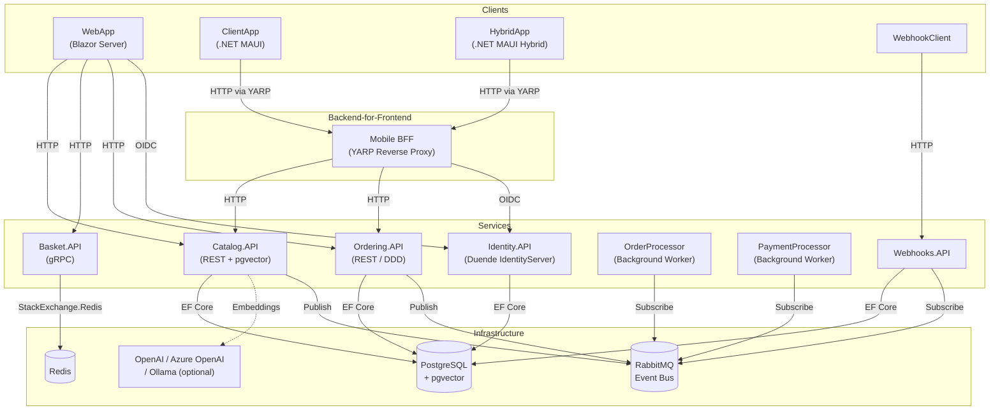

# eShop — Cloud-Native Microservices Reference Application

[](https://github.com/Evilazaro/eShop/actions)
[](./LICENSE)
[](https://dotnet.microsoft.com/download/dotnet/10.0)
[](https://learn.microsoft.com/en-us/dotnet/aspire/)
[](https://azure.microsoft.com/products/container-apps/)

**eShop** is a production-quality reference implementation of a cloud-native, microservices-based e-commerce platform built on **.NET 10** and **.NET Aspire**. It demonstrates best practices for building distributed systems, including service discovery, resilience, observability, and AI-powered features, all orchestrated locally and deployed to Azure Container Apps.

The application covers the full e-commerce lifecycle — browsing products, managing a shopping basket, placing orders, processing payments, and sending webhook notifications — while showcasing advanced patterns such as **Domain-Driven Design (DDD)**, **Event-Driven Architecture**, **CQRS**, and **OpenID Connect-based authentication** with Duende IdentityServer.

Beyond a traditional web storefront, eShop includes a **.NET MAUI** cross-platform mobile client and a **.NET MAUI Hybrid** app that share components with the Blazor web frontend. Optional AI integrations with **OpenAI**, **Azure OpenAI**, and **Ollama** enable semantic product search and catalog chat.

---

## Table of Contents

- [Features](#features)
- [Architecture](#architecture)
- [Technologies Used](#technologies-used)
- [Quick Start](#quick-start)
- [Configuration](#configuration)
- [Deployment](#deployment)
- [Usage](#usage)
- [Contributing](#contributing)
- [License](#license)

---

## Features

- 🛍️ **Full E-Commerce Storefront** — Browse catalog, manage basket, and place orders via a Blazor Server web application
- 📱 **Cross-Platform Mobile App** — .NET MAUI client (`ClientApp`) and .NET MAUI Hybrid app (`HybridApp`) sharing UI components
- 🔐 **Centralized Identity & Authentication** — Duende IdentityServer with OpenID Connect and JWT Bearer tokens across all APIs
- 🛒 **Distributed Basket** — gRPC-based basket service backed by Redis for fast session storage
- 📦 **Product Catalog with AI Search** — pgvector-powered semantic similarity search; optional chat interface via GPT-4.1-mini
- 📋 **Order Management (DDD)** — Orders domain modeled as a rich aggregate root; background processor for order fulfillment
- 💳 **Payment Processing** — Decoupled payment processor subscribing to order events via RabbitMQ
- 🔔 **Webhook Notifications** — Webhooks API and a sample webhook client for real-time order-status events
- 📡 **Event-Driven Architecture** — Reliable async communication between services using RabbitMQ and a reusable `EventBus` abstraction
- 🔭 **Built-in Observability** — Distributed tracing, metrics, and logging with OpenTelemetry (OTLP exporter)
- ☁️ **One-Command Cloud Deployment** — Deploy to Azure Container Apps with `azd up`
- 🤖 **Optional AI Integration** — Plug in OpenAI, Azure OpenAI, or Ollama for product embeddings and chat

---

## Architecture

The application is composed of loosely coupled microservices orchestrated by **.NET Aspire**. Each service owns its data store, and inter-service communication follows either synchronous HTTP/gRPC or asynchronous event bus patterns.



### Design Patterns

| Pattern                        | Where Applied                                   |
| ------------------------------ | ----------------------------------------------- |
| Domain-Driven Design (DDD)     | `Ordering.Domain`, `Ordering.API`               |
| Aggregate Root                 | `Order`, `Buyer` aggregates                     |
| Integration Events / Event Bus | `EventBus`, `EventBusRabbitMQ`, all services    |
| Repository Pattern             | `Basket.API` (Redis), `Ordering.Infrastructure` |
| CQRS (lightweight)             | `Ordering.API` command/query separation         |
| Backend-for-Frontend (BFF)     | YARP reverse proxy for mobile clients           |
| Shared Kernel                  | `eShop.ServiceDefaults`, `Shared`               |

---

## Technologies Used

| Category               | Technology                                            |
| ---------------------- | ----------------------------------------------------- |
| Runtime                | .NET 10, ASP.NET Core 10                              |
| Orchestration          | .NET Aspire 13.x                                      |
| Frontend               | Blazor Server, Razor Components                       |
| Mobile                 | .NET MAUI, .NET MAUI Hybrid                           |
| API                    | Minimal APIs, gRPC, REST, API Versioning              |
| Identity               | Duende IdentityServer 7.x, OpenID Connect, JWT        |
| Database               | PostgreSQL 16 + pgvector, Entity Framework Core 10    |
| Cache                  | Redis (StackExchange.Redis)                           |
| Messaging              | RabbitMQ, custom `EventBus` abstraction               |
| Reverse Proxy          | YARP (Yet Another Reverse Proxy)                      |
| Observability          | OpenTelemetry (traces, metrics, logs), OTLP           |
| AI (optional)          | Azure OpenAI, OpenAI API, Ollama, pgvector embeddings |
| Testing                | MSTest 4.x, NSubstitute, Playwright (E2E)             |
| Deployment             | Azure Container Apps, Azure Developer CLI (`azd`)     |
| Infrastructure as Code | Bicep                                                 |
| Containers             | Docker, Azure Container Registry                      |

---

## Quick Start

### Prerequisites

| Requirement                                                                                        | Minimum Version        |
| -------------------------------------------------------------------------------------------------- | ---------------------- |
| [.NET SDK](https://dotnet.microsoft.com/download/dotnet/10.0)                                      | 10.0.100               |
| [Docker Desktop](https://www.docker.com/products/docker-desktop/)                                  | 4.x (Linux containers) |
| [.NET Aspire workload](https://learn.microsoft.com/en-us/dotnet/aspire/fundamentals/setup-tooling) | 13.x                   |

> [!NOTE]
> Docker Desktop must be running before you start the application. All infrastructure dependencies (PostgreSQL, Redis, RabbitMQ) are provisioned as containers automatically by .NET Aspire.

> [!TIP]
> Install the .NET Aspire workload with:
>
> ```bash
> dotnet workload update
> dotnet workload install aspire
> ```

### Clone the Repository

```bash
git clone https://github.com/Evilazaro/eShop.git
cd eShop
```

### Run Locally

```bash
dotnet run --project src/eShop.AppHost/eShop.AppHost.csproj
```

The .NET Aspire dashboard opens automatically at `https://localhost:15888`. All services, databases, and the message broker start in the correct order. Use the dashboard to inspect resource health, structured logs, traces, and metrics.

> [!IMPORTANT]
> The first run downloads container images and restores NuGet packages. Allow a few minutes for all services to reach a healthy state.

**Access the storefront:**

| Application            | URL                                                  |
| ---------------------- | ---------------------------------------------------- |
| Aspire Dashboard       | `https://localhost:15888`                            |
| Online Store (WebApp)  | Shown in the Aspire dashboard under **webapp**       |
| Identity API           | Shown in the Aspire dashboard under **identity-api** |
| Catalog API (Swagger)  | `<catalog-api-url>/openapi/ui`                       |
| Ordering API (Swagger) | `<ordering-api-url>/openapi/ui`                      |

### Run Tests

**Unit tests:**

```bash
dotnet test tests/Basket.UnitTests
dotnet test tests/Ordering.UnitTests
dotnet test tests/ClientApp.UnitTests
```

**Functional tests:**

```bash
dotnet test tests/Catalog.FunctionalTests
dotnet test tests/Ordering.FunctionalTests
```

**End-to-end tests (Playwright):**

```bash
# Install Playwright browsers first
npx playwright install

# Run E2E tests (requires a running application)
npx playwright test
```

---

## Configuration

Configuration is managed through `appsettings.json` / `appsettings.Development.json` per service, and through environment variables injected by the .NET Aspire host.

### Key Environment Variables

| Variable                        | Service                                | Description                       | Default       |
| ------------------------------- | -------------------------------------- | --------------------------------- | ------------- |
| `Identity__Url`                 | Basket.API, Ordering.API, Webhooks.API | URL of the Identity API           | Set by Aspire |
| `IdentityUrl`                   | WebApp, WebhookClient                  | URL of the Identity API           | Set by Aspire |
| `ConnectionStrings__catalogdb`  | Catalog.API                            | PostgreSQL connection string      | Set by Aspire |
| `ConnectionStrings__orderingdb` | Ordering.API                           | PostgreSQL connection string      | Set by Aspire |
| `ConnectionStrings__redis`      | Basket.API                             | Redis connection string           | Set by Aspire |
| `ESHOP_USE_HTTP_ENDPOINTS`      | AppHost                                | Force HTTP endpoints (CI/testing) | `0`           |

> [!NOTE]
> When running locally with .NET Aspire, all connection strings and service URLs are injected automatically via the Aspire hosting model. Manual configuration is only required for standalone deployments.

### Optional AI Configuration

AI features are disabled by default. To enable them, edit `src/eShop.AppHost/Program.cs`:

```csharp
// OpenAI (openai.com)
bool useOpenAI = true;
// or
// Ollama (local LLM)
bool useOllama = true;
```

| AI Provider                      | Setting in `Extensions.cs`                | Required Credentials            |
| -------------------------------- | ----------------------------------------- | ------------------------------- |
| OpenAI                           | `OpenAITarget.OpenAI`                     | `OpenAIKeyParameter` (API key)  |
| Azure OpenAI (managed identity)  | `OpenAITarget.AzureOpenAI`                | Azure subscription + deployment |
| Azure OpenAI (existing endpoint) | `OpenAITarget.AzureOpenAIExistingWithKey` | Endpoint URL + API key          |
| Ollama (local)                   | `useOllama = true`                        | Docker + Ollama image           |

Models used:

| Purpose                          | Default Model            |
| -------------------------------- | ------------------------ |
| Text embeddings (catalog search) | `text-embedding-3-small` |
| Chat (catalog assistant)         | `gpt-4.1-mini`           |

### Per-Service `appsettings.json` Structure

```json
{
  "Identity": {
    "Url": "https://identity-api",
    "Audience": "basket"
  },
  "ConnectionStrings": {
    "catalogdb": "Host=postgres;Database=catalogdb;Username=...;Password=..."
  }
}
```

> [!WARNING]
> Never commit real credentials to source control. Use .NET Aspire secrets, Azure Key Vault, or environment-specific overrides for production configurations.

---

## Deployment

### Deploy to Azure Container Apps

eShop ships with full Azure Developer CLI (`azd`) support. The infrastructure is defined in `infra/main.bicep` and targets **Azure Container Apps**.

#### Prerequisites

- [Azure CLI](https://learn.microsoft.com/en-us/cli/azure/install-azure-cli) 2.60+
- [Azure Developer CLI (`azd`)](https://learn.microsoft.com/en-us/azure/developer/azure-developer-cli/install-azd) 1.9+
- An active Azure subscription

#### Provision and Deploy

```bash
# Authenticate
az login
azd auth login

# Initialize environment (first time only)
azd env new <environment-name>

# Provision infrastructure and deploy all services
azd up
```

`azd up` performs the following steps:

1. Provisions an Azure resource group (`rg-<environment-name>`)
2. Creates Azure Container Apps environment, Azure Container Registry, PostgreSQL Flexible Server, Redis Cache, and RabbitMQ
3. Builds all Docker images and pushes them to ACR
4. Deploys all container apps with health checks and correct startup ordering

> [!IMPORTANT]
> The deployment generates secure random passwords for RabbitMQ, PostgreSQL, and Redis automatically via the Bicep `generate` metadata. You do not need to supply them manually.

#### Deploy Only (after provisioning)

```bash
azd deploy
```

#### Infrastructure Outputs

After a successful `azd up`, the following values are available:

| Output                               | Description                               |
| ------------------------------------ | ----------------------------------------- |
| `AZURE_CONTAINER_REGISTRY_ENDPOINT`  | ACR endpoint for custom image pushes      |
| `MANAGED_IDENTITY_CLIENT_ID`         | Client ID of the app's managed identity   |
| `AZURE_LOG_ANALYTICS_WORKSPACE_NAME` | Log Analytics workspace for observability |

#### Multi-Architecture Container Images

For multi-platform builds (AMD64 + ARM64), use the provided scripts:

```powershell
# Queue all image builds in Azure Container Registry
.\build\acr-build\queue-all.ps1

# Create and push multi-arch manifests
.\build\multiarch-manifests\create-manifests.ps1
```

---

## Usage

### Browse the Catalog

Navigate to the **WebApp** URL shown in the Aspire dashboard. The storefront displays products with images served by the Catalog API.

### Search Products with AI (Optional)

When AI is enabled, the catalog supports **semantic search** powered by pgvector embeddings. Type a natural language query in the search box (e.g., _"comfortable running shoes"_) to find products by meaning rather than exact keywords.

### Place an Order

1. Sign in using a demo account created during database seeding.
2. Add items to the basket.
3. Proceed to checkout and confirm the order.
4. The `OrderProcessor` background worker picks up the `OrderStartedIntegrationEvent` from RabbitMQ and transitions the order through its status lifecycle.

### Webhook Notifications

Register a webhook endpoint via the **Webhooks API** to receive real-time HTTP POST notifications when an order status changes.

```http
POST /api/webhooks
Content-Type: application/json
Authorization: Bearer <token>

{
  "url": "https://your-endpoint/webhook",
  "token": "your-secret-token",
  "event": "OrderShipped"
}
```

### Catalog API (HTTP)

```bash
# List catalog items (first page)
curl https://<catalog-api>/api/catalog/items?pageSize=10&pageIndex=0

# Get a single item by ID
curl https://<catalog-api>/api/catalog/items/1

# Get product image
curl https://<catalog-api>/api/catalog/items/1/pic --output item1.jpg
```

### Ordering API (HTTP, requires auth)

```bash
# Get orders for the current user
curl https://<ordering-api>/api/v1/orders \
  -H "Authorization: Bearer <access_token>"
```

### Basket API (gRPC)

The basket service exposes a gRPC endpoint. Use any gRPC-compatible client with the proto definition at `src/Basket.API/Proto/basket.proto`.

---

## Contributing

Contributions are welcome! Please read [CONTRIBUTING.md](./CONTRIBUTING.md) and [CODE-OF-CONDUCT.md](./CODE-OF-CONDUCT.md) before submitting a pull request.

**Development workflow:**

1. Fork the repository and create a feature branch.
2. Make your changes and ensure all tests pass:
   ```bash
   dotnet test
   ```
3. Verify no build warnings (warnings are treated as errors in this repository).
4. Submit a pull request against the `main` branch.

> [!NOTE]
> This repository uses Central Package Management via `Directory.Packages.props`. Do not add `Version` attributes to individual `<PackageReference>` elements — specify versions centrally instead.

---

## License

This project is licensed under the **MIT License**. See [LICENSE](./LICENSE) for full terms.
