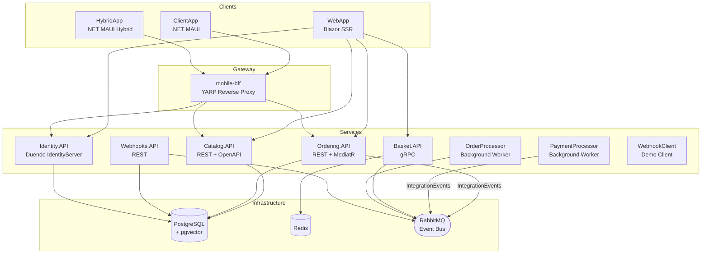

# eShop — Cloud-Native Reference Application

[](https://github.com/Evilazaro/eShop/actions)
[](LICENSE)
[](https://dotnet.microsoft.com/)
[](https://learn.microsoft.com/dotnet/aspire/)

---

**eShop** is a production-quality, cloud-native reference application that demonstrates modern microservices architecture using **.NET 10** and **.NET Aspire**. It models a real-world online store with full separation of concerns across independently deployable services, an event-driven messaging backbone, and multiple client front-ends.

The application covers the complete e-commerce workflow — from browsing a product catalog and managing a shopping basket to placing orders, processing payments, and delivering webhook notifications. Each concern is isolated in its own service, communicating over REST, gRPC, and asynchronous events via RabbitMQ.

eShop serves as a learning resource, architectural blueprint, and integration test-bed for the .NET ecosystem. It demonstrates best practices for service discovery, distributed tracing, health checks, identity federation, AI-assisted search, and deployment to Azure Container Apps using the Azure Developer CLI (`azd`).

---

## Table of Contents

1. [Features](#features)
2. [Architecture](#architecture)
3. [Technologies Used](#technologies-used)
4. [Quick Start](#quick-start)
5. [Configuration](#configuration)
6. [Deployment](#deployment)
7. [Usage](#usage)
8. [Contributing](#contributing)
9. [License](#license)

---

## Features

> **Key capabilities at a glance**

| Category          | Capability                                                                                 |
| ----------------- | ------------------------------------------------------------------------------------------ |
| **Catalog**       | Browse products, filter by brand/type, semantic vector search (pgvector + OpenAI optional) |
| **Basket**        | Add/remove items, persistent Redis-backed cart                                             |
| **Ordering**      | Place orders, track status, domain-driven order aggregate                                  |
| **Identity**      | OAuth 2.0 / OpenID Connect via Duende IdentityServer                                       |
| **Payments**      | Pluggable payment processor service                                                        |
| **Webhooks**      | Subscribe to order events; demo webhook client included                                    |
| **Mobile**        | .NET MAUI cross-platform app (iOS, Android, Windows, macOS)                                |
| **Hybrid**        | .NET MAUI Hybrid app sharing Blazor web components                                         |
| **Observability** | OpenTelemetry traces, metrics, and logs out of the box                                     |
| **AI (optional)** | OpenAI / Azure OpenAI / Ollama for semantic catalog search                                 |

---

## Architecture

The application is orchestrated by **.NET Aspire**, which composes all services, infrastructure dependencies, and configuration at development time and generates the deployment manifest for Azure.



### Service Responsibilities

| Service            | Purpose                                         | Storage               |
| ------------------ | ----------------------------------------------- | --------------------- |
| `Identity.API`     | Authentication, authorization, user management  | PostgreSQL            |
| `Catalog.API`      | Product listings, images, semantic search       | PostgreSQL + pgvector |
| `Basket.API`       | Shopping cart (gRPC interface)                  | Redis                 |
| `Ordering.API`     | Order creation and status, DDD aggregate        | PostgreSQL            |
| `OrderProcessor`   | Handles order state machine via event bus       | PostgreSQL            |
| `PaymentProcessor` | Simulates payment confirmation                  | —                     |
| `Webhooks.API`     | Manages webhook subscriptions and fan-out       | PostgreSQL            |
| `WebhookClient`    | Demo subscriber for webhook events              | —                     |
| `WebApp`           | Blazor Server storefront                        | —                     |
| `ClientApp`        | .NET MAUI mobile client                         | —                     |
| `HybridApp`        | .NET MAUI Hybrid client                         | —                     |
| `mobile-bff`       | YARP-based Backend-for-Frontend for mobile apps | —                     |

---

## Technologies Used

### Core Platform

| Technology                                                | Version | Role                          |
| --------------------------------------------------------- | ------- | ----------------------------- |
| [.NET](https://dotnet.microsoft.com/)                     | 10.0    | Runtime                       |
| [ASP.NET Core](https://learn.microsoft.com/aspnet/core)   | 10.0    | Web framework                 |
| [.NET Aspire](https://learn.microsoft.com/dotnet/aspire/) | 13.x    | Orchestration & observability |
| [.NET MAUI](https://learn.microsoft.com/dotnet/maui/)     | 10.0    | Cross-platform mobile/desktop |
| [Blazor](https://learn.microsoft.com/aspnet/core/blazor/) | 10.0    | Server-side rendering (SSR)   |

### Data & Messaging

| Technology                                                                                   | Version | Role                             |
| -------------------------------------------------------------------------------------------- | ------- | -------------------------------- |
| [Entity Framework Core](https://learn.microsoft.com/ef/core/)                                | 10.0    | ORM                              |
| [PostgreSQL](https://www.postgresql.org/) + [pgvector](https://github.com/pgvector/pgvector) | Latest  | Relational DB + vector search    |
| [Redis](https://redis.io/)                                                                   | Latest  | Distributed cache (basket)       |
| [RabbitMQ](https://www.rabbitmq.com/)                                                        | Latest  | Async event bus                  |
| [gRPC](https://grpc.io/)                                                                     | 2.76    | Service-to-service communication |

### Identity & Security

| Technology                                                                                        | Version | Role                                |
| ------------------------------------------------------------------------------------------------- | ------- | ----------------------------------- |
| [Duende IdentityServer](https://duendesoftware.com/)                                              | 7.x     | OAuth 2.0 / OpenID Connect provider |
| [ASP.NET Core Identity](https://learn.microsoft.com/aspnet/core/security/authentication/identity) | 10.0    | User management                     |

### AI & Search (Optional)

| Technology                    | Role                                |
| ----------------------------- | ----------------------------------- |
| Azure OpenAI / OpenAI         | Chat and embedding models           |
| [Ollama](https://ollama.com/) | Local LLM inference                 |
| pgvector                      | Vector similarity search in catalog |

### Infrastructure & Operations

| Technology                                         | Role                               |
| -------------------------------------------------- | ---------------------------------- |
| [YARP](https://microsoft.github.io/reverse-proxy/) | Reverse proxy (mobile BFF)         |
| [OpenTelemetry](https://opentelemetry.io/)         | Distributed tracing, metrics, logs |
| [MediatR](https://github.com/jbogard/MediatR)      | CQRS command/event dispatching     |
| [FluentValidation](https://fluentvalidation.net/)  | Input validation                   |
| [Scalar](https://scalar.com/)                      | OpenAPI UI                         |

---

## Quick Start

### Prerequisites

| Requirement                                                       | Minimum Version | Notes                            |
| ----------------------------------------------------------------- | --------------- | -------------------------------- |
| [.NET SDK](https://dotnet.microsoft.com/download)                 | **10.0.100**    | See `global.json`                |
| [Docker Desktop](https://www.docker.com/products/docker-desktop/) | Latest stable   | Runs PostgreSQL, Redis, RabbitMQ |
| [Git](https://git-scm.com/)                                       | Any             | —                                |

> **Note:** Docker must be running before you start the application. Aspire will provision all infrastructure containers automatically.

### 1. Clone the Repository

```bash
git clone https://github.com/Evilazaro/eShop.git
cd eShop
```

### 2. Install the .NET SDK

Ensure you have .NET 10 installed. The correct SDK version is specified in `global.json`:

```bash
dotnet --version
# Expected: 10.0.100 or later
```

### 3. Run the Application with .NET Aspire

```bash
dotnet run --project src/eShop.AppHost/eShop.AppHost.csproj
```

Aspire launches the **Aspire Dashboard** automatically. Open the URL shown in the terminal (usually `https://localhost:15888`) to view all running services, logs, traces, and metrics.

### 4. Open the Online Store

Once all services report **Running** in the Aspire Dashboard, open the `webapp` URL (displayed as **"Online Store (https)"** in the dashboard).

Default test credentials:

| Field    | Value               |
| -------- | ------------------- |
| Username | `alice@example.com` |
| Password | `Pass123$`          |

---

## Configuration

### Environment Selection

The AppHost uses HTTPS by default. To use plain HTTP (e.g., in CI or restricted environments):

```bash
USE_HTTP_ENDPOINTS=true dotnet run --project src/eShop.AppHost/eShop.AppHost.csproj
```

### Optional: Enable AI Features

Open [`src/eShop.AppHost/Program.cs`](src/eShop.AppHost/Program.cs) and set the flag:

```csharp
// set to true if you want to use OpenAI
bool useOpenAI = true;
```

Then choose a target in `Extensions.cs`:

| `OpenAITarget`               | Description                             |
| ---------------------------- | --------------------------------------- |
| `OpenAI`                     | Uses api.openai.com with an API key     |
| `AzureOpenAI`                | Uses Azure OpenAI with managed identity |
| `AzureOpenAIExisting`        | Bring-your-own Azure OpenAI endpoint    |
| `AzureOpenAIExistingWithKey` | Bring-your-own endpoint + API key       |

For local inference without an external API, the Ollama integration is also available via `CommunityToolkit.Aspire.Hosting.Ollama`.

### Infrastructure Passwords

When running locally, Aspire generates random passwords for PostgreSQL, Redis, and RabbitMQ. These are injected directly into the service environment — no manual configuration is needed for local development.

For production deployments, the `infra/main.parameters.json` file accepts the following secure parameters:

| Parameter           | Description                   |
| ------------------- | ----------------------------- |
| `postgres_password` | PostgreSQL master password    |
| `redis_password`    | Redis authentication password |
| `eventbus_password` | RabbitMQ admin password       |

> **Warning:** Never commit real secrets to source control. Use `azd env set <KEY> <VALUE>` or Azure Key Vault to manage production secrets.

### Service Configuration Files

Each service has `appsettings.json` (production defaults) and `appsettings.Development.json` (local overrides). Key settings:

| Setting                | Where                    | Description                   |
| ---------------------- | ------------------------ | ----------------------------- |
| `Identity__Url`        | Basket, Ordering, WebApp | URL of the Identity service   |
| `IdentityUrl`          | WebApp, WebhookClient    | Same as above, alternate key  |
| `ConnectionStrings__*` | All data services        | Injected by Aspire at runtime |

---

## Deployment

eShop deploys to **Azure Container Apps** using the [Azure Developer CLI (`azd`)](https://learn.microsoft.com/azure/developer/azure-developer-cli/).

### Prerequisites

- [Azure Developer CLI](https://learn.microsoft.com/azure/developer/azure-developer-cli/install-azd) installed
- An active Azure subscription
- Docker (for building container images)

### Steps

**1. Authenticate with Azure**

```bash
azd auth login
```

**2. Initialize the environment**

```bash
azd env new <your-environment-name>
```

**3. Deploy to Azure**

```bash
azd up
```

This command provisions all Azure resources defined in [`infra/`](infra/) (Azure Container Apps, PostgreSQL Flexible Server, Redis Cache, RabbitMQ via Container Apps) and deploys all services.

**4. (Optional) Deploy only application code after infrastructure exists**

```bash
azd deploy
```

### Infrastructure Overview

The Bicep templates in [`infra/`](infra/) provision:

| Resource             | Azure Service                                 |
| -------------------- | --------------------------------------------- |
| Application services | Azure Container Apps                          |
| PostgreSQL           | Azure Database for PostgreSQL Flexible Server |
| Redis                | Azure Cache for Redis                         |
| RabbitMQ             | Container App (sidecar)                       |
| Secrets              | Azure Key Vault (auto-generated passwords)    |

---

## Usage

### Browse the Catalog

Navigate to the **WebApp** URL. The catalog displays all products with filtering by brand and type. With AI enabled, the search box performs semantic (vector) search against product descriptions.

### Place an Order

1. Browse the catalog and click **Add to cart**.
2. Go to **My Basket** and review items.
3. Click **Checkout**, fill in the delivery address and payment details.
4. Submit the order — it enters the `SubmittedOrder` state.
5. The `OrderProcessor` service processes it asynchronously via RabbitMQ.

### Webhooks

Register a webhook endpoint to receive real-time notifications when orders change state:

```http
POST /api/webhooks/subscriptions
Content-Type: application/json
Authorization: Bearer <token>

{
  "url": "https://your-endpoint.example.com/hook",
  "token": "your-secret-token",
  "event": "OrderShipped"
}
```

### API Reference

Each service exposes an OpenAPI document. With the app running locally:

| Service        | Scalar UI URL                        |
| -------------- | ------------------------------------ |
| `Catalog.API`  | `https://localhost:<port>/scalar/v1` |
| `Ordering.API` | `https://localhost:<port>/scalar/v1` |
| `Webhooks.API` | `https://localhost:<port>/scalar/v1` |

Exact ports are displayed in the Aspire Dashboard.

### Running Tests

**Unit tests:**

```bash
dotnet test tests/Basket.UnitTests
dotnet test tests/Ordering.UnitTests
dotnet test tests/ClientApp.UnitTests
```

**Functional tests:**

```bash
dotnet test tests/Catalog.FunctionalTests
dotnet test tests/Ordering.FunctionalTests
```

**End-to-end (Playwright) tests:**

```bash
# Install Playwright browsers first
npx playwright install

# Run e2e tests (requires the full app to be running)
npx playwright test
```

### Build Only

```bash
dotnet build eShop.Web.slnf
```

---

## Contributing

Contributions are welcome. Please read [CONTRIBUTING.md](CONTRIBUTING.md) and [CODE-OF-CONDUCT.md](CODE-OF-CONDUCT.md) before submitting a pull request.

1. Fork the repository.
2. Create a feature branch: `git checkout -b feature/my-change`.
3. Make your changes and ensure all tests pass: `dotnet test`.
4. Submit a pull request against the `main` branch.

> **Note:** This repository treats warnings as errors (`TreatWarningsAsErrors=true`). Ensure your code compiles without warnings before submitting.

---

## License

This project is licensed under the [MIT License](LICENSE) — Copyright © .NET Foundation and Contributors.
