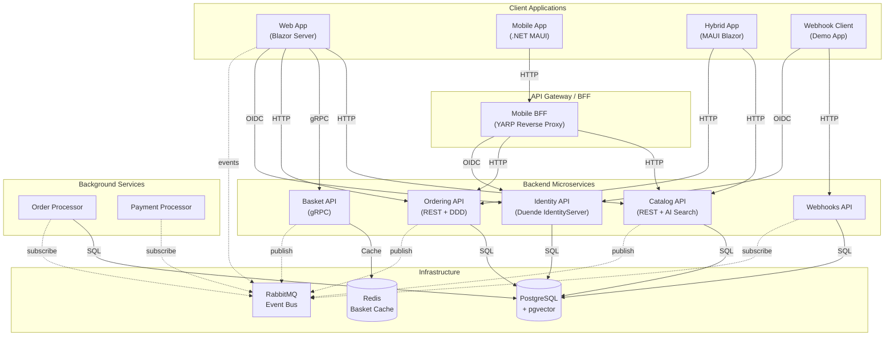

# eShop — Cloud-Native Reference Application

[](https://github.com/Evilazaro/eShop/actions/workflows/pr-validation.yml)
[](https://github.com/Evilazaro/eShop/actions/workflows/pr-validation-maui.yml)
[](LICENSE)
[](https://dotnet.microsoft.com/download/dotnet/10.0)
[](https://learn.microsoft.com/dotnet/aspire)

**eShop** is a canonical, production-grade reference application demonstrating how to build a modern, cloud-native e-commerce platform using **microservices** architecture, **Domain-Driven Design (DDD)**, and the **Microsoft .NET** ecosystem.

The application showcases the full spectrum of .NET 10 capabilities — from Blazor Server web frontends and .NET MAUI cross-platform mobile apps, to gRPC services, event-driven messaging, and AI-assisted product discovery. Every service is wired together with **.NET Aspire**, giving developers a seamless local development experience and a production-ready deployment path to **Azure Container Apps**.

This repository is maintained as a living example of industry best practices: resilient HTTP clients, OpenTelemetry observability, JWT-based authentication with Duende IdentityServer, and Infrastructure as Code via Azure Bicep and the Azure Developer CLI (`azd`). Whether you are evaluating architecture patterns, learning .NET cloud-native development, or building a real application, eShop provides a solid foundation to learn from and build upon.

---

## Table of Contents

- [Features](#features)
- [Architecture](#architecture)
- [Technologies Used](#technologies-used)
- [Quick Start](#quick-start)
  - [Prerequisites](#prerequisites)
  - [Clone the Repository](#clone-the-repository)
  - [Run Locally](#run-locally)
- [Configuration](#configuration)
- [Deployment](#deployment)
- [Usage](#usage)
- [Contributing](#contributing)
- [License](#license)

---

## Features

- 🛒 **Full E-Commerce Workflow** — Browse catalog, add items to basket, place and track orders end-to-end
- 🔐 **Centralized Authentication** — OAuth 2.0 / OpenID Connect via Duende IdentityServer; JWT bearer tokens across all APIs
- 📦 **Microservices Architecture** — Each domain (catalog, basket, ordering, identity, webhooks) is an independent, deployable service
- 🌐 **Blazor Server Web App** — Interactive server-side UI built with Razor Components and `QuickGrid`
- 📱 **Cross-Platform Mobile App** — Native .NET MAUI client targeting Android, iOS, macOS, and Windows
- 📲 **Hybrid App** — .NET MAUI Blazor Hybrid sharing UI components between web and native mobile
- 🔀 **Mobile Backend for Frontend (BFF)** — YARP reverse proxy aggregates backend services for mobile clients
- 🤖 **AI-Powered Product Search** — Optional semantic search via pgvector embeddings; pluggable OpenAI (including Azure OpenAI) or local Ollama models
- 📨 **Event-Driven Messaging** — RabbitMQ integration events decouple services and enable asynchronous processing
- 📊 **Built-In Observability** — OpenTelemetry traces, metrics, and logs exported via OTLP; Aspire Dashboard included
- 🏗️ **DDD & Clean Architecture** — Ordering domain uses Aggregates, Value Objects, Domain Events, and the Repository pattern
- 🔔 **Webhooks** — Configurable webhook subscriptions notify external systems of order status changes
- ☁️ **One-Command Azure Deployment** — `azd up` provisions Azure Container Apps, PostgreSQL, Redis, RabbitMQ, and a container registry
- ✅ **Comprehensive Test Suite** — Unit tests, functional tests with TestContainers, and Playwright end-to-end tests

---

## Architecture

The diagram below shows the high-level interaction between the services, client applications, and shared infrastructure components.



> [!NOTE]
> Solid lines represent synchronous calls (HTTP/gRPC). Dashed lines represent asynchronous integration events over RabbitMQ.

---

## Technologies Used

| Category                | Technology                                                 | Version       |
| ----------------------- | ---------------------------------------------------------- | ------------- |
| **Runtime**             | .NET                                                       | 10.0          |
| **Orchestration**       | .NET Aspire                                                | 13.x          |
| **Web Frontend**        | ASP.NET Core Blazor Server                                 | 10.0          |
| **Mobile / Hybrid**     | .NET MAUI + MAUI Blazor Hybrid                             | 10.0          |
| **REST APIs**           | ASP.NET Core Minimal APIs                                  | 10.0          |
| **API Versioning**      | Asp.Versioning                                             | 8.1           |
| **RPC**                 | gRPC (Grpc.Net)                                            | 2.76          |
| **ORM**                 | Entity Framework Core + Npgsql                             | 10.0          |
| **Database**            | PostgreSQL with pgvector                                   | Latest        |
| **Cache**               | Redis (StackExchange.Redis)                                | 13.x (Aspire) |
| **Message Broker**      | RabbitMQ                                                   | 13.x (Aspire) |
| **Reverse Proxy / BFF** | YARP                                                       | 13.x (Aspire) |
| **Identity / Auth**     | Duende IdentityServer                                      | 7.4           |
| **Auth Tokens**         | JWT Bearer (Microsoft.AspNetCore.Authentication.JwtBearer) | 10.0          |
| **AI / Embeddings**     | Azure OpenAI / OpenAI / Ollama + pgvector                  | 13.x          |
| **Observability**       | OpenTelemetry (traces, metrics, logs)                      | 1.15          |
| **IaC**                 | Azure Bicep                                                | Latest        |
| **Cloud**               | Azure Container Apps                                       | —             |
| **Testing**             | MSTest 4, NSubstitute, TestContainers, Playwright          | —             |

---

## Quick Start

### Prerequisites

| Requirement                                                                                  | Minimum Version | Notes                                                 |
| -------------------------------------------------------------------------------------------- | --------------- | ----------------------------------------------------- |
| [.NET SDK](https://dotnet.microsoft.com/download/dotnet/10.0)                                | **10.0.100**    | Configured in `global.json`                           |
| [Docker Desktop](https://www.docker.com/products/docker-desktop)                             | Latest stable   | Required for containers (PostgreSQL, Redis, RabbitMQ) |
| [.NET Aspire workload](https://learn.microsoft.com/dotnet/aspire/fundamentals/setup-tooling) | 13.x            | `dotnet workload install aspire`                      |
| Git                                                                                          | Any             | —                                                     |

> [!TIP]
> On Windows, Docker Desktop must be running before you start the AppHost. On macOS/Linux, ensure the Docker daemon is active.

### Clone the Repository

```bash
git clone https://github.com/Evilazaro/eShop.git
cd eShop
```

### Install the .NET Aspire Workload

```bash
dotnet workload install aspire
```

### Run Locally

1. **Restore dependencies:**

   ```bash
   dotnet restore eShop.Web.slnf
   ```

2. **Start the application via the Aspire AppHost:**

   ```bash
   dotnet run --project src/eShop.AppHost/eShop.AppHost.csproj
   ```

3. **Open the Aspire Dashboard** — The console output displays the dashboard URL (typically `http://localhost:15888`). Use it to monitor all running services, traces, and logs.

4. **Browse the online store** — The Blazor web application URL is printed as `Online Store (http)` or `Online Store (https)` in the Aspire Dashboard.

> [!IMPORTANT]
> The first launch pulls several Docker images (PostgreSQL with pgvector, Redis, RabbitMQ). Allow a few minutes for the initial setup to complete.

> [!NOTE]
> By default, the application uses HTTP endpoints for local development. Set the `launchProfile` to `https` in `src/eShop.AppHost/Properties/launchSettings.json` to enable HTTPS locally.

---

## Configuration

### Environment Variables

Each service reads its configuration from `appsettings.json`, `appsettings.Development.json`, and environment variables. Environment variables override file-based settings.

| Variable                        | Service                                | Description                                            | Default       |
| ------------------------------- | -------------------------------------- | ------------------------------------------------------ | ------------- |
| `Identity__Url`                 | Basket API, Ordering API, Webhooks API | URL of the Identity API for JWT validation             | Set by Aspire |
| `IdentityUrl`                   | Web App, Webhook Client                | URL of the Identity API for OIDC login                 | Set by Aspire |
| `ConnectionStrings__catalogdb`  | Catalog API                            | PostgreSQL connection string for the catalog database  | Set by Aspire |
| `ConnectionStrings__identitydb` | Identity API                           | PostgreSQL connection string for the identity database | Set by Aspire |
| `ConnectionStrings__orderingdb` | Ordering API, Order Processor          | PostgreSQL connection string for the orders database   | Set by Aspire |
| `ConnectionStrings__webhooksdb` | Webhooks API                           | PostgreSQL connection string for the webhooks database | Set by Aspire |
| `ConnectionStrings__redis`      | Basket API                             | Redis connection string for the basket cache           | Set by Aspire |
| `ConnectionStrings__eventbus`   | All event-publishing services          | RabbitMQ connection string                             | Set by Aspire |
| `OllamaEnabled`                 | Catalog API                            | Enable Ollama local AI embeddings (`true`/`false`)     | `false`       |
| `CallBackUrl`                   | Web App, Webhook Client                | External callback URL registered with Identity API     | Set by Aspire |

> [!NOTE]
> When running via `dotnet run --project src/eShop.AppHost`, .NET Aspire injects all connection strings and service URLs automatically. Manual configuration is only needed for standalone deployments.

### AI Configuration

The Catalog API and Web App support three AI embedding options for semantic product search:

| Mode               | How to Enable                                                                           |
| ------------------ | --------------------------------------------------------------------------------------- |
| **OpenAI**         | Set `useOpenAI = true` and `OpenAITarget.OpenAI` in `src/eShop.AppHost/Program.cs`      |
| **Azure OpenAI**   | Set `useOpenAI = true` and `OpenAITarget.AzureOpenAI` in `src/eShop.AppHost/Program.cs` |
| **Ollama (local)** | Set `useOllama = true` in `src/eShop.AppHost/Program.cs`                                |

> [!TIP]
> Ollama is the easiest way to try AI-powered search without an Azure subscription. Docker Desktop must be running, and the Aspire host will automatically pull and start the Ollama container.

### Identity / Authentication

Authentication is configured via the `Identity` section in each service's `appsettings.json`:

```json
{
  "Identity": {
    "Url": "https://identity-api",
    "Audience": "basket"
  }
}
```

> [!WARNING]
> The default Identity API configuration uses `AddDeveloperSigningCredential()`, which generates a new ephemeral signing key on each restart. **This is not suitable for production.** Store signing credentials in Azure Key Vault or another secrets manager for production deployments.

---

## Deployment

The application deploys to **Azure Container Apps** using the [Azure Developer CLI (`azd`)](https://learn.microsoft.com/azure/developer/azure-developer-cli/overview) and the Bicep templates in the `infra/` directory.

### Prerequisites for Deployment

| Requirement                                                                                        | Notes                                                                     |
| -------------------------------------------------------------------------------------------------- | ------------------------------------------------------------------------- |
| [Azure Developer CLI](https://learn.microsoft.com/azure/developer/azure-developer-cli/install-azd) | `winget install Microsoft.Azd` / `brew tap azure/azd && brew install azd` |
| Azure Subscription                                                                                 | Contributor access required                                               |
| Docker Desktop                                                                                     | Required to build container images                                        |

### Deploy to Azure

1. **Log in to Azure:**

   ```bash
   azd auth login
   ```

2. **Initialize the environment** (first time only):

   ```bash
   azd init
   ```

3. **Provision infrastructure and deploy all services:**

   ```bash
   azd up
   ```

   `azd up` performs the following steps:
   - Creates an Azure resource group prefixed with `rg-`
   - Provisions an **Azure Container Registry**, **Azure Container Apps Environment**, **Log Analytics Workspace**, and a **Managed Identity**
   - Builds and pushes all Docker images to the registry
   - Deploys all microservices as Container Apps

4. **Tear down** (optional):

   ```bash
   azd down
   ```

> [!IMPORTANT]
> The Bicep templates in `infra/` generate strong random passwords for PostgreSQL, Redis, and RabbitMQ automatically. These are stored as Azure Container Apps secrets and are never exposed in source control.

### Azure Resources Provisioned

| Resource                         | Purpose                                                        |
| -------------------------------- | -------------------------------------------------------------- |
| Azure Container Apps Environment | Hosts all microservices                                        |
| Azure Container Registry         | Stores Docker images                                           |
| Log Analytics Workspace          | Collects container logs and metrics                            |
| User-Assigned Managed Identity   | Grants Container Apps access to the registry                   |
| Aspire Dashboard                 | Built-in observability dashboard (`aspireDashboard` component) |

---

## Usage

### Browsing the Online Store

Navigate to the Web App URL shown in the Aspire Dashboard <| displayed as `Online Store (http/https)` |>. You can:

- Browse products by category or search by keyword
- View product details and images
- Add items to your basket (login required)
- Place an order and track its status

### Accessing the REST APIs

All REST APIs expose an OpenAPI (Swagger) UI when running in development:

| Service      | OpenAPI UI                                 |
| ------------ | ------------------------------------------ |
| Catalog API  | `http://localhost:<catalog-port>/swagger`  |
| Ordering API | `http://localhost:<ordering-port>/swagger` |
| Webhooks API | `http://localhost:<webhooks-port>/swagger` |

> [!TIP]
> The exact port numbers are displayed in the Aspire Dashboard under each service's endpoint list.

### Example: Fetch Catalog Items

```bash
curl -s http://localhost:<catalog-port>/api/catalog/items?pageSize=3 | jq .
```

Expected response (abbreviated):

```json
{
  "pageIndex": 0,
  "pageSize": 3,
  "count": 101,
  "data": [
    {
      "id": 1,
      "name": ".NET Bot Black Sweatshirt",
      "price": 19.5,
      "pictureUrl": "http://localhost:<catalog-port>/api/catalog/items/1/pic",
      "catalogType": { "type": "T-Shirt" },
      "catalogBrand": { "brand": ".NET" }
    }
  ]
}
```

### Running Tests

```bash
# Run all unit and functional tests
dotnet test eShop.Web.slnf --no-build

# Run only unit tests
dotnet test tests/Ordering.UnitTests/
dotnet test tests/Basket.UnitTests/

# Run functional tests (requires Docker)
dotnet test tests/Catalog.FunctionalTests/
dotnet test tests/Ordering.FunctionalTests/
```

> [!NOTE]
> Functional tests use .NET Aspire test host to spin up real containers (PostgreSQL, Redis, RabbitMQ) via TestContainers. Docker must be running.

### Running End-to-End Tests (Playwright)

```bash
# Install Playwright browsers (first time only)
npx playwright install

# Run E2E tests
npx playwright test
```

> [!NOTE]
> The Playwright tests in `e2e/` require the application to be running locally before executing. Start the AppHost first using `dotnet run --project src/eShop.AppHost`.

### Using the Mobile App (.NET MAUI)

Open `src/ClientApp/ClientApp.sln` in Visual Studio 2022 (17.10+) or JetBrains Rider, select your target platform (Android, iOS, Mac Catalyst, or Windows), and run the project. The mobile app connects to the local Aspire-hosted services by default.

> [!TIP]
> When testing with an Android emulator, the app is pre-configured to accept the Identity API at `https://10.0.2.2:5243` (the Android loopback alias for `localhost`).

---

## Contributing

Contributions are welcome! Please read [CONTRIBUTING.md](CONTRIBUTING.md) for guidelines on:

- How to report bugs and request features
- Coding and architectural contribution principles
- How to submit pull requests

> [!NOTE]
> All contributions must adhere to the project's [Code of Conduct](CODE-OF-CONDUCT.md). Respectful collaboration is key.

**Good starting points:**

- Issues labelled [`help wanted`](https://github.com/Evilazaro/eShop/issues?q=label%3A%22help+wanted%22) or [`good first issue`](https://github.com/Evilazaro/eShop/issues?q=label%3A%22good+first+issue%22)
- Writing or improving tests
- Fixing typos in code comments or documentation

> [!NOTE]
> This repository does not currently maintain a formal `CHANGELOG.md`. Refer to the [commit history](https://github.com/Evilazaro/eShop/commits/main) and [releases](https://github.com/Evilazaro/eShop/releases) for change information.

---

## License

This project is licensed under the **MIT License** — see the [LICENSE](LICENSE) file for details.

Copyright © .NET Foundation and Contributors.
