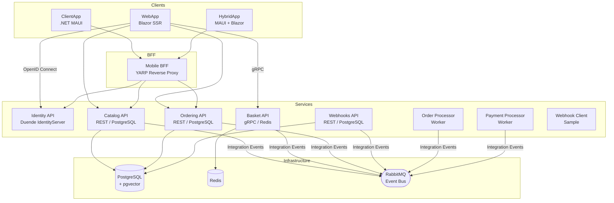

# eShop

[](https://dev.azure.com/dnceng/public/_build)
[](LICENSE)
[](https://dotnet.microsoft.com/)
[](https://learn.microsoft.com/dotnet/aspire/)

A reference implementation of a cloud-native e-commerce application built with **.NET 10** and **.NET Aspire**. eShop demonstrates microservices architecture, event-driven communication, distributed tracing, and multi-platform client development on modern .NET.


---

## Features

- **Microservices architecture** — independently deployable services for catalog, basket, ordering, identity, webhooks, and payment processing
- **Event-driven communication** — asynchronous integration events via RabbitMQ
- **Distributed caching** — Redis-backed shopping basket
- **Identity & authorization** — OAuth 2.0 / OpenID Connect via Duende IdentityServer
- **gRPC** — high-performance basket service communication
- **Multi-platform clients** — Blazor web app, .NET MAUI native app, and a MAUI Hybrid app sharing Razor components
- **API versioning** — versioned REST APIs across all services
- **OpenTelemetry** — distributed tracing, metrics, and structured logging
- **AI integration** — optional Azure OpenAI and Ollama support for catalog search
- **Webhooks** — outbound webhook notifications for order status events
- **Mobile BFF** — YARP reverse proxy acting as a Backend for Frontend for mobile clients
- **Azure deployment** — ready-to-deploy with `azd` and Azure Container Apps

---

## Architecture

The application is composed of the following services, orchestrated by **.NET Aspire**:




### Service Descriptions

| Service               | Description                                                                           |
| --------------------- | ------------------------------------------------------------------------------------- |
| **Catalog API**       | Product catalog with full CRUD, image handling, and pgvector-based AI semantic search |
| **Basket API**        | gRPC service for shopping cart operations backed by Redis                             |
| **Ordering API**      | Order management using Domain-Driven Design (DDD) and EF Core                         |
| **Order Processor**   | Background worker that processes confirmed orders via integration events              |
| **Payment Processor** | Background worker that simulates payment processing                                   |
| **Identity API**      | OAuth 2.0 / OIDC identity provider built on Duende IdentityServer                     |
| **Webhooks API**      | Manages webhook subscriptions and dispatches order status notifications               |
| **WebApp**            | Blazor Server-Side Rendering (SSR) storefront                                         |
| **ClientApp**         | .NET MAUI cross-platform native mobile/desktop app                                    |
| **HybridApp**         | .NET MAUI Hybrid app sharing Razor components with the web app                        |
| **Mobile BFF**        | YARP-based reverse proxy for mobile clients                                           |

---

## Technologies Used

| Category             | Technology                                               |
| -------------------- | -------------------------------------------------------- |
| **Runtime**          | .NET 10                                                  |
| **Orchestration**    | .NET Aspire 13.x                                         |
| **Web Framework**    | ASP.NET Core 10, Blazor SSR                              |
| **Mobile / Desktop** | .NET MAUI, MAUI Hybrid                                   |
| **Identity**         | Duende IdentityServer 7, ASP.NET Core Identity           |
| **Databases**        | PostgreSQL 16 (+ pgvector) via EF Core 10                |
| **Caching**          | Redis via StackExchange.Redis                            |
| **Messaging**        | RabbitMQ (Aspire.RabbitMQ.Client)                        |
| **RPC**              | gRPC (Grpc.Net.Client)                                   |
| **Reverse Proxy**    | YARP                                                     |
| **AI**               | Azure OpenAI, Ollama (optional)                          |
| **Observability**    | OpenTelemetry (traces, metrics, logs)                    |
| **Deployment**       | Azure Developer CLI (`azd`), Azure Container Apps, Bicep |
| **Testing**          | MSTest 4, NSubstitute, Playwright (E2E)                  |

---

## Quick Start

### Prerequisites

- [.NET 10 SDK](https://dotnet.microsoft.com/download/dotnet/10.0) (`10.0.100` or later)
- [.NET Aspire workload](https://learn.microsoft.com/dotnet/aspire/fundamentals/setup-tooling)
- [Docker Desktop](https://www.docker.com/products/docker-desktop/) (for local containers: PostgreSQL, Redis, RabbitMQ)

### Install the Aspire workload

```bash
dotnet workload install aspire
```

### Run locally

```bash
git clone https://github.com/Evilazaro/eShop.git
cd eShop
dotnet run --project src/eShop.AppHost
```

The .NET Aspire dashboard will open at `https://localhost:15888`. Service endpoints are listed in the dashboard and can be navigated directly from there.

> **Note:** The first run pulls container images for PostgreSQL, Redis, and RabbitMQ. Subsequent starts are faster because the containers are marked as persistent.

---

## Configuration

### Optional AI features

Semantic catalog search can be enabled with either **Azure OpenAI** or **Ollama** (local). Edit `src/eShop.AppHost/Program.cs` and set the appropriate flag:

```csharp
bool useOpenAI = true;          // Azure OpenAI
bool useAzureOpenAI = true;     // true = Azure OpenAI, false = Ollama
```

Configure the connection details via user secrets or environment variables as prompted by the Aspire dashboard.

### HTTPS vs HTTP

By default the AppHost selects `https` launch profiles. To use plain HTTP (e.g., in CI), set:

```bash
DOTNET_LAUNCH_PROFILE=http
```

---

## Deployment

eShop is configured for deployment to **Azure Container Apps** using the Azure Developer CLI.

### Prerequisites

- [Azure Developer CLI (`azd`)](https://learn.microsoft.com/azure/developer/azure-developer-cli/install-azd)
- An Azure subscription

### Deploy

```bash
# Log in to Azure
azd auth login

# Provision infrastructure and deploy all services
azd up
```

`azd up` provisions the following Azure resources (defined in `infra/`):

- **Azure Container Apps Environment** — hosts all microservices
- **Azure Container Registry** — stores container images
- **Azure Database for PostgreSQL Flexible Server** — persistent data store
- **Azure Cache for Redis** — session and basket cache
- **Azure Service Bus** (RabbitMQ-compatible) — event bus

To tear down all provisioned resources:

```bash
azd down
```

---

## Usage

Once running (locally or in Azure), navigate to the WebApp URL shown in the Aspire dashboard or `azd` output:

1. **Browse the catalog** — view products by category, search with keywords, or use AI-powered semantic search.
2. **Add to basket** — add items to your shopping cart (sign in required for checkout).
3. **Sign in** — create an account or log in via the Identity service.
4. **Place an order** — proceed through checkout; the Order Processor and Payment Processor handle fulfillment asynchronously.
5. **Webhook notifications** — use the Webhook Client sample to receive order status callbacks.

### Running end-to-end tests

```bash
npx playwright install --with-deps
npx playwright test
```

---

## Contributing

Contributions are welcome! Please read [CONTRIBUTING.md](CONTRIBUTING.md) before submitting pull requests.

Key contribution guidelines:

- Follow .NET best practices and conventions used throughout the codebase.
- Keep changes focused — large-scale architectural changes require a clear rationale.
- Look for issues tagged `help wanted` or `good first issue` for a good starting point.
- For small fixes (typos, docs), open a pull request directly.
- For new features or significant changes, open an issue first to discuss.

---

## License

This project is licensed under the [MIT License](LICENSE).
