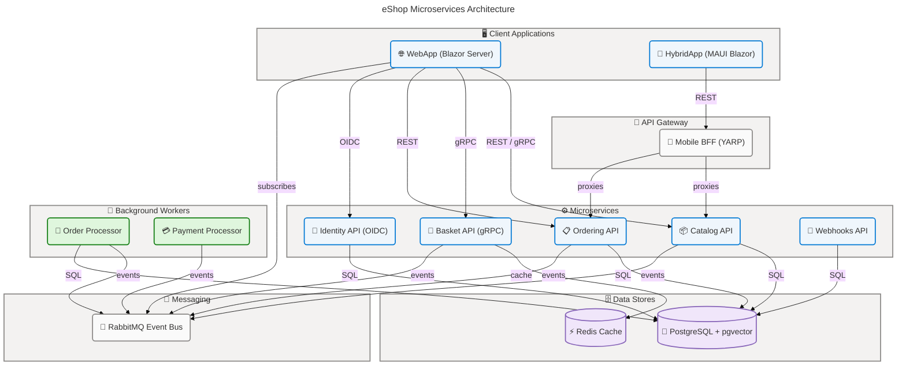

# eShop

[](LICENSE)
[](https://dotnet.microsoft.com)
[](https://learn.microsoft.com/dotnet/aspire)
[](https://github.com/Evilazaro/eShop/actions/workflows/ci.yml)

A production-grade, cloud-native e-commerce reference application built on **.NET 10** and **.NET Aspire 13**, demonstrating microservices architecture, Domain-Driven Design, CQRS, event-driven communication, and optional AI integration through OpenAI, Azure OpenAI, and Ollama.

## Table of Contents

- [Overview](#overview)
- [Quick Start](#quick-start)
- [Architecture](#architecture)
- [Features](#features)
- [Requirements](#requirements)
- [Configuration](#configuration)
- [Usage](#usage)
- [Contributing](#contributing)
- [License](#license)

## Overview

**Overview**

eShop is a canonical .NET reference application that demonstrates how to design, build, and run a cloud-native e-commerce platform as a collection of loosely coupled microservices. It targets teams evaluating modern .NET practices — from Domain-Driven Design and CQRS in the ordering domain, to gRPC-based basket management, to event-driven integration through RabbitMQ, to real-time order-status updates in a Blazor Server frontend.

The application is orchestrated by **.NET Aspire**, which provisions all required infrastructure (PostgreSQL, Redis, RabbitMQ) as containers, injects service-discovery configuration into every process, and surfaces a unified developer dashboard. Optional AI capabilities (semantic product search powered by pgvector embeddings) can be enabled against OpenAI, Azure OpenAI, or a locally-running Ollama instance with a single configuration flag.

> [!NOTE]
> eShop targets **.NET SDK 10.0.100** and **.NET Aspire 13.1**. Run `dotnet --version` to verify your SDK before proceeding. See the [Requirements](#requirements) section for the full prerequisite list.

> [!TIP]
> The fastest way to explore eShop is to run `dotnet run --project src/eShop.AppHost` — Aspire automatically starts every service, database, and message broker required.

## Quick Start

Clone the repository, restore the SDK, and launch the Aspire orchestration host:

```bash
git clone https://github.com/Evilazaro/eShop.git
cd eShop
dotnet run --project src/eShop.AppHost
```

After Aspire starts, the developer dashboard opens in your browser and surfaces all service endpoints. The online store is available at the `webapp` endpoint listed in the dashboard.

**Expected output (abbreviated):**

```text
Building...
info: Aspire.Hosting.DistributedApplication[0]
      Distributed application starting.
info: Aspire.Hosting.DistributedApplication[0]
      Now listening on: https://localhost:17002
info: Aspire.Hosting.DistributedApplication[0]
      Login to the dashboard at https://localhost:17002
```

Open the dashboard URL printed in the console to see all running services, logs, and traces.

> [!TIP]
> Use the `http` launch profile if HTTPS certificates are not configured on your machine:
>
> ```bash
> dotnet run --project src/eShop.AppHost --launch-profile http
> ```

## Architecture

**Overview**

eShop follows a microservices architecture pattern where each bounded context runs as an independently deployable service. The .NET Aspire `AppHost` project acts as the composition root, wiring service-discovery endpoints, environment variables, and infrastructure dependencies together at development time.

Services communicate over HTTP/REST (with versioned Minimal APIs), gRPC (Basket), and asynchronous events over RabbitMQ. Every service registers with OpenTelemetry and exposes `/health` endpoints, enabling unified observability through the Aspire dashboard.



**Component Roles:**

| Component            | 🔖 Role                                           | Technology                     |
| -------------------- | ------------------------------------------------- | ------------------------------ |
| 🌐 WebApp            | Blazor Server storefront — browse, cart, checkout | ASP.NET Core 10, Blazor Server |
| 📱 HybridApp         | Cross-platform mobile / desktop client            | .NET MAUI, Blazor Hybrid       |
| 🔀 Mobile BFF        | Reverse-proxy backend-for-frontend for mobile     | YARP 13.1                      |
| 📦 Catalog API       | Product catalog CRUD + AI semantic search         | Minimal API v1/v2, pgvector    |
| 🛒 Basket API        | Shopping cart read/write                          | gRPC, Redis                    |
| 📋 Ordering API      | Order lifecycle management (CQRS + DDD)           | MediatR, FluentValidation      |
| 🔐 Identity API      | OAuth 2.0 / OpenID Connect provider               | Duende IdentityServer 7        |
| 🔔 Webhooks API      | Webhook subscription and delivery                 | Minimal API, RabbitMQ          |
| 📝 Order Processor   | Grace-period order confirmation worker            | Hosted Service, RabbitMQ       |
| 💳 Payment Processor | Simulated payment approval worker                 | Hosted Service, RabbitMQ       |

## Features

**Overview**

eShop packages the architectural patterns most commonly requested by enterprise .NET teams into a fully runnable reference application. Every feature is implemented with production-quality code and verified by unit and functional tests, making it suitable for direct study, benchmarking, or use as a starting point for real projects.

The application covers the end-to-end e-commerce journey — from browsing AI-powered product search results, to adding items to a Redis-backed cart, to placing orders that flow through a multi-step CQRS pipeline, to receiving real-time status updates over event-bus-driven Blazor notifications.

| Feature                   | 📝 Description                                                                                      | Status    |
| ------------------------- | --------------------------------------------------------------------------------------------------- | --------- |
| 🏪 Product Catalog        | Paginated product listing with type/brand filtering and item detail pages                           | ✅ Stable |
| 🤖 AI Semantic Search     | Vector-similarity product search via OpenAI, Azure OpenAI, or Ollama embeddings and pgvector        | ✅ Stable |
| 🛒 Shopping Basket        | Persistent per-user cart stored in Redis; managed over gRPC                                         | ✅ Stable |
| 📋 Order Management       | Full CQRS order lifecycle: submit, validate, stock-check, pay, ship, cancel                         | ✅ Stable |
| 🔐 Authentication         | OpenID Connect / OAuth 2.0 login via Duende IdentityServer with cookie sessions                     | ✅ Stable |
| 🔔 Webhooks               | Configurable HTTP webhook subscriptions for order-status change events                              | ✅ Stable |
| 📱 Mobile / Desktop       | Cross-platform .NET MAUI Blazor Hybrid app sharing components with the web frontend                 | ✅ Stable |
| 📡 Event-Driven Messaging | Integration events published and consumed over RabbitMQ with at-least-once delivery                 | ✅ Stable |
| 📊 Observability          | OpenTelemetry traces, metrics, and structured logs exported to the Aspire dashboard                 | ✅ Stable |
| 🔄 Resilience             | HTTP client resilience policies (retry, circuit breaker) via `Microsoft.Extensions.Http.Resilience` | ✅ Stable |
| 🩺 Health Checks          | `/health` endpoints on every service; integrated with Aspire health monitoring                      | ✅ Stable |
| 🔀 API Versioning         | `v1` and `v2` catalog API versions served from the same host via `Asp.Versioning`                   | ✅ Stable |

## Requirements

**Overview**

eShop requires the .NET 10 SDK and Docker (or a compatible container runtime) to run locally. The .NET Aspire `AppHost` automatically pulls and starts PostgreSQL, Redis, and RabbitMQ container images — no manual infrastructure setup is needed for development. Docker Desktop (or Rancher Desktop / Podman Desktop) must be running before the `AppHost` is started.

Optional AI features require credentials for OpenAI or Azure OpenAI, or a locally running Ollama instance. These capabilities are **disabled by default** and do not affect the core application flow when not configured.

| Prerequisite                              | 📌 Version                            | Purpose                                           |
| ----------------------------------------- | ------------------------------------- | ------------------------------------------------- |
| ☁️ .NET SDK                               | 10.0.100 or later                     | Build and run all projects                        |
| 🐳 Docker Desktop                         | 4.x or compatible                     | Container runtime for PostgreSQL, Redis, RabbitMQ |
| 🖥️ Operating System                       | Windows 10+, macOS 12+, Ubuntu 22.04+ | Aspire host platform                              |
| 🤖 OpenAI / Azure OpenAI key              | Optional                              | AI semantic search feature                        |
| 🦙 Ollama                                 | Optional, latest                      | Local AI model inference alternative              |
| 🛠️ Visual Studio 2022 (17.14+) or VS Code | Optional                              | IDE support with Aspire tooling                   |

> [!NOTE]
> Install the .NET Aspire workload once after installing the SDK:
>
> ```bash
> dotnet workload install aspire
> ```

## Configuration

**Overview**

Nearly all eShop configuration is managed through the .NET Aspire `AppHost` via environment variables and connection strings injected at startup. Services use the standard `appsettings.json` + environment-variable layering provided by `Microsoft.Extensions.Configuration`. No manual environment setup is required for local development — Aspire injects the correct `ConnectionStrings__*` and service-discovery URLs into each process automatically.

Advanced configurations (AI, identity clients, HTTPS vs HTTP launch profile) are controlled through flags in `src/eShop.AppHost/Program.cs` and `src/eShop.AppHost/Extensions.cs`. The table below covers the settings most likely to need adjustment for local customization or production deployment.

| Setting                                  | 📁 Location                        | Default                 | Description                                               |
| ---------------------------------------- | ---------------------------------- | ----------------------- | --------------------------------------------------------- |
| ⚙️ `useOpenAI`                           | `src/eShop.AppHost/Program.cs`     | `false`                 | Enable OpenAI-backed semantic search                      |
| ⚙️ `useOllama`                           | `src/eShop.AppHost/Program.cs`     | `false`                 | Enable Ollama-backed semantic search                      |
| 🔑 `OpenAIEndpointParameter`             | Aspire parameter prompt            | _(prompted at runtime)_ | Azure OpenAI endpoint URL                                 |
| 🔑 `OpenAIKeyParameter`                  | Aspire parameter prompt (secret)   | _(prompted at runtime)_ | OpenAI / Azure OpenAI API key                             |
| 🌍 AI target                             | `Extensions.cs` `AddOpenAI()` call | `OpenAI`                | Target: `OpenAI`, `AzureOpenAI`, or `AzureOpenAIExisting` |
| 🔗 Launch profile                        | `--launch-profile http\|https`     | `https`                 | HTTP vs HTTPS endpoint binding                            |
| ⚡ `SessionCookieLifetimeMinutes`        | `src/WebApp/appsettings.json`      | `60`                    | Session cookie lifetime (minutes)                         |
| 📁 `CatalogOptions:UseCustomizationData` | `src/Catalog.API/appsettings.json` | `false`                 | Seed catalog from custom data files                       |
| 📊 `EventBus:SubscriptionClientName`     | Per-service `appsettings.json`     | Service-specific        | RabbitMQ consumer queue name                              |

**Enable OpenAI semantic search:**

Edit `src/eShop.AppHost/Program.cs` and set the flag:

```csharp
// src/eShop.AppHost/Program.cs
bool useOpenAI = true;
if (useOpenAI)
{
    builder.AddOpenAI(catalogApi, webApp, OpenAITarget.OpenAI);
}
```

**Enable Ollama (local) semantic search:**

```csharp
// src/eShop.AppHost/Program.cs
bool useOllama = true;
if (useOllama)
{
    builder.AddOllama(catalogApi, webApp);
}
```

> [!WARNING]
> Identity and basket configurations reference one another through environment variables injected by Aspire. Modifying service endpoint addresses manually without using Aspire's `WithEnvironment` / `WithReference` APIs can break the OIDC callback flow. Always adjust cross-service URLs through the `AppHost`.

## Usage

### Browsing the Catalog

Once `dotnet run --project src/eShop.AppHost` is running, open the `webapp` link from the Aspire dashboard. The storefront loads a paginated product grid. Filter by type or brand using the dropdowns, or type a free-text query into the search box (AI semantic search must be enabled).

```http
GET https://localhost:<catalog-port>/api/catalog/items?pageIndex=0&pageSize=10
```

**Example response (abbreviated):**

```json
{
  "pageIndex": 0,
  "pageSize": 10,
  "count": 101,
  "data": [
    {
      "id": 1,
      "name": ".NET Bot Black Sweatshirt",
      "price": 19.5,
      "catalogType": "T-Shirt",
      "catalogBrand": ".NET"
    }
  ]
}
```

### Placing an Order

1. Log in via the **Sign In** link (test credentials are seeded by `UsersSeed.cs` in `Identity.API`).
2. Browse the catalog and add items to the basket.
3. Navigate to the basket page and click **Place Order**.
4. The Ordering API creates an order through the CQRS pipeline; the Order Processor confirms it after a configurable grace period.
5. Real-time order-status updates appear in the storefront header via RabbitMQ integration events.

### Running Tests

Execute the full test suite from the repo root:

```bash
dotnet test eShop.slnx
```

Run a specific test project:

```bash
dotnet test tests/Ordering.UnitTests
dotnet test tests/Catalog.FunctionalTests
dotnet test tests/Basket.UnitTests
```

### Accessing the OpenAPI / Scalar UI

Each API service exposes interactive documentation at its `/scalar` endpoint when running. Use the Aspire dashboard to find the port for each service:

```text
https://localhost:<ordering-port>/scalar
https://localhost:<catalog-port>/scalar
https://localhost:<webhooks-port>/scalar
```

### Running the MAUI Hybrid App

Open `src/HybridApp/HybridApp.csproj` in Visual Studio 2022 (17.14+). The `Mobile BFF` endpoint is configured in `src/HybridApp/MauiProgram.cs`:

```csharp
// src/HybridApp/MauiProgram.cs
internal static string MobileBffHost =
    DeviceInfo.Platform == DevicePlatform.Android
        ? "http://10.0.2.2:11632/"
        : "http://localhost:11632/";
```

Ensure the `AppHost` is running before launching the MAUI app so the Mobile BFF proxy is available.

## Contributing

**Overview**

Contributions to eShop are welcome and guided by a clear set of principles designed to keep the reference application trustworthy. The project values canonical .NET patterns over exhaustive coverage of every possible library or tool — every addition must justify its complexity relative to the value it demonstrates.

The best first contributions are issues tagged `help wanted` or `good first issue` in the GitHub issue tracker. Larger submissions — especially architectural changes — benefit from an issue discussion before a pull request is opened, so the team can align on scope and approach early.

> [!TIP]
> Before opening a pull request, ensure all existing tests pass with `dotnet test eShop.slnx` and that the solution builds cleanly with `dotnet build eShop.Web.slnf`.

**Contribution guidelines:**

- **Best Practices** — Contributions must reflect current .NET and industry best practices.
- **Selectivity** — Prefer demonstrating a realistic technology set over showcasing every available library.
- **Architectural Integrity** — Large-scale changes require clear rationale and should be discussed in an issue first.
- **Performance** — Performance improvements must include benchmark comparisons.
- **Tests** — Reliability improvements should be accompanied by relevant test scenarios.

**Workflow:**

1. Fork the repository and create a feature branch.
2. Make your changes following the guidelines above.
3. Open a pull request with a clear description and link to the related issue.
4. Address review feedback and ensure CI passes.

See [`CONTRIBUTING.md`](CONTRIBUTING.md) for the full contributor guide and [`CODE-OF-CONDUCT.md`](CODE-OF-CONDUCT.md) for community standards.

## License

This project is licensed under the **MIT License**. See [`LICENSE`](LICENSE) for the full text.

Copyright © .NET Foundation and Contributors.
