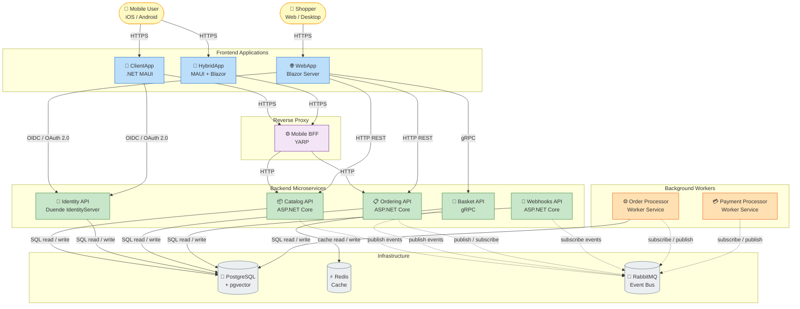

# eShop

[](https://github.com/Evilazaro/eShop/actions/workflows/pr-validation.yml)
[](LICENSE)
[](https://dotnet.microsoft.com/download/dotnet/10.0)
[](https://learn.microsoft.com/dotnet/aspire)
[](CONTRIBUTING.md)

eShop is a **cloud-native reference e-commerce application** built on **.NET 10** and **.NET Aspire**, designed to demonstrate microservices architecture, event-driven communication, and modern .NET development patterns at scale. It provides a fully functional online storefront with product browsing, shopping basket management, secure checkout, and real-time order tracking across both web and mobile platforms.

The application is composed of multiple independently deployable microservices — each owning its own data store — communicating through REST, gRPC, and an event bus. Authentication is handled by a dedicated Identity service powered by **Duende IdentityServer**, while integration events flow through **RabbitMQ** to enable loose coupling between services. Optional AI capabilities allow the catalog and web application to offer semantic product search using OpenAI, Azure OpenAI, or a local Ollama model.

eShop serves as a practical learning reference for teams adopting cloud-native patterns on .NET. It covers a wide range of topics including .NET Aspire orchestration, **Blazor Server** frontends, **.NET MAUI** mobile apps, containerized infrastructure, distributed tracing with **OpenTelemetry**, and one-command Azure deployment with `azd`.

---

## Table of Contents

- [Features](#features)
- [Architecture](#architecture)
- [Technologies Used](#technologies-used)
- [Quick Start](#quick-start)
- [Configuration](#configuration)
- [Deployment](#deployment)
- [Usage](#usage)
- [Contributing](#contributing)
- [License](#license)

---

## Features

- 🛒 **Full E-Commerce Workflow** — Browse products, manage a shopping basket, authenticate, place orders, and track order status end-to-end.
- 🔐 **Secure Authentication** — OAuth 2.0 / OpenID Connect via Duende IdentityServer with JWT-based API authorization across all services.
- 📱 **Multi-Platform Clients** — A Blazor Server web app, a native .NET MAUI mobile app, and a .NET MAUI Hybrid (Blazor-in-MAUI) app.
- 🏗️ **Microservices Architecture** — Independent services for catalog, basket, ordering, identity, and webhooks, each with its own PostgreSQL database.
- 📨 **Event-Driven Communication** — RabbitMQ-backed integration events decouple services and enable fully asynchronous order and payment workflows.
- 🤖 **Optional AI Integration** — Semantic catalog search and smart product recommendations powered by OpenAI, Azure OpenAI, or a local Ollama model.
- 🔔 **Webhook Notifications** — Subscribe to order and catalog domain events via a dedicated webhooks service and test client.
- 📊 **Distributed Observability** — OpenTelemetry traces, metrics, and structured logs across every service, surfaced in the .NET Aspire Dashboard.
- 🚀 **Cloud-Native Orchestration** — .NET Aspire AppHost wires all services, databases, and infrastructure for frictionless local development.
- ☁️ **Azure Deployment Ready** — One-command deployment to Azure Container Apps using Azure Developer CLI (`azd up`) and Bicep infrastructure-as-code.

---

## Architecture

The diagram below shows how **Shoppers** and **Mobile Users** interact with the eShop system to achieve their goals — browsing the catalog, managing a basket, placing orders, and receiving event notifications — and how the underlying microservices, background workers, and infrastructure components collaborate to fulfill those goals.



**Key user flows:**

| Actor | Goal | Primary Path |
|---|---|---|
| Shopper | Browse and purchase products | WebApp → Catalog API → Basket API → Ordering API |
| Mobile User | Browse and order from mobile | ClientApp → Mobile BFF → Catalog API / Ordering API |
| Shopper / Mobile User | Sign in securely | WebApp / ClientApp → Identity API (OIDC) |
| System | Process a placed order asynchronously | RabbitMQ → Order Processor → Ordering DB |
| System | Process payment asynchronously | RabbitMQ → Payment Processor → RabbitMQ |
| Subscriber | Receive domain event notifications | Webhooks API → (subscriber callback) |

> [!NOTE]
> Solid arrows (`→`) represent **synchronous / direct** calls (HTTP, gRPC). Dashed arrows (`-.->`) represent **asynchronous / event-driven** flows through RabbitMQ.

---

## Technologies Used

| Category | Technology | Version |
|---|---|---|
| Runtime | .NET | 10.0 |
| Orchestration | .NET Aspire | 13.x |
| Web Frontend | ASP.NET Core Blazor Server | 10.0 |
| Mobile / Desktop Client | .NET MAUI | 10.0 |
| RPC | gRPC (`Grpc.Net`) | 2.76.0 |
| Identity & Authorization | Duende IdentityServer | 7.x |
| ORM | Entity Framework Core | 10.0 |
| Database | PostgreSQL + pgvector | latest |
| Cache | Redis (`StackExchange.Redis`) | latest |
| Message Bus | RabbitMQ | latest |
| Reverse Proxy | YARP | 10.x |
| Observability | OpenTelemetry | 1.15.x |
| AI (optional) | Azure OpenAI / OpenAI / Ollama | latest |
| API Versioning | Asp.Versioning | 8.1.x |
| Testing | MSTest / Playwright | 4.x / latest |
| Infrastructure as Code | Bicep | latest |
| Cloud Deployment | Azure Developer CLI (`azd`) | latest |

---

## Quick Start

### Prerequisites

| Requirement | Minimum Version | Notes |
|---|---|---|
| [.NET SDK](https://dotnet.microsoft.com/download/dotnet/10.0) | 10.0.100 | Pinned in `global.json` |
| [Docker Desktop](https://www.docker.com/products/docker-desktop/) | Latest stable | Runs PostgreSQL, Redis, and RabbitMQ containers |
| [Git](https://git-scm.com/) | Any recent | For cloning the repository |

> [!NOTE]
> .NET Aspire automatically provisions and starts all required infrastructure containers (PostgreSQL, Redis, RabbitMQ) through Docker when you run the AppHost. No manual container configuration is needed for local development.

### Installation

```bash
# 1. Clone the repository
git clone https://github.com/Evilazaro/eShop.git
cd eShop

# 2. Restore all dependencies
dotnet restore eShop.Web.slnf
```

### Running Locally

```bash
# Start the entire application via .NET Aspire AppHost
dotnet run --project src/eShop.AppHost/eShop.AppHost.csproj
```

.NET Aspire starts every microservice, the Blazor web app, and all infrastructure containers. Once running, the **.NET Aspire Dashboard** opens automatically (default: `https://localhost:15888`) and displays service URLs, logs, distributed traces, and health check results.

> [!TIP]
> The default launch profile uses **HTTPS**. If you need to avoid certificate setup in a restricted environment, set the `ESHOP_USE_HTTP` environment variable to `true` before running.

**Service access points after startup:**

| Service | How to Find URL |
|---|---|
| Online Store (Blazor) | Shown in the Aspire Dashboard under `webapp` |
| .NET Aspire Dashboard | `https://localhost:15888` |
| Identity API | Shown in the Aspire Dashboard under `identity-api` |
| Catalog API (Swagger) | Shown in the Aspire Dashboard under `catalog-api` |

### Running Tests

```bash
# Build and run all unit and functional tests
dotnet test eShop.Web.slnf --no-progress

# Run end-to-end Playwright tests (requires running services)
npx playwright test
```

> [!NOTE]
> The solution filter `eShop.Web.slnf` covers all web-related projects. To build the full solution including .NET MAUI apps, open `eShop.slnx` in Visual Studio with the MAUI workload installed.

---

## Configuration

Configuration follows standard ASP.NET Core conventions: `appsettings.json` provides defaults, `appsettings.Development.json` overrides for local development, and .NET Aspire injects connection strings and service discovery environment variables at runtime.

### AppHost Settings

**`src/eShop.AppHost/appsettings.json`** — controls top-level orchestration options:

```json
{
  "Logging": {
    "LogLevel": {
      "Default": "Information",
      "Microsoft.AspNetCore": "Warning"
    }
  },
  "ConnectionStrings": {
    // "OpenAi": "Endpoint=https://<resource>.openai.azure.com/;Key=<key>"
  }
}
```

### Per-Service Identity Configuration

Each service that requires JWT authentication reads an `Identity` section:

```json
{
  "Identity": {
    "Url": "http://identity-api",
    "Audience": "basket"
  }
}
```

| Key | Description | Default |
|---|---|---|
| `Identity:Url` | URL of the Identity API | Injected by Aspire at runtime |
| `Identity:Audience` | Expected JWT audience for this service | Per-service value (e.g., `basket`, `orders`) |

### Optional AI Configuration

> [!IMPORTANT]
> AI integration is **disabled by default**. To enable it, edit `src/eShop.AppHost/Program.cs` and set the appropriate flag to `true`.

```csharp
// src/eShop.AppHost/Program.cs

bool useOpenAI = true;   // Enable OpenAI or Azure OpenAI
bool useOllama = false;  // Enable local Ollama (mutually exclusive with useOpenAI)
```

When `useOpenAI` is `true`, provide your connection string in `appsettings.json`:

```json
{
  "ConnectionStrings": {
    "OpenAi": "Endpoint=https://<your-resource>.openai.azure.com/;Key=<your-key>"
  }
}
```

To use **standard OpenAI** (instead of Azure OpenAI), pass `OpenAITarget.OpenAI` as the second argument to `builder.AddOpenAI(...)` in `Program.cs`.

### Environment Variables

| Variable | Description | Required |
|---|---|---|
| `ESHOP_USE_HTTP` | Use HTTP instead of HTTPS for local service endpoints | No |
| `ASPNETCORE_FORWARDEDHEADERS_ENABLED` | Enable forwarded header processing (set automatically by Aspire) | No |
| `ConnectionStrings__OpenAi` | Azure OpenAI or OpenAI connection string | Only when AI is enabled |

> [!CAUTION]
> The Identity API is configured with `AddDeveloperSigningCredential()` and in-memory clients for local development. These settings are **not suitable for production**. Replace them with persistent key storage and a proper client configuration before deploying.

---

## Deployment

eShop is configured for deployment to **Azure Container Apps** using the [Azure Developer CLI](https://learn.microsoft.com/azure/developer/azure-developer-cli/) (`azd`).

### Prerequisites

- [Azure Developer CLI](https://learn.microsoft.com/azure/developer/azure-developer-cli/install-azd) installed
- An active Azure subscription
- Docker Desktop running locally

### Deploy to Azure

```bash
# 1. Log in to Azure
azd auth login

# 2. Provision all infrastructure and deploy all services
azd up
```

`azd up` performs the following steps automatically:

1. Provisions Azure resources defined in `infra/` (Azure Container Apps Environment, Azure Container Registry, PostgreSQL, Redis, Service Bus, etc.).
2. Builds container images for all services.
3. Pushes images to Azure Container Registry.
4. Deploys all containers to Azure Container Apps.

> [!NOTE]
> On first run, `azd up` will prompt you to select an Azure subscription and region. Resource names are derived from the environment name you provide.

### Infrastructure Files

| File | Purpose |
|---|---|
| `infra/main.bicep` | Top-level Bicep deployment template |
| `infra/main.parameters.json` | Default parameter values (region, naming) |
| `infra/resources.bicep` | Individual Azure resource definitions |
| `azure.yaml` | Azure Developer CLI service manifest |

> [!IMPORTANT]
> Review `infra/main.parameters.json` before running `azd up` to confirm your preferred Azure **region** and **environment name**.

### Updating a Deployment

```bash
# Re-deploy only the application code (no infrastructure changes)
azd deploy

# Re-provision infrastructure and redeploy
azd up
```

---

## Usage

### Browsing the Catalog

Navigate to the Online Store URL shown in the .NET Aspire Dashboard. Product browsing and catalog search are available **without signing in**.

### Placing an Order

```
1. Add one or more products to your basket using the "Add to Basket" button.
2. Open the basket and click "Checkout".
3. You are redirected to the Identity API sign-in page.
4. Sign in with the seeded development credentials:
      Email:    user@example.com
      Password: Pass@word1
5. Review and confirm your order.
6. Navigate to "My Orders" to track order status.
```

> [!WARNING]
> The default development credentials (`user@example.com` / `Pass@word1`) are seeded at startup for convenience. **Never use these credentials in a production deployment.**

### Using the Mobile App (.NET MAUI)

Open `src/ClientApp/ClientApp.sln` in Visual Studio (with the .NET MAUI workload installed) and deploy to an iOS, Android, or Windows target. The app connects to the same backend services through the **Mobile BFF** YARP reverse proxy.

> [!NOTE]
> Ensure the AppHost is running and the Mobile BFF endpoint is reachable from your device or emulator before launching the MAUI app.

### Webhook Subscriptions

The `WebhookClient` project demonstrates how to subscribe to and receive domain events:

```bash
dotnet run --project src/WebhookClient/WebhookClient.csproj
```

Navigate to the WebhookClient URL in the Aspire Dashboard to register a subscription. Webhooks are triggered by order status changes and catalog updates.

### Exploring the APIs

Catalog API, Ordering API, and Webhooks API expose interactive **OpenAPI / Swagger** documentation:

| API | Swagger Endpoint |
|---|---|
| Catalog API | `<catalog-api-url>/swagger` |
| Ordering API | `<ordering-api-url>/swagger` |
| Webhooks API | `<webhooks-api-url>/swagger` |

URLs for all services are shown in the **.NET Aspire Dashboard** once the AppHost is running.

---

## Contributing

Contributions are welcome! Please read the [Contributing Guide](CONTRIBUTING.md) before opening a pull request.

- **Report bugs or request features**: Open a [GitHub Issue](https://github.com/Evilazaro/eShop/issues).
- **Submit a pull request**: Fork the repository, create a feature branch, commit your changes, and open a PR against `main`.
- **Code of Conduct**: All participants are expected to follow the [Code of Conduct](CODE-OF-CONDUCT.md).

### Development Workflow

```bash
# Build the web solution
dotnet build eShop.Web.slnf

# Run all tests before submitting a PR
dotnet test eShop.Web.slnf --no-progress
```

> [!NOTE]
> The GitHub Actions workflow (`pr-validation.yml`) runs `dotnet build` and `dotnet test` automatically on every pull request. Ensure all tests pass locally before opening a PR to avoid CI failures.

### Known Limitations

| Area | Limitation |
|---|---|
| Identity signing keys | Uses `AddDeveloperSigningCredential()` — not suitable for production |
| Identity clients | Configured in-memory — must use persistent storage for production |
| Key management | `KeyManagement.Enabled = false` in Identity API — must be re-enabled before production use |
| MAUI builds | Excluded from the `eShop.Web.slnf` solution filter; requires Visual Studio with MAUI workload |

---

## License

This project is licensed under the **MIT License** — see the [LICENSE](LICENSE) file for full details.

Copyright © .NET Foundation and Contributors.
