# eShop

[](LICENSE)
[](https://dotnet.microsoft.com)
[](https://learn.microsoft.com/dotnet/aspire)

**eShop** is a cloud-native, microservices-based e-commerce reference application built with .NET 10 and .NET Aspire. It demonstrates production-ready patterns for distributed systems, including service discovery, resilience, observability, event-driven architecture, and centralized identity management—all orchestrated through the Aspire `AppHost`.

The application solves the challenge of building a scalable, maintainable online store by decomposing the system into independent services—each owning its domain and data—while .NET Aspire provides unified orchestration, health monitoring, and developer-experience tooling. **RabbitMQ** decouples cross-service workflows such as order processing and payment confirmation through an integration event bus, eliminating tight coupling between services.

The primary technology stack includes .NET 10, ASP.NET Core Blazor Server, .NET MAUI Blazor Hybrid, gRPC, Entity Framework Core, Duende IdentityServer, PostgreSQL with pgvector, Redis, RabbitMQ, YARP, and OpenTelemetry. The application deploys to **Azure Container Apps** via the Azure Developer CLI (`azd`), using Azure Container Registry and Azure Log Analytics for container management and centralized observability.

## Table of Contents

- [Features](#features)
- [Architecture](#architecture)
- [Technologies Used](#technologies-used)
- [Quick Start](#quick-start)
- [Configuration](#configuration)
- [Deployment](#deployment)
- [Usage](#usage)
- [Contributing](#contributing)
- [License](#license)

## Features

| Feature                    | Description                                                                                                           |
| -------------------------- | --------------------------------------------------------------------------------------------------------------------- |
| 🛍️ Product Catalog         | Browse and search products with filtering, paging, and optional AI-powered semantic search via pgvector embeddings.   |
| 🛒 Shopping Cart           | Persistent, session-aware cart backed by Redis and communicated over gRPC for high-performance access.                |
| 📋 Order Management        | Full order lifecycle—placement, confirmation, and status tracking—with versioned REST APIs and OpenAPI documentation. |
| 🔐 Centralized Identity    | OAuth 2.0 and OpenID Connect authentication and authorization across all services via Duende IdentityServer.          |
| 📱 Cross-Platform Client   | .NET MAUI Blazor Hybrid mobile and desktop app routed through a dedicated YARP Mobile BFF (Backend For Frontend).     |
| 🚌 Event-Driven Workflows  | Asynchronous order processing and payment confirmation delivered over a RabbitMQ integration event bus.               |
| 📡 Webhook Notifications   | Real-time outbound webhook notifications for order status changes, managed via the Webhooks API.                      |
| 🔭 Built-In Observability  | Distributed tracing, metrics, and structured logging with OpenTelemetry exported to the .NET Aspire Dashboard.        |
| ☁️ Cloud-Ready Deployment  | One-command provisioning and deployment to Azure Container Apps using the Azure Developer CLI (`azd up`).             |
| 🤖 Optional AI Integration | Plug-in support for Azure OpenAI or Ollama local LLM for AI-enhanced catalog search and recommendations.              |

## Architecture

The diagram below shows the primary actors, frontend layer, API gateway, core services, background workers, integration event bus, and data layer of the eShop system. Solid arrows represent synchronous interactions and dashed arrows represent asynchronous or event-driven interactions.

```mermaid
---
config:
  description: "High-level architecture diagram showing actors, primary flows, and major components."
  theme: base
  themeVariables:
    htmlLabels: true
    fontFamily: "-apple-system, BlinkMacSystemFont, \"Segoe UI\", system-ui, \"Apple Color Emoji\", \"Segoe UI Emoji\", sans-serif"
    fontSize: 16
---
flowchart TB

  %% ── Class Definitions ─────────────────────────────────────────────────────
  %% All hex values are Fluent UI React v9 global color tokens (Light theme).
  %% actor:       blue tint50  — fill / primary stroke / grey14 text
  %% service:     grey         — grey96 fill / grey38 stroke / grey14 text
  %% gateway:     lightTeal tint40 — fill / primary stroke / shade50 text
  %% datastore:   green tint60 — fill / primary stroke / shade10 text
  %% identity:    marigold     — tint60 fill / primary stroke / shade40 text
  %% integration: lightTeal    — tint60 fill / primary stroke / shade40 text
  %% compute:     lightBlue    — tint60 fill / primary stroke / shade40 text
  %% storage:     seafoam      — tint60 fill / primary stroke / shade40 text
  %% web:         blue         — tint60 fill / primary stroke / shade40 text
  %% iot:         orchid       — tint60 fill / primary stroke / shade40 text
  classDef actor        fill:#d0e7f8,stroke:#0078d4,color:#242424,font-weight:bold
  classDef service      fill:#f5f5f5,stroke:#616161,color:#242424,font-weight:bold
  classDef gateway      fill:#a6e9ed,stroke:#00b7c3,color:#001d1f,font-weight:bold
  classDef datastore    fill:#f1faf1,stroke:#107c10,color:#0e700e,font-weight:bold
  classDef identity     fill:#fefbf4,stroke:#eaa300,color:#463100,font-weight:bold
  classDef integration  fill:#f2fcfd,stroke:#00b7c3,color:#00373a,font-weight:bold
  classDef compute      fill:#f6fafe,stroke:#3a96dd,color:#112d42,font-weight:bold
  classDef storage      fill:#f3fdf8,stroke:#00cc6a,color:#003d20,font-weight:bold
  classDef web          fill:#f3f9fd,stroke:#0078d4,color:#002440,font-weight:bold
  classDef iot          fill:#f9f8fc,stroke:#8764b8,color:#281e37,font-weight:bold

  %% ── Actors ─────────────────────────────────────────────────────────────────
  subgraph ACTORS["👥 Actors"]
    CUSTOMER(["👤 Customer"])
    DEVELOPER(["👤 Developer"])
  end

  %% ── Frontend Layer ─────────────────────────────────────────────────────────
  subgraph FRONTEND["🖥️ Frontend Layer"]
    WEBAPP("🌐 Web App<br/>Blazor Server")
    HYBRIDAPP("📱 Hybrid App<br/>.NET MAUI Blazor")
    WEBHOOKCLIENT("📄 Webhook Client<br/>Blazor Server")
  end

  %% ── API Gateway ─────────────────────────────────────────────────────────────
  subgraph GATEWAYS["🔀 API Gateway"]
    MOBILE_BFF("🔀 Mobile BFF<br/>YARP Proxy")
  end

  %% ── Identity Layer ───────────────────────────────────────────────────────────
  subgraph IDENTITY_LAYER["🔐 Identity Layer"]
    IDENTITY_API("🔐 Identity API<br/>Duende IdentityServer")
  end

  %% ── Core Services ────────────────────────────────────────────────────────────
  subgraph CORE_SERVICES["⚙️ Core Services"]
    CATALOG_API("📦 Catalog API<br/>REST + OpenAPI")
    BASKET_API("🛒 Basket API<br/>gRPC")
    ORDERING_API("📋 Ordering API<br/>REST + OpenAPI")
    WEBHOOKS_API("📡 Webhooks API<br/>REST + OpenAPI")
  end

  %% ── Background Workers ───────────────────────────────────────────────────────
  subgraph WORKERS["⚡ Background Workers"]
    ORDER_PROCESSOR("⚡ Order Processor<br/>Background Worker")
    PAYMENT_PROCESSOR("⚡ Payment Processor<br/>Background Worker")
  end

  %% ── Integration Event Bus ────────────────────────────────────────────────────
  subgraph MESSAGING["🚌 Integration Event Bus"]
    RABBITMQ("🚌 RabbitMQ<br/>Message Broker")
  end

  %% ── Data Layer ───────────────────────────────────────────────────────────────
  subgraph DATA["🗄️ Data Layer"]
    REDIS[("⚡ Redis Cache")]
    CATALOG_DB[("🐘 Catalog DB")]
    IDENTITY_DB[("🐘 Identity DB")]
    ORDERING_DB[("🐘 Ordering DB")]
    WEBHOOKS_DB[("🐘 Webhooks DB")]
  end

  %% ── Primary Flows ────────────────────────────────────────────────────────────
  CUSTOMER      -- "HTTPS / Browse and Shop"       --> WEBAPP
  CUSTOMER      -- "HTTPS / Mobile Shopping"       --> HYBRIDAPP
  DEVELOPER     -- "HTTPS / Manage Webhooks"       --> WEBHOOKCLIENT
  HYBRIDAPP     -- "REST / Products and Orders"    --> MOBILE_BFF
  MOBILE_BFF    -- "REST / Forward Catalog"        --> CATALOG_API
  MOBILE_BFF    -- "REST / Forward Orders"         --> ORDERING_API
  MOBILE_BFF    -- "OIDC / Validate Token"         --> IDENTITY_API
  WEBAPP        -- "REST / Browse Products"        --> CATALOG_API
  WEBAPP        -- "gRPC / Manage Cart"            --> BASKET_API
  WEBAPP        -- "REST / Place Orders"           --> ORDERING_API
  WEBAPP        -- "OIDC / Authenticate"           --> IDENTITY_API
  WEBHOOKCLIENT -- "REST / Register Webhook"       --> WEBHOOKS_API
  WEBHOOKCLIENT -- "OIDC / Authenticate"           --> IDENTITY_API
  BASKET_API    -- "Redis / Read-Write Cart"       --> REDIS
  BASKET_API    -. "Event / Order Placed"         .-> RABBITMQ
  CATALOG_API   -- "SQL / Read-Write Products"     --> CATALOG_DB
  CATALOG_API   -. "Event / Price Changed"        .-> RABBITMQ
  ORDERING_API  -- "SQL / Read-Write Orders"       --> ORDERING_DB
  ORDERING_API  -. "Event / Order Status"         .-> RABBITMQ
  WEBHOOKS_API  -- "SQL / Read-Write Webhooks"     --> WEBHOOKS_DB
  WEBHOOKS_API  -. "Event / Webhook Triggers"     .-> RABBITMQ
  IDENTITY_API  -- "SQL / Read-Write Users"        --> IDENTITY_DB
  ORDER_PROCESSOR  -. "Event / Process Orders"    .-> RABBITMQ
  ORDER_PROCESSOR  -- "SQL / Update Orders"        --> ORDERING_DB
  PAYMENT_PROCESSOR -. "Event / Process Payments" .-> RABBITMQ

  %% ── Class Assignments ────────────────────────────────────────────────────────
  class CUSTOMER,DEVELOPER actor
  class WEBAPP,WEBHOOKCLIENT web
  class HYBRIDAPP iot
  class MOBILE_BFF gateway
  class IDENTITY_API identity
  class CATALOG_API,BASKET_API,ORDERING_API,WEBHOOKS_API service
  class ORDER_PROCESSOR,PAYMENT_PROCESSOR compute
  class RABBITMQ integration
  class REDIS storage
  class CATALOG_DB,IDENTITY_DB,ORDERING_DB,WEBHOOKS_DB datastore

  %% ── Subgraph Styles ──────────────────────────────────────────────────────────
  style ACTORS         fill:#f0f0f0,stroke:#d1d1d1,color:#424242,stroke-width:2px
  style FRONTEND       fill:#f0f0f0,stroke:#d1d1d1,color:#424242,stroke-width:2px
  style GATEWAYS       fill:#f0f0f0,stroke:#d1d1d1,color:#424242,stroke-width:2px
  style IDENTITY_LAYER fill:#f0f0f0,stroke:#d1d1d1,color:#424242,stroke-width:2px
  style CORE_SERVICES  fill:#f0f0f0,stroke:#d1d1d1,color:#424242,stroke-width:2px
  style WORKERS        fill:#f0f0f0,stroke:#d1d1d1,color:#424242,stroke-width:2px
  style MESSAGING      fill:#f0f0f0,stroke:#d1d1d1,color:#424242,stroke-width:2px
  style DATA           fill:#f0f0f0,stroke:#d1d1d1,color:#424242,stroke-width:2px
```



## Technologies Used

| Technology                  | Type           | Purpose                                                                             |
| --------------------------- | -------------- | ----------------------------------------------------------------------------------- |
| .NET 10                     | Runtime        | Core application platform for all services and background workers.                  |
| ASP.NET Core                | Framework      | HTTP APIs, Blazor Server rendering, and middleware pipeline.                        |
| Blazor Server               | UI Framework   | Interactive server-side rendered web frontend (`WebApp`).                           |
| .NET MAUI Blazor Hybrid     | UI Framework   | Cross-platform mobile and desktop client (`HybridApp`).                             |
| .NET Aspire                 | Orchestration  | Local and cloud orchestration, service discovery, health checks, and observability. |
| Entity Framework Core       | ORM            | Data access layer and schema migration management for all PostgreSQL databases.     |
| Duende IdentityServer       | Identity       | OAuth 2.0 and OpenID Connect identity provider for centralized authentication.      |
| gRPC                        | Protocol       | High-performance binary communication protocol for the Basket API.                  |
| RabbitMQ                    | Message Broker | Asynchronous integration event bus for decoupled cross-service workflows.           |
| Redis                       | Cache          | High-performance in-memory shopping cart session storage.                           |
| PostgreSQL + pgvector       | Database       | Relational data storage with vector extension for AI-powered semantic search.       |
| YARP                        | Reverse Proxy  | Mobile Backend For Frontend (BFF) routing proxy for the `HybridApp`.                |
| OpenTelemetry               | Observability  | Distributed tracing, metrics collection, and structured log export.                 |
| Azure Container Apps        | Hosting        | Serverless container hosting environment for all production workloads.              |
| Azure Container Registry    | Registry       | Container image storage and distribution for deployment.                            |
| Azure Log Analytics         | Monitoring     | Centralized log aggregation and querying for all container apps.                    |
| Azure Developer CLI (`azd`) | Deployment     | Infrastructure provisioning and application deployment automation.                  |
| Bicep                       | IaC            | Azure infrastructure definition in `infra/main.bicep` and `infra/resources.bicep`.  |
| Playwright                  | Testing        | End-to-end browser test automation for critical shopping flows.                     |
| MSTest                      | Testing        | Unit and functional test framework across all test projects.                        |

## Quick Start

### Prerequisites

| Requirement    | Version | Notes                                                               |
| -------------- | ------- | ------------------------------------------------------------------- |
| .NET SDK       | 10.0+   | See `global.json` for the exact pinned version.                     |
| Docker Desktop | Latest  | Required to run PostgreSQL, Redis, and RabbitMQ containers locally. |
| Node.js        | 18+     | Required for Playwright end-to-end test tooling only.               |

> [!NOTE]
> .NET Aspire automatically provisions the PostgreSQL, Redis, and RabbitMQ infrastructure containers when you run the `AppHost` project. No manual container setup is required.

### Installation

1. Clone the repository:

```bash
git clone https://github.com/Evilazaro/eShop.git
cd eShop
```

2. Restore all .NET dependencies:

```bash
dotnet restore eShop.slnx
```

3. Start the entire application stack using the Aspire AppHost:

```bash
dotnet run --project src/eShop.AppHost/eShop.AppHost.csproj
```

4. Open the `.NET Aspire Dashboard` URL printed in the terminal output to monitor running services, view logs, and inspect distributed traces.

5. Navigate to the `webapp` endpoint shown in the dashboard to use the online store.

### Minimal Working Example

After starting the AppHost, the following services are available at ports assigned by Aspire:

```text
webapp            → https://localhost:<port>   (Blazor Server online store)
identity-api      → https://localhost:<port>   (IdentityServer login and token endpoints)
catalog-api       → https://localhost:<port>   (REST catalog endpoints with OpenAPI UI)
basket-api        → https://localhost:<port>   (gRPC cart service)
ordering-api      → https://localhost:<port>   (REST order endpoints with OpenAPI UI)
mobile-bff        → https://localhost:<port>   (YARP reverse proxy for HybridApp)
```

> [!TIP]
> Use the Aspire Dashboard to retrieve the exact port for each service and to inspect health check status before making API calls.

## Configuration

> [!IMPORTANT]
> Service endpoints and connection strings are injected at runtime by .NET Aspire through environment variables. Do not hardcode connection strings in `appsettings.json` files.

| Option                     | Default            | Description                                                                                              |
| -------------------------- | ------------------ | -------------------------------------------------------------------------------------------------------- |
| `Identity__Url`            | Injected by Aspire | URL of the Identity API; used by downstream services for JWT token validation.                           |
| `IdentityUrl`              | Injected by Aspire | URL of the Identity API; used by the `WebApp` and `WebhookClient` for OIDC flows.                        |
| `CallBackUrl`              | Injected by Aspire | OAuth 2.0 redirect callback URL registered with IdentityServer for each client app.                      |
| `ESHOP_USE_HTTP_ENDPOINTS` | `0`                | Set to `1` to force all service endpoints to HTTP. Used in CI to simplify Playwright test configuration. |
| `useOpenAI`                | `false`            | Set to `true` in `src/eShop.AppHost/Program.cs` to enable Azure OpenAI or OpenAI integration.            |
| `useOllama`                | `false`            | Set to `true` in `src/eShop.AppHost/Program.cs` to enable Ollama local LLM integration.                  |

**Example:** enable Azure OpenAI in `src/eShop.AppHost/Program.cs`:

```csharp
bool useOpenAI = true;
if (useOpenAI)
{
    // Set the second argument to OpenAITarget.AzureOpenAI to use Azure OpenAI.
    builder.AddOpenAI(catalogApi, webApp, OpenAITarget.AzureOpenAI);
}
```

**Example:** enable Ollama local LLM in `src/eShop.AppHost/Program.cs`:

```csharp
bool useOllama = true;
if (useOllama)
{
    builder.AddOllama(catalogApi, webApp);
}
```

## Deployment

> [!IMPORTANT]
> Ensure Docker Desktop, the Azure Developer CLI (`azd`), and the Azure CLI (`az`) are installed and that you are authenticated to Azure before running these steps.

1. Install the Azure Developer CLI:

```bash
winget install microsoft.azd
```

2. Log in to Azure:

```bash
azd auth login
```

3. Initialize the environment (first time only; sets the target Azure subscription and region):

```bash
azd init
```

4. Provision all Azure infrastructure and deploy all services in one step:

```bash
azd up
```

This command creates an Azure Resource Group, Azure Container Registry, Azure Log Analytics Workspace, Azure Container Apps Environment (with Aspire Dashboard), and deploys all application containers using the Bicep templates in `infra/`.

5. Retrieve the public URLs for the deployed services:

```bash
azd show
```

> [!NOTE]
> To redeploy only application code after infrastructure already exists, run `azd deploy` instead of `azd up`. This skips the Bicep provisioning step and only pushes updated container images.

## Usage

### Browse the Product Catalog

Open the `webapp` URL shown in the Aspire Dashboard (local) or the output of `azd show` (cloud). The catalog supports browsing by category and full-text search.

### Place an Order

1. Select **Sign In** in the `WebApp` and authenticate through the Identity API login page. Default seed accounts are created automatically by `UsersSeed` on first startup.
2. Browse the catalog and add items to your cart.
3. Proceed to checkout and confirm the order.
4. The `OrderProcessor` background worker picks up the `OrderStatusChangedToAwaitingValidationIntegrationEvent` from RabbitMQ and confirms stock availability.
5. The `PaymentProcessor` background worker handles the `OrderStatusChangedToStockConfirmedIntegrationEvent` and completes payment processing.

### Query the Catalog API Directly

```bash
# List catalog items (page 0, 10 items per page)
curl -X GET "https://<catalog-api-url>/api/catalog/items?pageSize=10&pageIndex=0" \
     -H "Accept: application/json"
```

Expected response:

```json
{
  "pageIndex": 0,
  "pageSize": 10,
  "count": 100,
  "data": [
    {
      "id": 1,
      "name": ".NET Bot Black Sweatshirt",
      "price": 19.99,
      "pictureFileName": "1.png"
    }
  ]
}
```

### Run Unit and Functional Tests

```bash
dotnet test tests/Basket.UnitTests/
dotnet test tests/Ordering.UnitTests/
dotnet test tests/Catalog.FunctionalTests/
dotnet test tests/Ordering.FunctionalTests/
```

### Run End-to-End Tests

```bash
# Install Playwright browsers (first time only)
npx playwright install

# Run all E2E tests
npx playwright test
```

> [!NOTE]
> The E2E tests in `e2e/` cover `BrowseItemTest`, `AddItemTest`, and `RemoveItemTest` flows. Set `ESHOP_USE_HTTP_ENDPOINTS=1` in your environment to simplify endpoint resolution in CI.

## Contributing

Contributions are welcome! Review the guidelines in [CONTRIBUTING.md](CONTRIBUTING.md) before submitting a pull request.

- Find beginner-friendly tasks by browsing issues labelled [`good first issue`](https://github.com/Evilazaro/eShop/issues?q=label%3A%22good+first+issue%22) or [`help wanted`](https://github.com/Evilazaro/eShop/issues?q=label%3A%22help+wanted%22).
- For new feature suggestions, open an issue with a clear title, description, and any relevant examples or mockups before submitting a pull request.
- For bug fixes and typos, submit a pull request directly—no issue required.
- All contributors must follow the [Code of Conduct](CODE-OF-CONDUCT.md).

> [!TIP]
> Read the **Contribution Principles** section in [CONTRIBUTING.md](CONTRIBUTING.md) to understand the project's standards for best practices, architectural integrity, and performance improvements before making large-scale changes.

## License

This project is licensed under the **MIT License** — Copyright (c) .NET Foundation and Contributors. See the [LICENSE](LICENSE) file for the full license text.
