# eShop — Cloud-Native Microservices Reference Platform on .NET 10 and .NET Aspire


## 📖 Overview

**Overview**

eShop is a production-grade reference e-commerce platform built on .NET 10 and .NET Aspire 13, designed for development teams who want a practical, living blueprint for building enterprise-grade cloud-native applications. It demonstrates modern microservices architecture patterns including domain-driven design, event-driven workflows, AI-powered semantic search, and one-command Azure deployment — making it an authoritative starting point for any distributed systems initiative.

The platform orchestrates ten independently deployable services through .NET Aspire's local orchestration layer, connects all infrastructure services (PostgreSQL with pgvector, Redis, RabbitMQ) via automatic service discovery, and deploys to Azure Container Apps with a single `azd up` command. Every service ships with OpenTelemetry observability, resilient HTTP clients, and structured logging — establishing the patterns teams need to build, operate, and scale microservices in production.

## 📑 Table of Contents

- [Architecture](#-architecture)
- [Features](#-features)
- [Requirements](#-requirements)
- [Quick Start](#-quick-start)
- [Deployment](#-deployment)
- [Usage](#-usage)
- [Configuration](#-configuration)
- [Contributing](#-contributing)
- [License](#-license)

## 🏗️ Architecture

**Overview**

eShop separates each business capability into an independently deployable service that owns its own data store and communicates through well-defined interfaces. This approach lets teams build, test, and deploy each service independently while composing them into a coherent platform — exactly the kind of decoupled architecture needed for enterprise-scale engineering.

The orchestration layer uses .NET Aspire 13 locally and Azure Container Apps in production. RabbitMQ drives the asynchronous order state machine, gRPC provides high-throughput basket operations, and a YARP-based Mobile BFF aggregates backend APIs for the .NET MAUI mobile client. pgvector powers optional AI semantic search in the Catalog API via OpenAI, Azure OpenAI, or local Ollama.

```mermaid
---
title: "eShop Microservices Architecture"
config:
  theme: base
  look: classic
  layout: dagre
  themeVariables:
    fontSize: '16px'
  flowchart:
    htmlLabels: true
---
flowchart TB
    accTitle: eShop Microservices Architecture
    accDescr: Shows all eShop services and their relationships — Blazor WebApp and MAUI HybridApp connect to backend APIs via HTTP/gRPC or the YARP Mobile BFF, all services communicate asynchronously through RabbitMQ, and data is persisted in PostgreSQL or Redis

    %% ═══════════════════════════════════════════════════════════════════════════
    %% AZURE / FLUENT ARCHITECTURE PATTERN v2.0
    %% (Semantic + Structural + Font + Accessibility Governance)
    %% ═══════════════════════════════════════════════════════════════════════════
    %% PHASE 1 - FLUENT UI: All styling uses approved Fluent UI palette only
    %% PHASE 2 - GROUPS: Every subgraph has semantic color via style directive
    %% PHASE 3 - COMPONENTS: Every node has semantic classDef + icon prefix
    %% PHASE 4 - ACCESSIBILITY: accTitle/accDescr present, WCAG AA contrast
    %% PHASE 5 - STANDARD: Governance block present, classDefs centralized
    %% ═══════════════════════════════════════════════════════════════════════════
    %% Color Scheme: AZURE/FLUENT v1.1 — approved semantic classDefs defined below

    subgraph eshop["🏪 eShop Platform"]
        direction TB

        subgraph frontend["🖥️ Frontend"]
            direction LR
            webapp("🌐 WebApp<br/>(Blazor Server)"):::core
            hybridapp("📱 HybridApp<br/>(.NET MAUI)"):::core
            webhookclient("🪝 WebhookClient<br/>(Blazor Server)"):::core
        end

        subgraph bff["🔀 API Gateway"]
            mobilebff("🔀 Mobile BFF<br/>(YARP Proxy)"):::neutral
        end

        subgraph apis["⚙️ Backend APIs"]
            direction LR
            identityapi("🔐 Identity API<br/>(Duende IdentityServer)"):::success
            catalogapi("📦 Catalog API<br/>(REST + AI Search)"):::success
            basketapi("🛒 Basket API<br/>(gRPC)"):::success
            orderingapi("📋 Ordering API<br/>(REST + DDD)"):::success
            webhooksapi("🪝 Webhooks API<br/>(REST)"):::success
        end

        subgraph workers["⚡ Background Workers"]
            direction LR
            orderprocessor("⏳ Order Processor<br/>(Grace Period)"):::warning
            paymentprocessor("💳 Payment Processor<br/>(Simulated)"):::warning
        end

        subgraph infra["🗄️ Infrastructure"]
            direction LR
            postgres[("🐘 PostgreSQL<br/>+ pgvector")]:::neutral
            redis[("⚡ Redis<br/>Cache")]:::neutral
            rabbitmq[("📬 RabbitMQ<br/>Event Bus")]:::neutral
        end

        subgraph ai["🤖 AI — Optional"]
            direction LR
            openai("🧠 OpenAI /<br/>Azure OpenAI"):::neutral
            ollama("🦙 Ollama<br/>(Local AI)"):::neutral
        end
    end

    webapp -->|"gRPC"| basketapi
    webapp -->|"HTTP REST v2"| catalogapi
    webapp -->|"HTTP REST v1"| orderingapi
    hybridapp -->|"HTTP"| mobilebff
    mobilebff -->|"routes to"| catalogapi
    mobilebff -->|"routes to"| orderingapi
    mobilebff -->|"routes to"| identityapi
    webhookclient -->|"registers with"| webhooksapi

    catalogapi -->|"persists to"| postgres
    orderingapi -->|"persists to"| postgres
    identityapi -->|"persists to"| postgres
    webhooksapi -->|"persists to"| postgres
    basketapi -->|"caches in"| redis

    catalogapi -->|"publishes events"| rabbitmq
    orderingapi -->|"publishes events"| rabbitmq
    basketapi -->|"subscribes"| rabbitmq
    orderprocessor -->|"publishes events"| rabbitmq
    paymentprocessor -->|"subscribes / publishes"| rabbitmq
    webhooksapi -->|"subscribes"| rabbitmq
    webapp -->|"subscribes"| rabbitmq

    catalogapi -->|"embeddings API"| openai
    catalogapi -->|"embeddings API"| ollama

    style eshop fill:#F3F2F1,stroke:#8A8886,stroke-width:2px,color:#323130
    style frontend fill:#F3F2F1,stroke:#8A8886,stroke-width:2px,color:#323130
    style bff fill:#F3F2F1,stroke:#8A8886,stroke-width:2px,color:#323130
    style apis fill:#F3F2F1,stroke:#8A8886,stroke-width:2px,color:#323130
    style workers fill:#F3F2F1,stroke:#8A8886,stroke-width:2px,color:#323130
    style infra fill:#F3F2F1,stroke:#8A8886,stroke-width:2px,color:#323130
    style ai fill:#F3F2F1,stroke:#8A8886,stroke-width:2px,color:#323130

    classDef neutral fill:#FAFAFA,stroke:#8A8886,stroke-width:2px,color:#323130
    classDef core fill:#EFF6FC,stroke:#0078D4,stroke-width:2px,color:#323130
    classDef success fill:#DFF6DD,stroke:#107C10,stroke-width:2px,color:#323130
    classDef warning fill:#FFF4CE,stroke:#FFB900,stroke-width:2px,color:#323130
```



**Component Roles:**

| Component            | Role                                                       | Technology                   |
| -------------------- | ---------------------------------------------------------- | ---------------------------- |
| 🌐 WebApp            | Primary Blazor Server frontend — catalog, cart, checkout   | ASP.NET Core + Blazor Server |
| 📱 HybridApp         | .NET MAUI mobile client — Android, iOS, Windows, macOS     | .NET MAUI + Blazor WebView   |
| 🔀 Mobile BFF        | YARP reverse proxy aggregating backend APIs for mobile     | YARP + .NET Aspire           |
| 🔐 Identity API      | OpenID Connect / OAuth2 authorization server               | Duende IdentityServer 7.3    |
| 📦 Catalog API       | Product catalog REST API with AI-powered semantic search   | Minimal API + pgvector       |
| 🛒 Basket API        | Shopping cart service over high-performance gRPC           | gRPC + StackExchange.Redis   |
| 📋 Ordering API      | Order lifecycle management using DDD and CQRS              | MediatR + FluentValidation   |
| ⏳ Order Processor   | Background worker managing grace period order state        | .NET Worker Service          |
| 💳 Payment Processor | Simulated payment event subscriber and publisher           | .NET Worker Service          |
| 🪝 Webhooks API      | Webhook subscription management and event delivery         | Minimal API + EF Core        |
| 🪝 WebhookClient     | Demo Blazor Server app for receiving webhook payloads      | Blazor Server                |
| 🐘 PostgreSQL        | Primary relational data store for all APIs, with pgvector  | Npgsql + EF Core 10          |
| ⚡ Redis             | Shopping cart cache and session storage                    | StackExchange.Redis          |
| 📬 RabbitMQ          | Asynchronous integration event bus for the entire platform | Aspire.RabbitMQ.Client       |

## ✨ Features

**Overview**

eShop demonstrates a comprehensive set of modern cloud-native development patterns in a single, runnable reference implementation. Each feature maps to an industry-recognized architectural practice, making the platform useful both as a learning resource for teams adopting microservices and as a production blueprint for e-commerce platforms targeting Azure Container Apps.

Every feature works in the local development environment out of the box. Optional AI capabilities (semantic search via OpenAI, Azure OpenAI, or Ollama) are toggled with a single flag in the AppHost, ensuring the core platform runs without any external API dependencies.

| Feature                             | Description                                                                                                                        |
| ----------------------------------- | ---------------------------------------------------------------------------------------------------------------------------------- |
| 🚀 One-Command Local Dev            | Run all services and infrastructure with `dotnet run --project src/eShop.AppHost` via .NET Aspire                                  |
| 🧩 Microservices Architecture       | 10 independently deployable services with explicit domain boundaries and dedicated data stores                                     |
| 🤖 AI Semantic Product Search       | Vector similarity search in Catalog API powered by pgvector and OpenAI, Azure OpenAI, or Ollama embeddings                         |
| 📬 Event-Driven Order Workflow      | RabbitMQ integration events drive the complete order state machine across Catalog, Basket, Ordering, Payment, and Webhook services |
| 🔒 Enterprise Authentication        | OpenID Connect / OAuth2 via Duende IdentityServer 7.3 with ASP.NET Core Identity and PostgreSQL                                    |
| 🛒 gRPC Shopping Cart               | High-performance Basket API using gRPC with Redis-backed persistent cart storage                                                   |
| 🏗️ Domain-Driven Design             | Ordering bounded context with aggregate roots, value objects, domain events, and CQRS via MediatR                                  |
| 📱 .NET MAUI Mobile Client          | Blazor Hybrid App sharing WebAppComponents Razor library with the Blazor Server web frontend                                       |
| ☁️ One-Command Azure Deployment     | Deploy to Azure Container Apps with `azd up` — provisions ACR, Log Analytics, Container Apps Environment, and all services         |
| 📊 Full OpenTelemetry Observability | Traces, metrics, and logs for every service — visible in the .NET Aspire dashboard and exportable to Azure Monitor                 |
| 🔀 Mobile API Gateway (BFF)         | YARP-based Backend-for-Frontend proxy with .NET Aspire service discovery routing for the mobile client                             |
| 🧪 Comprehensive Test Coverage      | Unit tests, functional tests using Aspire test containers, and Playwright end-to-end browser tests                                 |
| 🪝 Webhook Delivery System          | Subscription-based webhook API with a demo client showing real-time order and catalog event delivery                               |
| 🔄 Transactional Outbox Pattern     | Reliable integration event publishing via EF Core `IntegrationEventLogEF` to prevent dual-write failures                           |

## 📋 Requirements

**Overview**

eShop requires .NET 10 SDK and Docker Desktop as primary local prerequisites. The .NET Aspire workload handles all infrastructure container orchestration automatically, spinning up PostgreSQL, Redis, and RabbitMQ containers on first run without any manual setup. Azure CLI tools are only required when deploying to Azure.

> [!IMPORTANT]
> Docker Desktop (or a compatible OCI container runtime such as Podman) **must be running** before launching the application. .NET Aspire uses container orchestration to provision PostgreSQL, Redis, and RabbitMQ. Without Docker, the AppHost will fail at startup.

| Requirement                      | Version        | Purpose                                                    |
| -------------------------------- | -------------- | ---------------------------------------------------------- |
| 🛠️ .NET SDK                      | `10.0.100`+    | Runtime, build toolchain, and `dotnet` CLI                 |
| 🐋 Docker Desktop                | Latest         | Container hosting for PostgreSQL, Redis, and RabbitMQ      |
| ☁️ Azure Developer CLI           | Latest (`azd`) | Azure provisioning, deployment, and environment management |
| 🔑 Azure Subscription            | Active         | Required only for `azd up` cloud deployment                |
| 💻 Visual Studio 2022 or VS Code | 17.x+ / Latest | Recommended IDEs with .NET Aspire tooling support          |
| 📝 .NET Aspire Workload          | `13.1.0`       | Aspire orchestration and AppHost SDK                       |

Install the required .NET Aspire workload with:

```bash
dotnet workload install aspire
```

**Expected output:**

```text
Updating workload manifest information...
Installing Microsoft.NET.Sdk.Aspire.Manifest...
Successfully installed workload(s) aspire.
```

## 🚀 Quick Start

> [!TIP]
> .NET Aspire automatically provisions PostgreSQL, Redis, and RabbitMQ as Docker containers on first run. No manual infrastructure setup or connection string configuration is needed for local development.

**Step 1 — Clone the repository:**

```bash
git clone https://github.com/Evilazaro/eShop.git
cd eShop
```

**Expected output:**

```text
Cloning into 'eShop'...
remote: Enumerating objects: 5432, done.
Receiving objects: 100% (5432/5432), done.
Resolving deltas: 100% (1621/1621), done.
```

**Step 2 — Install the .NET Aspire workload:**

```bash
dotnet workload install aspire
```

**Expected output:**

```text
Successfully installed workload(s) aspire.
```

**Step 3 — Run the AppHost (starts all services):**

```bash
dotnet run --project src/eShop.AppHost
```

**Expected output:**

```text
Building...
info: Aspire.Hosting.DistributedApplication[0]
      Orchestrator starting...
info: Aspire.Hosting.DistributedApplication[0]
      Login to the dashboard at: http://localhost:15888
info: Aspire.Hosting.DistributedApplication[0]
      AppHost running. Press Ctrl+C to stop.
```

**Step 4 — Open the .NET Aspire Dashboard:**

Navigate to `http://localhost:15888` to view all running services, logs, distributed traces, and metrics.

**Step 5 — Open the eShop storefront:**

Find the `webapp` service in the Aspire dashboard and click its endpoint URL (typically `https://localhost:7298`) to access the eShop storefront.

## 📦 Deployment

> [!WARNING]
> Running `azd up` provisions Azure resources that **incur costs**. Review `infra/main.bicep` and `infra/resources.bicep` to understand what is provisioned before deploying to a production subscription. Run `azd down` to tear down all resources when no longer needed.

Deploy the complete eShop platform to Azure Container Apps using the Azure Developer CLI:

**Step 1 — Log in to Azure:**

```bash
azd auth login
```

**Expected output:**

```text
Logged in to Azure.
```

**Step 2 — Initialize an environment:**

```bash
azd env new eshop-dev
```

**Expected output:**

```text
New environment 'eshop-dev' created successfully.
```

**Step 3 — Provision infrastructure and deploy all services:**

```bash
azd up
```

**Expected output:**

```text
Provisioning Azure resources (azd provision)
(✓) Done: Resource group: rg-eshop-dev
(✓) Done: Managed Identity: mi-eshop-dev
(✓) Done: Container Registry: acrreshopdev.azurecr.io
(✓) Done: Log Analytics Workspace: law-eshop-dev
(✓) Done: Container Apps Environment: cae-eshop-dev

Deploying services (azd deploy)
(✓) Done: identity-api
(✓) Done: catalog-api
(✓) Done: basket-api
(✓) Done: ordering-api
(✓) Done: order-processor
(✓) Done: payment-processor
(✓) Done: webhooks-api
(✓) Done: webapp

SUCCESS: Your application has been deployed to Azure Container Apps.
Dashboard: https://portal.azure.com/#resource/subscriptions/.../resourceGroups/rg-eshop-dev
```

> [!NOTE]
> The `azure.yaml` file designates `src/eShop.AppHost/eShop.AppHost.csproj` as the deployment entry point. `azd` reads the .NET Aspire manifest generated by this project to automatically build container images and generate Container Apps deployment configurations for every service.

**Step 4 — Tear down resources when done:**

```bash
azd down
```

**Expected output:**

```text
Deleting all resources and deployments for environment 'eshop-dev'...
(✓) Deleted: Resource group rg-eshop-dev
SUCCESS: Resources and the environment 'eshop-dev' have been deleted.
```

## 💻 Usage

The following scenarios demonstrate key eShop capabilities.

### Browse the Product Catalog

The Catalog API exposes versioned REST endpoints. The v2.0 endpoint is used by the WebApp and supports AI semantic search. Call the paginated listing endpoint directly:

```bash
curl -X GET "https://<catalog-api-url>/api/catalog/items?pageSize=10&pageIndex=0" \
  -H "Accept: application/json"
```

**Expected output:**

```json
{
  "pageIndex": 0,
  "pageSize": 10,
  "count": 101,
  "data": [
    {
      "id": 1,
      "name": ".NET Bot Black Sweatshirt",
      "description": "eShop branded product",
      "price": 19.5,
      "catalogType": { "id": 2, "type": "T-Shirt" },
      "catalogBrand": { "id": 2, "brand": ".NET" }
    }
  ]
}
```

### AI-Powered Semantic Product Search

The Catalog API supports natural language product search via the pgvector extension. When AI embeddings are enabled, text queries are converted to vectors and matched against indexed product descriptions:

```bash
curl -X GET "https://<catalog-api-url>/api/catalog/items/withsemanticrelevance/dark%20hoodie" \
  -H "Accept: application/json"
```

**Expected output:**

```json
{
  "pageIndex": 0,
  "pageSize": 10,
  "count": 2,
  "data": [
    {
      "id": 1,
      "name": ".NET Bot Black Sweatshirt",
      "price": 19.5
    }
  ]
}
```

> [!CAUTION]
> AI semantic search is disabled by default. To enable it, set `useOpenAI = true` or `useOllama = true` in `src/eShop.AppHost/Program.cs` and supply the required API credentials. Without this flag, the semantic search endpoint falls back to name-based string matching.

### Run the Unit and Functional Tests

```bash
dotnet test eShop.slnx
```

**Expected output:**

```text
Test run for Basket.UnitTests (net10.0)...
Passed! - Failed: 0, Passed: 42, Skipped: 0, Total: 42

Test run for Ordering.UnitTests (net10.0)...
Passed! - Failed: 0, Passed: 89, Skipped: 0, Total: 89

Test run for Ordering.FunctionalTests (net10.0)...
Passed! - Failed: 0, Passed: 12, Skipped: 0, Total: 12

Test run complete.
```

### Run End-to-End Browser Tests

```bash
npx playwright test
```

**Expected output:**

```text
Running 3 tests using 1 worker

  ✓ AddItemTest › adds an item to the cart (3.4s)
  ✓ BrowseItemTest › browses the catalog (2.1s)
  ✓ RemoveItemTest › removes an item from the cart (2.8s)

  3 passed (12.3s)
```

## ⚙️ Configuration

**Overview**

eShop uses .NET Aspire's automatic service discovery for all inter-service communication, meaning no manual connection string configuration is needed for local development. The AppHost injects environment variables for every service dependency at startup. For Azure deployments, the `azd` CLI provisions secrets and injects resource endpoints automatically.

> [!NOTE]
> In local development, all infrastructure connections (PostgreSQL, Redis, RabbitMQ) are resolved and injected automatically by .NET Aspire. To override any value locally, edit `src/eShop.AppHost/Program.cs` or set environment variables using `azd env set <KEY> <VALUE>`.

| Parameter                          | Description                                              | Default                       |
| ---------------------------------- | -------------------------------------------------------- | ----------------------------- |
| 🤖 `useOpenAI`                     | Enable OpenAI integration for AI semantic product search | `false`                       |
| 🦙 `useOllama`                     | Enable local Ollama for AI semantic product search       | `false`                       |
| 🔗 `ConnectionStrings__catalogdb`  | PostgreSQL connection for the Catalog API                | Auto-injected by Aspire       |
| 🔗 `ConnectionStrings__identitydb` | PostgreSQL connection for the Identity API               | Auto-injected by Aspire       |
| 🔗 `ConnectionStrings__orderingdb` | PostgreSQL connection for the Ordering API               | Auto-injected by Aspire       |
| 🔗 `ConnectionStrings__webhooksdb` | PostgreSQL connection for the Webhooks API               | Auto-injected by Aspire       |
| ⚡ `ConnectionStrings__redis`      | Redis connection for the Basket API                      | Auto-injected by Aspire       |
| 📬 `ConnectionStrings__eventbus`   | RabbitMQ connection for all event-driven services        | Auto-injected by Aspire       |
| 🌍 `AZURE_LOCATION`                | Azure region for `azd up` deployment                     | `eastus`                      |
| 🔑 `AZURE_ENV_NAME`                | Azure Developer CLI environment name                     | User-defined at `azd env new` |
| ⚙️ `OpenAI__ChatModel`             | OpenAI chat completion model name                        | `gpt-4.1-mini`                |
| ⚙️ `OpenAI__EmbeddingModel`        | OpenAI text embedding model name                         | `text-embedding-3-small`      |

To enable AI semantic search in local development, toggle the flag in `src/eShop.AppHost/Program.cs`:

```csharp
// Set to true to enable OpenAI semantic search
bool useOpenAI = true;

// OR set to true to use local Ollama instead
bool useOllama = false;
```

**Expected output:** _(no output on save — restart the AppHost with `dotnet run --project src/eShop.AppHost` to apply)_

To set Azure deployment environment variables:

```bash
azd env set AZURE_LOCATION westus3
```

**Expected output:**

```text
Successfully set environment variable 'AZURE_LOCATION'.
```

## 🤝 Contributing

**Overview**

eShop welcomes contributions from developers interested in improving the reference implementation, adding new architectural patterns, or fixing issues. The project enforces strict quality standards — all changes must include test coverage, performance-critical changes must include benchmark results, and all contributions must align with the DDD and microservices patterns already established across the bounded contexts.

Before submitting a pull request, review the five core principles in `CONTRIBUTING.md`: Best Practices, Selectivity in Tools, Architectural Integrity, Reliability/Scalability, and Performance. First-time contributors can find beginner-friendly issues in the GitHub issue tracker using the `help wanted` or `good first issue` labels.

**Contribution workflow:**

1. Fork the repository on GitHub
2. Create a feature branch: `git checkout -b feature/your-feature-name`
3. Make your changes following the coding conventions in `Directory.Build.props`
4. Add or update tests for all changed code
5. Verify the build passes: `dotnet build eShop.slnx`
6. Commit with a descriptive message that references the issue number
7. Open a pull request with a clear description and a linked GitHub issue

For detailed guidelines, see [CONTRIBUTING.md](CONTRIBUTING.md) and [CODE-OF-CONDUCT.md](CODE-OF-CONDUCT.md).

## 📄 License

This project is licensed under the **MIT License** — see the [LICENSE](LICENSE) file for full terms.

Copyright © .NET Foundation and Contributors.
