# eShop


**eShop** is a cloud-native, microservices-based e-commerce reference application built on .NET 10 and .NET Aspire. It provides a fully functioning online store with product browsing, shopping basket management, order placement, identity federation, and webhook subscriptions, all orchestrated through the .NET Aspire AppHost.

The application demonstrates how to build and run distributed, event-driven systems using modern .NET technologies. Each domain is encapsulated in its own microservice that communicates through REST, gRPC, and asynchronous integration events over RabbitMQ, enabling independent scaling and deployment of each component.

The technology stack highlights ASP.NET Core Blazor Server for the web storefront, .NET MAUI for native and hybrid mobile clients, Duende IdentityServer for OAuth2/OpenID Connect authentication, PostgreSQL (with pgvector) for relational and vector data storage, Redis for distributed caching, and Azure Container Apps as the production hosting target.

## Table of Contents

- [Features](#features)
- [Architecture](#architecture)
- [Technologies Used](#technologies-used)
- [Quick Start](#quick-start)
- [Configuration](#configuration)
- [Deployment](#deployment)
- [Usage](#usage)
- [Contributing](#contributing)
- [License](#license)

## Features

| Feature                      | Description                                                                                                         |
| ---------------------------- | ------------------------------------------------------------------------------------------------------------------- |
| 🛍️ Product Catalog           | Browse and search products backed by PostgreSQL with optional AI-powered semantic search using pgvector embeddings. |
| 🛒 Shopping Basket           | Add, update, and remove basket items stored in Redis via a high-performance gRPC API.                               |
| 📦 Order Management          | Place and track orders with a full domain-driven order lifecycle processed by dedicated background workers.         |
| 🔐 Identity & Authentication | Secure every service with OAuth2 and OpenID Connect provided by Duende IdentityServer.                              |
| 📡 Webhooks                  | Subscribe external systems to order-status events and receive real-time HTTP callbacks.                             |
| 📱 Mobile Clients            | Access the store from a native .NET MAUI app or a MAUI Hybrid (Blazor) app through a dedicated Mobile BFF.          |
| 🤖 AI Integration            | Enhance product discovery with optional text-embedding generation via Azure OpenAI or a local Ollama model.         |
| 🔭 Observability             | Collect distributed traces, metrics, and structured logs from every service using OpenTelemetry.                    |
| ☁️ Cloud Deployment          | Deploy the full application to Azure Container Apps with a single `azd up` command.                                 |

## Architecture

```mermaid
---
config:
  description: "High-level architecture diagram of eShop — a cloud-native microservices e-commerce reference application."
  theme: base
  themeVariables:
    htmlLabels: true
    fontFamily: "-apple-system, BlinkMacSystemFont, \"Segoe UI\", system-ui, \"Apple Color Emoji\", \"Segoe UI Emoji\", sans-serif"
    fontSize: 16
---
flowchart TB

  %% ── Class Definitions ─────────────────────────────────────────────────────
  %% All hex values are Fluent UI React v9 global color tokens (Light theme).
  classDef actor        fill:#d0e7f8,stroke:#0078d4,color:#242424,font-weight:bold
  classDef service      fill:#f5f5f5,stroke:#616161,color:#242424,font-weight:bold
  classDef gateway      fill:#a6e9ed,stroke:#00b7c3,color:#001d1f,font-weight:bold
  classDef datastore    fill:#f1faf1,stroke:#107c10,color:#0e700e,font-weight:bold
  classDef external     fill:#fff9f5,stroke:#f7630c,color:#835b00,font-weight:bold
  classDef ai           fill:#f7f4fb,stroke:#5c2e91,color:#46236e,font-weight:bold
  classDef analytics    fill:#f0fafa,stroke:#038387,color:#012728,font-weight:bold
  classDef compute      fill:#f6fafe,stroke:#3a96dd,color:#112d42,font-weight:bold
  classDef containers   fill:#f2fafc,stroke:#0099bc,color:#002e38,font-weight:bold
  classDef devops       fill:#f7f9fe,stroke:#4f6bed,color:#182047,font-weight:bold
  classDef identity     fill:#fefbf4,stroke:#eaa300,color:#463100,font-weight:bold
  classDef integration  fill:#f2fcfd,stroke:#00b7c3,color:#00373a,font-weight:bold
  classDef iot          fill:#f9f8fc,stroke:#8764b8,color:#281e37,font-weight:bold
  classDef monitor      fill:#eff4f9,stroke:#003966,color:#00111f,font-weight:bold
  classDef networking   fill:#eff7f9,stroke:#005b70,color:#001b22,font-weight:bold
  classDef security     fill:#fdf6f6,stroke:#d13438,color:#3f1011,font-weight:bold
  classDef storage      fill:#f3fdf8,stroke:#00cc6a,color:#003d20,font-weight:bold
  classDef web          fill:#f3f9fd,stroke:#0078d4,color:#002440,font-weight:bold

  %% ── Actors ─────────────────────────────────────────────────────────────────
  subgraph ACTORS["👥 Actors"]
    CUSTOMER(["👤 Customer"])
    MOBILE_USER(["👤 Mobile User"])
    WEBHOOK_SUB(["🔗 Webhook Subscriber"])
  end

  %% ── Frontend Layer ─────────────────────────────────────────────────────────
  subgraph FRONTEND["🖥️ Frontend Layer"]
    WEBAPP("🌐 Web App<br/>(Blazor Server)")
    CLIENTAPP("📱 MAUI Client App")
    HYBRIDAPP("📱 MAUI Hybrid App<br/>(Blazor in MAUI)")
    WEBHOOKCLIENT("📄 Webhook Client<br/>(Razor)")
  end

  %% ── API Gateway Layer ───────────────────────────────────────────────────────
  subgraph GATEWAY_LAYER["🔀 API Gateway"]
    MOBILE_BFF("🔀 Mobile BFF<br/>(YARP)")
  end

  %% ── Core Services ───────────────────────────────────────────────────────────
  subgraph SERVICES["⚙️ Core Services"]
    CATALOG_API("🌐 Catalog API")
    BASKET_API("🌐 Basket API<br/>(gRPC)")
    ORDERING_API("🌐 Ordering API")
    IDENTITY_API("🔐 Identity API<br/>(Duende IdentityServer)")
    WEBHOOKS_API("🌐 Webhooks API")
  end

  %% ── Background Services ─────────────────────────────────────────────────────
  subgraph BACKGROUND["⚡ Background Services"]
    ORDER_PROC("⚡ Order Processor")
    PAYMENT_PROC("⚡ Payment Processor")
  end

  %% ── Messaging ───────────────────────────────────────────────────────────────
  subgraph MESSAGING["🚌 Messaging"]
    RABBIT[("🚌 RabbitMQ<br/>Event Bus")]
  end

  %% ── Data Layer ──────────────────────────────────────────────────────────────
  subgraph DATA["🗄️ Data Layer"]
    CATALOG_DB[("🐘 Catalog DB<br/>(PostgreSQL + pgvector)")]
    IDENTITY_DB[("🐘 Identity DB<br/>(PostgreSQL)")]
    ORDER_DB[("🐘 Ordering DB<br/>(PostgreSQL)")]
    WEBHOOKS_DB[("🐘 Webhooks DB<br/>(PostgreSQL)")]
    REDIS[("⚡ Redis Cache")]
  end

  %% ── External Systems ────────────────────────────────────────────────────────
  subgraph EXTERNAL["🌍 External Systems"]
    AI_SVC(["🤖 AI Service<br/>(OpenAI / Ollama)"])
  end

  %% ── Primary Flows ───────────────────────────────────────────────────────────
  CUSTOMER      -- "HTTPS / Browse store"              --> WEBAPP
  MOBILE_USER   -- "UI / Interact"                     --> CLIENTAPP
  MOBILE_USER   -- "UI / Interact"                     --> HYBRIDAPP
  CLIENTAPP     -- "REST / Catalog and Orders"         --> MOBILE_BFF
  HYBRIDAPP     -- "REST / Catalog"                    --> MOBILE_BFF
  MOBILE_BFF    -- "REST / Proxy catalog"              --> CATALOG_API
  MOBILE_BFF    -- "REST / Proxy orders"               --> ORDERING_API
  MOBILE_BFF    -- "OIDC / Validate token"             --> IDENTITY_API
  WEBAPP        -- "OIDC / Authenticate"               --> IDENTITY_API
  WEBAPP        -- "REST / Browse catalog"             --> CATALOG_API
  WEBAPP        -- "gRPC / Manage basket"              --> BASKET_API
  WEBAPP        -- "REST / Place order"                --> ORDERING_API
  WEBAPP        -- "REST / Subscribe webhooks"         --> WEBHOOKS_API
  WEBHOOKCLIENT -- "OIDC / Authenticate"               --> IDENTITY_API
  WEBHOOKCLIENT -- "REST / Manage subscriptions"       --> WEBHOOKS_API
  CATALOG_API   -- "SQL / Read-Write"                  --> CATALOG_DB
  CATALOG_API   -. "AMQP / Publish-Subscribe" .->      RABBIT
  CATALOG_API   -. "HTTPS / Generate embeddings" .->   AI_SVC
  BASKET_API    -. "Redis / Cache basket" .->           REDIS
  ORDERING_API  -- "SQL / Read-Write"                  --> ORDER_DB
  ORDERING_API  -. "AMQP / Publish events" .->         RABBIT
  IDENTITY_API  -- "SQL / Read-Write"                  --> IDENTITY_DB
  WEBHOOKS_API  -- "SQL / Read-Write"                  --> WEBHOOKS_DB
  WEBHOOKS_API  -. "AMQP / Subscribe events" .->       RABBIT
  WEBHOOKS_API  -. "HTTPS / Deliver notifications" .-> WEBHOOK_SUB
  ORDER_PROC    -. "AMQP / Consume and Publish" .->    RABBIT
  ORDER_PROC    -- "SQL / Update orders"               --> ORDER_DB
  PAYMENT_PROC  -. "AMQP / Consume and Publish" .->    RABBIT

  %% ── Class Assignments ───────────────────────────────────────────────────────
  class CUSTOMER,MOBILE_USER,WEBHOOK_SUB actor
  class WEBAPP,CATALOG_API,ORDERING_API,BASKET_API,WEBHOOKS_API,WEBHOOKCLIENT web
  class IDENTITY_API identity
  class MOBILE_BFF gateway
  class ORDER_PROC,PAYMENT_PROC compute
  class CLIENTAPP,HYBRIDAPP iot
  class RABBIT integration
  class CATALOG_DB,IDENTITY_DB,ORDER_DB,WEBHOOKS_DB datastore
  class REDIS storage
  class AI_SVC ai

  %% ── Subgraph Styles ─────────────────────────────────────────────────────────
  style ACTORS        fill:#f5f5f5,stroke:#616161,color:#242424,stroke-width:2px
  style FRONTEND      fill:#f3f9fd,stroke:#0078d4,color:#002440,stroke-width:2px
  style GATEWAY_LAYER fill:#a6e9ed,stroke:#00b7c3,color:#001d1f,stroke-width:2px
  style SERVICES      fill:#f5f5f5,stroke:#616161,color:#242424,stroke-width:2px
  style BACKGROUND    fill:#f6fafe,stroke:#3a96dd,color:#112d42,stroke-width:2px
  style MESSAGING     fill:#f2fcfd,stroke:#00b7c3,color:#00373a,stroke-width:2px
  style DATA          fill:#f1faf1,stroke:#107c10,color:#0e700e,stroke-width:2px
  style EXTERNAL      fill:#fff9f5,stroke:#f7630c,color:#835b00,stroke-width:2px
```



## Technologies Used

| Technology                  | Type          | Purpose                                                                     |
| --------------------------- | ------------- | --------------------------------------------------------------------------- |
| .NET 10                     | Runtime       | Core runtime for all services and applications                              |
| ASP.NET Core                | Framework     | Web API and Blazor Server hosting                                           |
| .NET Aspire 13.2            | Orchestration | Local service orchestration, service discovery, and observability dashboard |
| Blazor Server               | UI Framework  | Interactive web storefront (`WebApp`)                                       |
| .NET MAUI                   | UI Framework  | Native mobile client (`ClientApp`) and hybrid app (`HybridApp`)             |
| Duende IdentityServer 7     | Identity      | OAuth2 and OpenID Connect identity provider                                 |
| gRPC (`Grpc.AspNetCore`)    | Communication | High-performance basket service communication                               |
| YARP                        | Reverse Proxy | Mobile Backend for Frontend (BFF) routing                                   |
| RabbitMQ                    | Messaging     | Asynchronous integration event bus between services                         |
| PostgreSQL + pgvector       | Database      | Relational storage and vector similarity search for all domains             |
| Redis                       | Cache         | Distributed basket state caching                                            |
| Entity Framework Core 10    | ORM           | Database access and schema migration                                        |
| MediatR 13                  | Mediator      | In-process command and domain event dispatching in Ordering                 |
| FluentValidation 12         | Validation    | Request validation across APIs                                              |
| OpenTelemetry               | Observability | Distributed tracing, metrics, and structured logging                        |
| Azure Container Apps        | Hosting       | Production deployment target                                                |
| Azure Developer CLI (`azd`) | Deployment    | Infrastructure provisioning and application deployment                      |
| Bicep                       | IaC           | Azure resource definition                                                   |
| OpenAI / Ollama             | AI            | Optional text-embedding generation for semantic catalog search              |

## Quick Start

> [!IMPORTANT]
> The .NET Aspire AppHost launches and wires up all services automatically. Run a single command to start the entire application stack locally.

### Prerequisites

| Prerequisite                                                                                           | Version           | Notes                                                                 |
| ------------------------------------------------------------------------------------------------------ | ----------------- | --------------------------------------------------------------------- |
| [.NET SDK](https://dot.net/download)                                                                   | 10.0.100 or later | Defined in `global.json`; install via the official .NET download page |
| [Docker Desktop](https://www.docker.com/products/docker-desktop/)                                      | Latest stable     | Required to host PostgreSQL, Redis, and RabbitMQ containers           |
| [Visual Studio 2022](https://visualstudio.microsoft.com/) or [VS Code](https://code.visualstudio.com/) | Latest            | Recommended IDE; VS Code requires the C# Dev Kit extension            |

### Installation Steps

1. Clone the repository:

```bash
git clone https://github.com/Evilazaro/eShop.git
cd eShop
```

2. Restore all .NET tool dependencies:

```bash
dotnet restore eShop.slnx
```

3. Start the full application stack using the .NET Aspire AppHost:

```bash
dotnet run --project src/eShop.AppHost
```

4. Open the Aspire Dashboard URL printed in the terminal (for example, `http://localhost:15888`) to monitor all services.

5. Open the Web App URL printed in the dashboard (for example, `https://localhost:7298`) to browse the storefront.

> [!TIP]
> The first run pulls Docker images for PostgreSQL, Redis, and RabbitMQ. Subsequent runs start in seconds because the containers use the `Persistent` lifetime.

### Minimal Working Example

```bash
# Start the entire stack
dotnet run --project src/eShop.AppHost

# Expected output (abbreviated):
# Building...
# info: Aspire.Hosting.DistributedApplication[0]
#       Aspire version: 13.2.0
# info: Aspire.Hosting.DistributedApplication[0]
#       Distributed application starting.
# info: Aspire.Hosting.DistributedApplication[0]
#       Now listening on: http://localhost:15888
# info: Aspire.Hosting.DistributedApplication[0]
#       Login to the dashboard at http://localhost:15888/login?t=<token>
```

## Configuration

Key settings are split across `appsettings.json` and `appsettings.Development.json` in each service project. The AppHost propagates connection strings and environment variables automatically when running locally with .NET Aspire.

| Option                                 | Default            | Description                                                                        |
| -------------------------------------- | ------------------ | ---------------------------------------------------------------------------------- |
| `IdentityUrl`                          | Set by AppHost     | Public URL of the Identity API used by the WebApp and MAUI client for OIDC sign-in |
| `ConnectionStrings:EventBus`           | `amqp://localhost` | AMQP connection string for RabbitMQ                                                |
| `EventBus:SubscriptionClientName`      | Service name       | Unique queue name per service on the event bus                                     |
| `CatalogOptions:UseCustomizationData`  | `false`            | Set to `true` to seed the catalog from custom CSV data files                       |
| `OllamaEnabled`                        | _(not set)_        | Set to `"true"` in `Catalog.API` to use a local Ollama model for embeddings        |
| `ConnectionStrings:textEmbeddingModel` | _(not set)_        | Connection string for an Azure OpenAI text-embedding model in `Catalog.API`        |

**Example: enabling Azure OpenAI embeddings in `Catalog.API`**

```json
{
  "ConnectionStrings": {
    "textEmbeddingModel": "Endpoint=https://<your-resource>.openai.azure.com/;Key=<your-key>;Deployment=text-embedding-3-small"
  }
}
```

> [!NOTE]
> Never commit real API keys or connection strings to source control. Use environment variables or a secrets manager in production.

## Deployment

eShop deploys to **Azure Container Apps** using the Azure Developer CLI (`azd`). The Bicep templates in `infra/` provision all required Azure resources.

1. Install the Azure Developer CLI:

```bash
winget install Microsoft.Azd
```

2. Log in to your Azure account:

```bash
azd auth login
```

3. Initialize the environment (choose a unique environment name and Azure region when prompted):

```bash
azd init
```

4. Provision infrastructure and deploy all services in one step:

```bash
azd up
```

> [!NOTE]
> `azd up` provisions the Azure Container Apps environment, PostgreSQL Flexible Servers, Redis Cache, and RabbitMQ, then builds and pushes all container images, and finally deploys the application.

5. Retrieve the deployed Web App URL from the `azd` output and open it in a browser to verify the deployment.

6. To update the application after code changes, redeploy without re-provisioning infrastructure:

```bash
azd deploy
```

> [!CAUTION]
> Deployment creates billable Azure resources. Run `azd down` to tear down the environment and stop incurring charges when it is no longer needed.

## Usage

### Browse the Catalog

Navigate to the Web App URL. The home page lists available products fetched from the Catalog API.

```
GET https://<webapp-url>/
# Renders the Blazor Server storefront with product tiles.
```

### Add a Product to the Basket

Select any product and click **Add to basket**. The WebApp calls the Basket API via gRPC and stores the item in Redis.

```csharp
// Basket gRPC call (handled internally by BasketService in WebApp)
var reply = await basketClient.UpdateBasketAsync(new UpdateBasketRequest
{
    Items = { new BasketItem { ProductId = 1, Quantity = 1 } }
});
// reply.Items contains the updated basket contents
```

### Place an Order

Proceed to checkout and confirm the order. The Ordering API creates the order record and publishes an `OrderStartedIntegrationEvent` to RabbitMQ.

```
POST https://<ordering-api>/api/v1/orders
Authorization: Bearer <oidc_token>
Content-Type: application/json

{
  "city": "Seattle",
  "street": "1 Microsoft Way",
  "state": "WA",
  "country": "USA",
  "zipCode": "98052",
  "cardNumber": "4111111111111111",
  "cardHolderName": "Test User",
  "cardExpiration": "12/26",
  "cardSecurityNumber": "123",
  "cardTypeId": 1,
  "buyerEmail": "test@example.com",
  "orderItems": [{ "productId": 1, "productName": "Demo Product", "unitPrice": 9.99, "units": 1 }]
}

# 201 Created — order enters the AwaitingValidation state
```

> [!NOTE]
> All API endpoints require a valid Bearer token issued by the Identity API. Obtain a token by signing in through the Web App or the MAUI Client App.

### Subscribe to Webhooks

Register an HTTP endpoint to receive order-status change notifications:

```
POST https://<webhooks-api>/api/v1/webhooks
Authorization: Bearer <oidc_token>
Content-Type: application/json

{
  "url": "https://your-receiver.example.com/hooks",
  "token": "my-secret-token",
  "event": "OrderPaid"
}

# 201 Created — the Webhooks API delivers an HTTP POST to the registered URL on each matching event
```

## Contributing

Contributions to eShop are welcome. Please read [CONTRIBUTING.md](CONTRIBUTING.md) for the project principles and workflow before opening a pull request.

- **Issues:** Search existing issues before opening a new one. Tag feature requests clearly and include examples or mockups.
- **Pull Requests:** Fork the repository, create a feature branch, and submit a pull request against `main`. Reference the related issue in the PR description.
- **Code of Conduct:** All contributors must follow the [CODE-OF-CONDUCT.md](CODE-OF-CONDUCT.md) to maintain a welcoming and inclusive environment.

> [!TIP]
> Issues labeled `good first issue` or `help wanted` are a great starting point for new contributors.

## License

This project is licensed under the **MIT License**. See the [LICENSE](LICENSE) file for full license text.
