# eShop — .NET Reference Application

[](ci.yml)
[](LICENSE)
[](https://dotnet.microsoft.com/download/dotnet/10.0)
[](https://learn.microsoft.com/dotnet/aspire)

**eShop** is a reference .NET application that implements a fully functional e-commerce web site using a cloud-native microservices architecture. The project demonstrates how to design, build, and deploy loosely coupled services that together deliver product catalog browsing, shopping basket management, order processing, and user authentication — all orchestrated with .NET Aspire.

The application solves a common challenge faced by developers adopting microservices: how to compose multiple independent services into a cohesive application with shared identity, event-driven communication, and robust observability. eShop shows proven patterns for service decomposition, asynchronous messaging, gRPC inter-service communication, and OAuth2/OIDC integration using production-ready libraries on .NET 10.

Built on **ASP.NET Core 10** and **.NET Aspire 13.2.0**, the stack includes Blazor Server for the primary web front end, .NET MAUI for cross-platform mobile clients, RabbitMQ for async event-driven messaging, Duende IdentityServer for OAuth2/OIDC, PostgreSQL with pgvector for relational storage and AI embeddings, Redis for distributed caching, YARP as a mobile Backend-for-Frontend reverse proxy, and optional Azure OpenAI or Ollama integration for AI-powered catalog features. The application deploys to Azure Container Apps using the Azure Developer CLI (`azd`).

## Table of Contents

- [Features](#features)
- [Architecture](#architecture)
- [Technologies Used](#technologies-used)
- [Quick Start](#quick-start)
- [Configuration](#configuration)
- [Deployment](#deployment)
- [Usage](#usage)
- [Contributing](#contributing)
- [License](#license)

## Features

| Feature                        | Description                                                                                                                               |
| ------------------------------ | ----------------------------------------------------------------------------------------------------------------------------------------- |
| 🛍️ Product Catalog             | Browse and search products through the Catalog API, with optional AI-powered vector search using pgvector embeddings.                     |
| 🛒 Shopping Basket             | Add, update, and remove items in a Redis-backed basket through a gRPC endpoint.                                                           |
| 📦 Order Management            | Place and track orders processed by an event-driven Ordering API backed by PostgreSQL.                                                    |
| 🔐 Identity and Authentication | OAuth2/OIDC sign-in powered by Duende IdentityServer backed by a dedicated PostgreSQL database.                                           |
| 📡 Webhooks                    | Subscribe to and receive order-status change notifications through the Webhooks API and the sample WebhookClient app.                     |
| 📱 Mobile Applications         | Cross-platform mobile clients for iOS, Android, macOS, and Windows built with .NET MAUI (`ClientApp`) and .NET MAUI Hybrid (`HybridApp`). |
| 🤖 AI Integration              | Optional semantic product search using Azure OpenAI or Ollama with pgvector-powered embeddings in the Catalog API and WebApp.             |
| ☁️ Cloud Deployment            | One-command deployment to Azure Container Apps via the Azure Developer CLI (`azd up`) with Bicep-defined infrastructure.                  |
| 🔭 Observability               | Distributed tracing, metrics, and structured logging through OpenTelemetry, surfaced in the .NET Aspire Dashboard.                        |

## Architecture

The eShop architecture centers on an ASP.NET Core 10 back end composed of independently deployable microservices. Browser users interact with the Blazor Server `WebApp`, while mobile users use the .NET MAUI `ClientApp` or `HybridApp` through a YARP-based **Mobile BFF**. All services authenticate through the `Identity API` (Duende IdentityServer). The `Catalog API` serves product data and AI embeddings; the `Basket API` manages shopping carts over gRPC with Redis; the `Ordering API` persists orders and emits integration events via RabbitMQ. The `Order Processor` and `Payment Processor` worker services consume these events to advance order state. The `Webhooks API` subscribes to events and notifies external clients such as the sample `WebhookClient`. All services emit telemetry via OpenTelemetry, visible in the .NET Aspire Dashboard.

```mermaid
---
config:
  theme: base
  flowchart:
    htmlLabels: true
    nodeSpacing: 50
    rankSpacing: 60
    padding: 20
    curve: basis
  themeVariables:
    fontFamily: "-apple-system, BlinkMacSystemFont, \"Segoe UI\", system-ui, \"Apple Color Emoji\", \"Segoe UI Emoji\", sans-serif"
    fontSize: 16
---
flowchart TB

  %% ── Class Definitions ─────────────────────────────────────────────────────
  classDef actor        fill:#d0e7f8,stroke:#0078d4,color:#242424,font-weight:bold
  classDef service      fill:#f5f5f5,stroke:#616161,color:#242424,font-weight:bold
  classDef gateway      fill:#a6e9ed,stroke:#00b7c3,color:#001d1f,font-weight:bold
  classDef datastore    fill:#f1faf1,stroke:#107c10,color:#0e700e,font-weight:bold
  classDef external     fill:#fff9f5,stroke:#f7630c,color:#835b00,font-weight:bold
  classDef ai           fill:#f7f4fb,stroke:#5c2e91,color:#46236e,font-weight:bold
  classDef compute      fill:#f6fafe,stroke:#3a96dd,color:#112d42,font-weight:bold
  classDef identity     fill:#fefbf4,stroke:#eaa300,color:#463100,font-weight:bold
  classDef integration  fill:#f2fcfd,stroke:#00b7c3,color:#00373a,font-weight:bold
  classDef monitor      fill:#eff4f9,stroke:#003966,color:#00111f,font-weight:bold
  classDef storage      fill:#f3fdf8,stroke:#00cc6a,color:#003d20,font-weight:bold
  classDef web          fill:#f3f9fd,stroke:#0078d4,color:#002440,font-weight:bold

  %% ── Actors ─────────────────────────────────────────────────────────────────
  subgraph ACTORS["👥 Actors"]
    BROWSER(["👤 Browser User"])
    MOBILE_USER(["📱 Mobile User"])
  end

  %% ── Frontend Layer ─────────────────────────────────────────────────────────
  subgraph FRONTEND["🖥️ Frontend Layer"]
    WEBAPP("🌐 WebApp<br/>Blazor Server")
    CLIENT_APP("📱 ClientApp<br/>.NET MAUI")
    HYBRID_APP("📱 HybridApp<br/>.NET MAUI Hybrid")
    WEBHOOK_CLIENT("🌐 WebhookClient<br/>Blazor Server")
  end

  %% ── Gateway and Identity Layer ──────────────────────────────────────────────
  subgraph GATEWAY_IDENTITY["🔀 Gateway and Identity"]
    MOBILE_BFF("🔀 Mobile BFF<br/>YARP Reverse Proxy")
    IDENTITY_API("🔐 Identity API<br/>Duende IdentityServer")
  end

  %% ── Core Services ───────────────────────────────────────────────────────────
  subgraph CORE_SERVICES["⚙️ Core Services"]
    CATALOG_API("🌐 Catalog API<br/>REST + pgvector AI")
    BASKET_API("🌐 Basket API<br/>gRPC")
    ORDERING_API("🌐 Ordering API<br/>REST")
    WEBHOOKS_API("🌐 Webhooks API<br/>REST")
  end

  %% ── Background Workers ──────────────────────────────────────────────────────
  subgraph WORKERS["⚙️ Background Workers"]
    ORDER_PROCESSOR("⚙️ Order Processor<br/>Worker Service")
    PAYMENT_PROCESSOR("⚙️ Payment Processor<br/>Worker Service")
  end

  %% ── Messaging ───────────────────────────────────────────────────────────────
  subgraph MESSAGING["🚌 Messaging"]
    EVENT_BUS("🚌 RabbitMQ<br/>Event Bus")
  end

  %% ── Data Layer ──────────────────────────────────────────────────────────────
  subgraph DATA["🗄️ Data Layer"]
    CATALOG_DB[("🐘 Catalog DB<br/>PostgreSQL + pgvector")]
    IDENTITY_DB[("🐘 Identity DB<br/>PostgreSQL")]
    ORDER_DB[("🐘 Order DB<br/>PostgreSQL")]
    WEBHOOKS_DB[("🐘 Webhooks DB<br/>PostgreSQL")]
    REDIS_CACHE[("⚡ Redis Cache")]
  end

  %% ── AI Integration ──────────────────────────────────────────────────────────
  subgraph AI_LAYER["🤖 AI Integration"]
    AI_SERVICE(["🤖 Azure OpenAI / Ollama"])
  end

  %% ── Monitoring ──────────────────────────────────────────────────────────────
  subgraph MONITORING["📊 Monitoring"]
    ASPIRE("📊 Aspire Dashboard<br/>OpenTelemetry")
  end

  %% ── Primary Flows ───────────────────────────────────────────────────────────
  BROWSER         -- "HTTPS / Browse Store"             --> WEBAPP
  BROWSER         -- "HTTPS / View Notifications"       --> WEBHOOK_CLIENT
  MOBILE_USER     -- "HTTPS / Browse"                   --> CLIENT_APP
  MOBILE_USER     -- "HTTPS / Browse"                   --> HYBRID_APP
  WEBAPP          -- "OIDC / Auth Redirect"              --> IDENTITY_API
  WEBHOOK_CLIENT  -- "OIDC / Auth Redirect"             --> IDENTITY_API
  CLIENT_APP      -- "REST / API Calls"                  --> MOBILE_BFF
  HYBRID_APP      -- "REST / API Calls"                  --> MOBILE_BFF
  MOBILE_BFF      -- "OIDC / Auth Proxy"                 --> IDENTITY_API
  MOBILE_BFF      -- "REST / Catalog"                    --> CATALOG_API
  MOBILE_BFF      -- "REST / Orders"                     --> ORDERING_API
  WEBAPP          -- "REST / Product Catalog"            --> CATALOG_API
  WEBAPP          -- "gRPC / Basket Operations"          --> BASKET_API
  WEBAPP          -- "REST / Place Order"                --> ORDERING_API
  CATALOG_API     -- "SQL / Read-Write"                  --> CATALOG_DB
  CATALOG_API     -. "HTTPS / AI Embeddings"            .-> AI_SERVICE
  CATALOG_API     -. "AMQP / Publish Events"            .-> EVENT_BUS
  BASKET_API      -- "Redis / Cache Basket"              --> REDIS_CACHE
  BASKET_API      -. "AMQP / Publish Events"            .-> EVENT_BUS
  ORDERING_API    -- "SQL / Read-Write"                  --> ORDER_DB
  ORDERING_API    -. "AMQP / Publish Events"            .-> EVENT_BUS
  IDENTITY_API    -- "SQL / Auth Data"                   --> IDENTITY_DB
  ORDER_PROCESSOR -. "AMQP / Subscribe and Publish"    .-> EVENT_BUS
  ORDER_PROCESSOR -- "SQL / Update Orders"               --> ORDER_DB
  PAYMENT_PROCESSOR -. "AMQP / Subscribe and Publish"  .-> EVENT_BUS
  WEBHOOKS_API    -- "SQL / Read-Write"                  --> WEBHOOKS_DB
  WEBHOOKS_API    -. "AMQP / Subscribe Events"          .-> EVENT_BUS
  WEBHOOKS_API    -- "HTTPS / Webhook Notify"            --> WEBHOOK_CLIENT
  WEBAPP          -. "OTLP / Telemetry"                 .-> ASPIRE
  CATALOG_API     -. "OTLP / Telemetry"                 .-> ASPIRE

  %% ── Class Assignments ───────────────────────────────────────────────────────
  class BROWSER,MOBILE_USER actor
  class WEBAPP,CATALOG_API,BASKET_API,ORDERING_API,WEBHOOKS_API,WEBHOOK_CLIENT web
  class CLIENT_APP,HYBRID_APP compute
  class MOBILE_BFF gateway
  class IDENTITY_API identity
  class ORDER_PROCESSOR,PAYMENT_PROCESSOR service
  class EVENT_BUS integration
  class CATALOG_DB,IDENTITY_DB,ORDER_DB,WEBHOOKS_DB datastore
  class REDIS_CACHE storage
  class AI_SERVICE external
  class ASPIRE monitor

  %% ── Subgraph Styles ─────────────────────────────────────────────────────────
  style ACTORS          fill:#f0f0f0,stroke:#d1d1d1,color:#424242,stroke-width:2px
  style FRONTEND        fill:#f0f0f0,stroke:#d1d1d1,color:#424242,stroke-width:2px
  style GATEWAY_IDENTITY fill:#f0f0f0,stroke:#d1d1d1,color:#424242,stroke-width:2px
  style CORE_SERVICES   fill:#f0f0f0,stroke:#d1d1d1,color:#424242,stroke-width:2px
  style WORKERS         fill:#f0f0f0,stroke:#d1d1d1,color:#424242,stroke-width:2px
  style MESSAGING       fill:#f0f0f0,stroke:#d1d1d1,color:#424242,stroke-width:2px
  style DATA            fill:#f0f0f0,stroke:#d1d1d1,color:#424242,stroke-width:2px
  style AI_LAYER        fill:#f0f0f0,stroke:#d1d1d1,color:#424242,stroke-width:2px
  style MONITORING      fill:#f0f0f0,stroke:#d1d1d1,color:#424242,stroke-width:2px
```



## Technologies Used

| Technology                | Type             | Purpose                                                                             |
| ------------------------- | ---------------- | ----------------------------------------------------------------------------------- |
| .NET 10                   | Framework        | Core platform for all services and applications                                     |
| ASP.NET Core 10           | Web Framework    | REST APIs, Blazor Server rendering, and gRPC hosting                                |
| .NET Aspire 13.2.0        | Orchestration    | Local development orchestration, service discovery, and health monitoring           |
| Blazor Server             | UI Framework     | Server-side interactive web front end for `WebApp` and `WebhookClient`              |
| .NET MAUI                 | Mobile Framework | Cross-platform native apps (`ClientApp` for XAML and `HybridApp` for Blazor Hybrid) |
| Duende IdentityServer 7.3 | Identity         | OAuth2 and OpenID Connect authentication and authorization                          |
| Entity Framework Core 10  | ORM              | Database access and schema migrations across all services                           |
| gRPC / Protobuf           | RPC              | Basket API communication between `WebApp` and `Basket.API`                          |
| RabbitMQ                  | Message Broker   | Asynchronous event-driven messaging between microservices                           |
| Redis                     | Cache            | Distributed session storage for the shopping basket                                 |
| PostgreSQL                | Database         | Primary relational datastore for catalog, orders, identity, and webhooks            |
| pgvector                  | DB Extension     | Vector embeddings enabling AI-powered semantic product search in `Catalog.API`      |
| YARP                      | Reverse Proxy    | Mobile Backend-for-Frontend (Mobile BFF) routing for `ClientApp` and `HybridApp`    |
| OpenTelemetry 1.15        | Observability    | Distributed tracing, metrics, and structured logging exported via OTLP              |
| Azure OpenAI / Ollama     | AI               | Optional AI completion for catalog semantic search (configurable in `AppHost`)      |
| Azure Container Apps      | Cloud Platform   | Production hosting environment for all containerized services                       |
| Azure Bicep               | IaC              | Infrastructure as Code templates for Azure resource provisioning                    |
| Azure Developer CLI       | Deployment Tool  | One-command provisioning and deployment via `azd up`                                |
| MSTest 4                  | Testing          | Unit and functional test framework for all test projects                            |
| Playwright 1.42           | Testing          | End-to-end browser test automation for the web store                                |
| Scalar                    | API Explorer     | Interactive OpenAPI documentation for `Catalog.API` and `Ordering.API`              |

## Quick Start

### Prerequisites

| Prerequisite                                                                                       | Minimum Version | Purpose                                                |
| -------------------------------------------------------------------------------------------------- | --------------- | ------------------------------------------------------ |
| [.NET SDK](https://dotnet.microsoft.com/download/dotnet/10.0)                                      | 10.0.100        | Build and run all .NET 10 projects                     |
| [Docker Desktop](https://www.docker.com/products/docker-desktop/)                                  | 4.0             | Run PostgreSQL, Redis, and RabbitMQ containers locally |
| .NET Aspire workload                                                                               | 13.2.0          | Orchestrate microservices and enable service discovery |
| [Azure Developer CLI](https://learn.microsoft.com/azure/developer/azure-developer-cli/install-azd) | latest          | Deploy to Azure (optional for local development)       |

> [!NOTE]
> The functional tests in `tests/` use the Aspire host to spin up test containers and require Docker to be running. See [tests/README.md](tests/README.md) for details.

### Installation

1. Clone the repository:

   ```bash
   git clone https://github.com/Evilazaro/eShop.git
   cd eShop
   ```

2. Install the .NET Aspire workload:

   ```bash
   dotnet workload install aspire
   ```

3. Start Docker Desktop and confirm it is running.

4. Run the application using the .NET Aspire AppHost:

   ```bash
   dotnet run --project src/eShop.AppHost/eShop.AppHost.csproj
   ```

5. Open the **Aspire Dashboard** at the URL printed in the terminal output, then navigate to the `webapp` resource URL to browse the online store.

> [!TIP]
> The Aspire Dashboard shows health status, logs, traces, and resource URLs for every service. Use it as your primary debugging surface during local development.

### Minimal Working Example

```bash
# Clone, restore workload, and launch the full stack
git clone https://github.com/Evilazaro/eShop.git
cd eShop
dotnet workload install aspire
dotnet run --project src/eShop.AppHost/eShop.AppHost.csproj
# Expected: Aspire Dashboard opens at https://localhost:<port>
# Navigate to the webapp resource URL to access the store
```

## Configuration

The application reads configuration from environment variables and from source-level flags in `src/eShop.AppHost/Program.cs`.

| Option                     | Default         | Description                                                                                                              |
| -------------------------- | --------------- | ------------------------------------------------------------------------------------------------------------------------ |
| `ESHOP_USE_HTTP_ENDPOINTS` | (unset)         | Set to `1` to force HTTP for all endpoints. Used in CI for Playwright tests.                                             |
| `useOpenAI`                | `false`         | Change to `true` in `src/eShop.AppHost/Program.cs` to enable Azure OpenAI integration for the Catalog API and WebApp.    |
| `useOllama`                | `false`         | Change to `true` in `src/eShop.AppHost/Program.cs` to enable Ollama (local LLM) for AI features instead of Azure OpenAI. |
| `Identity__Url`            | Auto-configured | URL of the Identity API. .NET Aspire service discovery sets this automatically during local development.                 |

> [!WARNING]
> The `Identity API` uses `AddDeveloperSigningCredential()` by default, which stores signing keys in memory and is **not suitable for production**. Replace it with a persistent, secure key-management solution before deploying to a production environment.

### Example Override

Force HTTP endpoints for automated testing:

```bash
# PowerShell
$env:ESHOP_USE_HTTP_ENDPOINTS = "1"
dotnet run --project src/eShop.AppHost/eShop.AppHost.csproj
```

```bash
# Bash
export ESHOP_USE_HTTP_ENDPOINTS=1
dotnet run --project src/eShop.AppHost/eShop.AppHost.csproj
```

## Deployment

eShop deploys to **Azure Container Apps** using the Azure Developer CLI (`azd`). The Bicep templates in `infra/` provision a Container Apps Environment, Azure Container Registry, Log Analytics Workspace, and a Managed Identity.

> [!IMPORTANT]
> Complete the prerequisites in the [Quick Start](#quick-start) section and ensure you have an active Azure subscription before proceeding.

1. Install the [Azure Developer CLI](https://learn.microsoft.com/azure/developer/azure-developer-cli/install-azd).

2. Authenticate with Azure:

   ```bash
   azd auth login
   ```

3. Provision infrastructure and deploy all services in one step:

   ```bash
   azd up
   ```

   `azd up` prompts for an environment name, Azure subscription, and target region, then provisions all resources and deploys each containerized service.

4. Note the `webapp` endpoint URL printed in the `azd up` output and open it in a browser to verify the deployment.

5. To redeploy only the application code without re-provisioning infrastructure, run:

   ```bash
   azd deploy
   ```

6. To tear down all provisioned Azure resources, run:

   ```bash
   azd down
   ```

## Usage

### Browse the Catalog via the OpenAPI Explorer

The `Catalog.API` and `Ordering.API` expose interactive OpenAPI documentation through Scalar. After starting the application locally, open the Scalar UI at the catalog endpoint:

```bash
# Catalog API Scalar UI (port assigned by Aspire — check the Dashboard for the exact URL)
https://localhost:<catalog-api-port>/scalar/v1
```

### Query the Catalog API Directly

```bash
# List catalog items (replace <port> with the value from the Aspire Dashboard)
curl -s https://localhost:<catalog-api-port>/api/catalog/items?pageSize=5 | jq .
```

Expected output (abbreviated):

```json
{
  "pageIndex": 0,
  "pageSize": 5,
  "count": 101,
  "data": [
    { "id": 1, "name": ".NET Bot Black Hoodie", "price": 19.5, ... }
  ]
}
```

### Run Unit and Functional Tests

```bash
# Run all unit and functional tests
dotnet test eShop.Web.slnf
```

### Run End-to-End Playwright Tests

```bash
# Install Playwright browsers (first time only)
npx playwright install

# Run all e2e tests
npx playwright test
```

> [!NOTE]
> The Playwright tests in `e2e/` require the application to be running. Start the AppHost first and set `ESHOP_USE_HTTP_ENDPOINTS=1` if your test environment does not support HTTPS.

## Contributing

Contributions to eShop are welcome! Read [CONTRIBUTING.md](CONTRIBUTING.md) for the full contribution guidelines, including best practices, architectural principles, and the process for submitting changes.

**To report a bug or request a feature**, open an issue on GitHub with a clear title, a description, and any relevant examples or context.

**To submit code changes**, follow these steps:

1. Fork the repository and create a feature branch.
2. Make your changes and include tests where applicable.
3. Open a pull request against the `main` branch with a clear description of the change.
4. Address any review feedback from maintainers.

All contributors must follow the [CODE-OF-CONDUCT.md](CODE-OF-CONDUCT.md) to maintain a welcoming and inclusive environment.

## License

eShop is licensed under the **MIT License**. See the [LICENSE](LICENSE) file for the full license text.

Copyright (c) .NET Foundation and Contributors.
