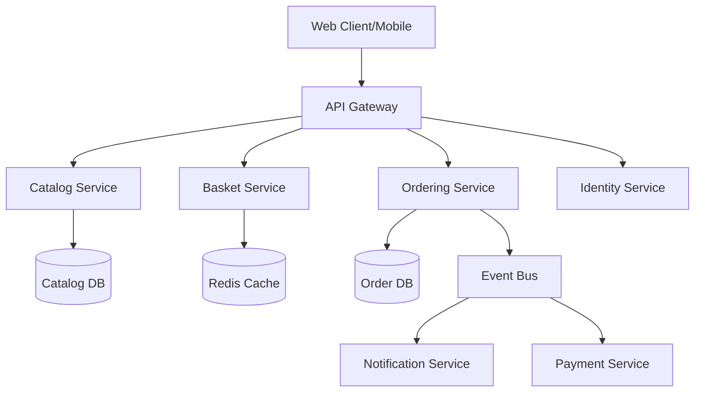

# eShop - .NET Aspire E-Commerce Reference Application

[]()
[](LICENSE)
[]()
[]()

Uma aplicação de referência de e-commerce moderna construída com .NET Aspire, demonstrando as melhores práticas de desenvolvimento de microserviços, observabilidade e arquitetura cloud-native.

## 📋 Índice

- [Visão Geral](#-visão-geral)
- [Arquitetura](#-arquitetura)
- [Tecnologias Utilizadas](#-tecnologias-utilizadas)
- [Pré-requisitos](#-pré-requisitos)
- [Instalação e Execução](#-instalação-e-execução)
- [Estrutura do Projeto](#-estrutura-do-projeto)
- [Microserviços](#-microserviços)
- [Testes](#-testes)
- [Como Contribuir](#-como-contribuir)
- [Código de Conduta](#-código-de-conduta)
- [Licença](#-licença)

## 🎯 Visão Geral

O **eShop** é uma aplicação de e-commerce de referência que demonstra como construir aplicações distribuídas modernas usando .NET Aspire. O projeto implementa um sistema completo de comércio eletrônico com funcionalidades como:

- 🛒 Catálogo de produtos
- 🛍️ Carrinho de compras
- 💳 Processamento de pedidos
- 👤 Gerenciamento de identidade
- 📦 Gerenciamento de estoque
- 🔔 Sistema de notificações
- 📊 Observabilidade e telemetria integradas

### Objetivos do Projeto

- Demonstrar padrões de arquitetura de microserviços com .NET
- Mostrar o uso efetivo do .NET Aspire para orquestração de aplicações distribuídas
- Implementar observabilidade e telemetria de ponta a ponta
- Servir como referência para desenvolvimento cloud-native

## 🏗️ Arquitetura

### Arquitetura de Microserviços



### Princípios Arquiteturais

- **Domain-Driven Design (DDD)**: Cada microserviço possui seu próprio contexto delimitado
- **Event-Driven Architecture**: Comunicação assíncrona entre serviços via mensageria
- **API Gateway Pattern**: Ponto único de entrada para clientes
- **Database per Service**: Cada serviço gerencia seu próprio banco de dados
- **CQRS**: Separação de comandos e consultas onde apropriado
- **Service Discovery**: Descoberta automática de serviços via .NET Aspire

### .NET Aspire

O projeto utiliza .NET Aspire para:

- **Orquestração de Serviços**: Gerenciamento de ciclo de vida de múltiplos microserviços
- **Service Discovery**: Descoberta automática de dependências
- **Observabilidade**: Telemetria, logs e métricas integrados
- **Configuração**: Gerenciamento centralizado de configurações
- **Resiliência**: Implementação de padrões de retry, circuit breaker, etc.

## 🛠️ Tecnologias Utilizadas

### Core Technologies

- **[.NET 8+](https://dotnet.microsoft.com/)** - Framework principal
- **[.NET Aspire](https://learn.microsoft.com/dotnet/aspire/)** - Orquestração e observabilidade
- **[ASP.NET Core](https://docs.microsoft.com/aspnet/core/)** - Framework web
- **[Entity Framework Core](https://docs.microsoft.com/ef/core/)** - ORM

### Infraestrutura

- **[Docker](https://www.docker.com/)** - Containerização
- **[Redis](https://redis.io/)** - Cache distribuído
- **[PostgreSQL](https://www.postgresql.org/)** / **SQL Server** - Bancos de dados
- **[RabbitMQ](https://www.rabbitmq.com/)** - Message broker

### Frontend

- **[Blazor](https://dotnet.microsoft.com/apps/aspnet/web-apps/blazor)** - Framework UI
- **TypeScript** - Tipagem para scripts
- **[Playwright](https://playwright.dev/)** - Testes E2E

### Observabilidade

- **[OpenTelemetry](https://opentelemetry.io/)** - Telemetria distribuída
- **[Prometheus](https://prometheus.io/)** - Métricas
- **[Grafana](https://grafana.com/)** - Visualização

### Qualidade de Código

- **EditorConfig** - Padrões de código
- **Spectral** - Linting de APIs
- **MarkdownLint** - Qualidade de documentação

## 📦 Pré-requisitos

Antes de começar, certifique-se de ter instalado:

### Obrigatórios

- **[.NET 8 SDK](https://dotnet.microsoft.com/download/dotnet/8.0)** ou superior
- **[Docker Desktop](https://www.docker.com/products/docker-desktop/)** (para containers)
- **[Visual Studio 2022](https://visualstudio.microsoft.com/)** (17.9+) ou **[Visual Studio Code](https://code.visualstudio.com/)**
- **[Node.js](https://nodejs.org/)** (18+) - para ferramentas de frontend

### Recomendados

- **[Git](https://git-scm.com/)** - Controle de versão
- **[Azure CLI](https://docs.microsoft.com/cli/azure/)** - Para deployment em Azure (opcional)
- **[Winget](https://github.com/microsoft/winget-cli)** - Gerenciador de pacotes Windows

### Instalação Automática (Windows)

O projeto inclui arquivos de configuração do winget para instalação automática:

```powershell
# Para Visual Studio
winget configure .config/configuration.vs.winget

# Para VS Code
winget configure .config/configuration.vsCode.winget
```

## 🚀 Instalação e Execução

### 1. Clone o Repositório

```bash
git clone https://github.com/Evilazaro/eShop.git
cd eShop
```

### 2. Restaurar Dependências

```bash
dotnet restore
npm install
```

### 3. Executar com .NET Aspire

#### Visual Studio 2022

1. Abra o arquivo `eShop.slnx`
2. Defina o projeto Aspire AppHost como projeto de inicialização
3. Pressione `F5` para executar

#### Visual Studio Code

```bash
dotnet run --project src/eShop.AppHost/eShop.AppHost.csproj
```

#### CLI

```bash
# Executar todos os serviços via Aspire
dotnet run --project src/eShop.AppHost

# Ou executar serviços individuais
dotnet run --project src/Catalog.API
dotnet run --project src/Basket.API
```

### 4. Acessar a Aplicação

Após a inicialização, o .NET Aspire Dashboard estará disponível em:

- **Dashboard**: `http://localhost:15000`
- **Web Application**: `http://localhost:5000`
- **API Gateway**: `http://localhost:5001`

## 📁 Estrutura do Projeto

```
eShop/
├── .aspire/                    # Configurações do .NET Aspire
├── .config/                    # Configurações de ferramentas
├── .github/                    # GitHub Actions e workflows
├── build/                      # Scripts de build e CI/CD
├── e2e/                        # Testes end-to-end (Playwright)
├── src/                        # Código-fonte principal
│   ├── eShop.AppHost/         # Orquestrador Aspire
│   ├── eShop.ServiceDefaults/ # Configurações compartilhadas
│   ├── Catalog.API/           # Microserviço de catálogo
│   ├── Basket.API/            # Microserviço de carrinho
│   ├── Ordering.API/          # Microserviço de pedidos
│   ├── Identity.API/          # Serviço de identidade
│   ├── WebApp/                # Aplicação web frontend
│   └── ...                    # Outros microserviços
├── tests/                      # Testes unitários e integração
├── Directory.Build.props       # Propriedades compartilhadas MSBuild
├── Directory.Build.targets     # Targets compartilhados MSBuild
├── Directory.Packages.props    # Gerenciamento centralizado de pacotes
├── global.json                 # Versão do .NET SDK
├── nuget.config               # Configuração NuGet
└── README.md                  # Esta documentação
```

### Arquivos de Configuração Importantes

- **`Directory.Build.props`** - Propriedades comuns de build
- **`Directory.Packages.props`** - Gerenciamento de versões de pacotes NuGet
- **`global.json`** - Define a versão do .NET SDK
- **`.editorconfig`** - Padrões de codificação
- **`nuget.config`** - Fontes de pacotes NuGet

## 🔧 Microserviços

### Catalog Service
Gerencia o catálogo de produtos, categorias e preços.

**Tecnologias**: ASP.NET Core, Entity Framework Core, PostgreSQL

**Endpoints principais**:
- `GET /api/catalog/items` - Lista produtos
- `GET /api/catalog/items/{id}` - Detalhes do produto
- `POST /api/catalog/items` - Criar produto (Admin)

### Basket Service
Gerencia carrinhos de compras dos usuários.

**Tecnologias**: ASP.NET Core, Redis

**Endpoints principais**:
- `GET /api/basket/{userId}` - Obter carrinho
- `POST /api/basket` - Atualizar carrinho
- `DELETE /api/basket/{userId}` - Limpar carrinho

### Ordering Service
Processa e gerencia pedidos.

**Tecnologias**: ASP.NET Core, Entity Framework Core, SQL Server, Event Bus

**Endpoints principais**:
- `POST /api/orders` - Criar pedido
- `GET /api/orders/{orderId}` - Detalhes do pedido
- `GET /api/orders/user/{userId}` - Histórico de pedidos

### Identity Service
Gerencia autenticação e autorização.

**Tecnologias**: ASP.NET Core Identity, JWT

**Endpoints principais**:
- `POST /api/auth/login` - Autenticação
- `POST /api/auth/register` - Registro
- `POST /api/auth/refresh` - Refresh token

### Web Application
Interface de usuário web construída com Blazor.

**Tecnologias**: Blazor WebAssembly/Server, SignalR

## 🧪 Testes

### Executar Todos os Testes

```bash
dotnet test
```

### Testes Unitários

```bash
dotnet test --filter "Category=Unit"
```

### Testes de Integração

```bash
dotnet test --filter "Category=Integration"
```

### Testes E2E (Playwright)

```bash
# Instalar dependências do Playwright
npx playwright install

# Executar testes E2E
npm test

# Executar com UI
npm run test:ui
```

### Cobertura de Testes

```bash
dotnet test /p:CollectCoverage=true /p:CoverletOutputFormat=opencover
```

## 🤝 Como Contribuir

Agradecemos seu interesse em contribuir! Existem várias formas de ajudar:

### Reportar Bugs

1. Verifique se o bug já foi reportado nas [Issues](https://github.com/Evilazaro/eShop/issues)
2. Abra uma nova issue com:
   - Descrição clara do problema
   - Passos para reproduzir
   - Comportamento esperado vs atual
   - Screenshots (se aplicável)
   - Informações de ambiente (OS, .NET version, etc.)

### Sugerir Melhorias

1. Abra uma issue com a tag `enhancement`
2. Descreva a melhoria proposta e sua motivação
3. Aguarde feedback da comunidade

### Contribuir com Código

1. **Fork** o repositório
2. **Clone** seu fork localmente
   ```bash
   git clone https://github.com/seu-usuario/eShop.git
   ```
3. **Crie uma branch** para sua feature
   ```bash
   git checkout -b feature/minha-feature
   ```
4. **Faça suas alterações** seguindo os padrões do projeto
5. **Commit** suas mudanças
   ```bash
   git commit -m "feat: adiciona nova funcionalidade X"
   ```
6. **Push** para seu fork
   ```bash
   git push origin feature/minha-feature
   ```
7. Abra um **Pull Request** detalhado

### Padrões de Commit

Seguimos o padrão [Conventional Commits](https://www.conventionalcommits.org/):

- `feat:` Nova funcionalidade
- `fix:` Correção de bug
- `docs:` Documentação
- `style:` Formatação
- `refactor:` Refatoração
- `test:` Testes
- `chore:` Manutenção

### Diretrizes de Código

- Siga as convenções do `.editorconfig`
- Mantenha a cobertura de testes acima de 80%
- Documente APIs públicas
- Escreva testes para novas funcionalidades
- Mantenha commits pequenos e focados

Para mais detalhes, consulte [CONTRIBUTING.md](CONTRIBUTING.md).

## 📜 Código de Conduta

Este projeto adota o Contributor Covenant Code of Conduct. Ao participar, você concorda em respeitar este código.

Comportamentos esperados:
- ✅ Ser respeitoso e inclusivo
- ✅ Aceitar críticas construtivas
- ✅ Focar no melhor para a comunidade
- ❌ Assédio ou discriminação de qualquer tipo

Leia o [CODE-OF-CONDUCT.md](CODE-OF-CONDUCT.md) completo para mais informações.

## 📄 Licença

Este projeto está licenciado sob a licença MIT - veja o arquivo [LICENSE](LICENSE) para detalhes.

```
MIT License

Copyright (c) 2024 eShop Contributors

Permission is hereby granted, free of charge, to any person obtaining a copy
of this software and associated documentation files...
```

## 🙏 Agradecimentos

- Equipe .NET por criar o framework Aspire
- Todos os [contribuidores](https://github.com/Evilazaro/eShop/graphs/contributors)
- Comunidade open-source

## 📞 Suporte

- 📧 Email: support@eshop.example.com
- 💬 Discussions: [GitHub Discussions](https://github.com/Evilazaro/eShop/discussions)
- 🐛 Issues: [GitHub Issues](https://github.com/Evilazaro/eShop/issues)
- 📚 Documentação: [Wiki](https://github.com/Evilazaro/eShop/wiki)

## 🗺️ Roadmap

- [ ] Implementar Payment Gateway
- [ ] Adicionar suporte a múltiplas moedas
- [ ] Sistema de avaliações e reviews
- [ ] Recomendações baseadas em IA
- [ ] Aplicativo mobile (MAUI)
- [ ] Suporte a Kubernetes
- [ ] Dashboard administrativo

## 📊 Status do Projeto

- ✅ Arquitetura de microserviços implementada
- ✅ Integração com .NET Aspire
- ✅ Observabilidade completa
- ✅ Testes E2E
- 🚧 Payment Gateway (em desenvolvimento)
- 📋 Mobile App (planejado)

---

**Desenvolvido com ❤️ pela comunidade .NET**

Se este projeto foi útil, considere dar uma ⭐ no GitHub!
