# eShop — .NET Reference Application

[](https://github.com/Evilazaro/eShop/actions)
[](./LICENSE)
[](https://dotnet.microsoft.com/)
[](https://learn.microsoft.com/dotnet/aspire/)

**eShop** is a production-quality, cloud-native e-commerce reference application built on **.NET 10** and **.NET Aspire**. It demonstrates microservices architecture patterns, event-driven communication, multi-platform client development, and Azure-native deployment — all in a single, runnable solution.

The application is composed of independently deployable microservices that communicate via REST, gRPC, and asynchronous message-passing over RabbitMQ. A shared identity service (Duende IdentityServer) secures every API and client using OAuth 2.0 / OpenID Connect. All services are orchestrated locally with .NET Aspire and deployed to Azure Container Apps via `azd`.

This repository serves as an authoritative reference for teams adopting .NET microservices, .NET MAUI cross-platform clients, Blazor Server-Side Rendering, AI-assisted catalog search, and Azure Developer CLI (`azd`) workflows.

> [!NOTE]
> This project is a reference application maintained by the .NET Foundation and contributors. It is intended for learning and demonstration purposes. Review and adapt the code before using it in production.

---

## Table of Contents

1. [Features](#features)
2. [Architecture](#architecture)
3. [Technologies Used](#technologies-used)
4. [Quick Start](#quick-start)
5. [Configuration](#configuration)
6. [Deployment](#deployment)
7. [Usage](#usage)
8. [Contributing](#contributing)
9. [License](#license)

---

## Features

- 🛒 **Full shopping experience** — Browse catalog, add items to basket, place and track orders
- 🔐 **Centralized identity** — OAuth 2.0 / OIDC via Duende IdentityServer with JWT bearer token validation across all services
- ⚡ **Event-driven architecture** — Decoupled service communication using RabbitMQ integration events and the in-process EventBus abstraction
- 🌐 **Blazor web storefront** — Server-Side Rendered (SSR) Blazor with interactive server components
- 📱 **Multi-platform mobile clients** — .NET MAUI native client and .NET MAUI Blazor Hybrid app sharing UI components
- 🔀 **Mobile Backend-for-Frontend** — YARP reverse-proxy routes mobile traffic to appropriate upstream microservices
- 🧠 **Optional AI catalog search** — Semantic vector search via pgvector and optional OpenAI / Azure OpenAI / Ollama integration
- 🪝 **Webhooks** — Subscribe to and receive order-lifecycle webhook notifications
- ☁️ **Azure-ready** — One-command deployment to Azure Container Apps with `azd up`
- 🔭 **Observable by default** — Health checks, distributed tracing, and metrics via .NET Aspire service defaults

---

## Architecture

The diagram below shows the high-level topology and data/control flow between all major system components.

```mermaid
flowchart TB
    %% ── External Clients ──────────────────────────────────────────────────────
    subgraph Clients["Client Applications"]
        direction LR
        WebApp["WebApp\n(Blazor SSR)"]
        ClientApp["ClientApp\n(.NET MAUI)"]
        HybridApp["HybridApp\n(MAUI Blazor Hybrid)"]
    end

    %% ── Reverse Proxy ─────────────────────────────────────────────────────────
    MobileBFF["Mobile BFF\n(YARP Reverse Proxy)"]

    %% ── Core Microservices ────────────────────────────────────────────────────
    subgraph APIs["Core Microservices"]
        direction TB
        IdentityAPI["Identity API\n(Duende IdentityServer)"]
        BasketAPI["Basket API\n(gRPC)"]
        CatalogAPI["Catalog API\n(REST v1/v2)"]
        OrderingAPI["Ordering API\n(REST v1)"]
        WebhooksAPI["Webhooks API\n(REST v1)"]
    end

    %% ── Background Workers ────────────────────────────────────────────────────
    subgraph Workers["Background Workers"]
        direction LR
        OrderProcessor["Order Processor"]
        PaymentProcessor["Payment Processor"]
        WebhookClient["Webhook Client"]
    end

    %% ── Infrastructure ────────────────────────────────────────────────────────
    subgraph Infra["Infrastructure"]
        direction TB
        Redis[("Redis Cache")]
        Postgres[("PostgreSQL + pgvector")]
        RabbitMQ(["RabbitMQ (Event Bus)"])
    end

    %% ── Optional AI ───────────────────────────────────────────────────────────
    AIProvider(["OpenAI / Azure OpenAI / Ollama"])

    %% ── Client → API connections ──────────────────────────────────────────────
    WebApp -->|"HTTP/HTTPS"| BasketAPI
    WebApp -->|"HTTP/HTTPS"| CatalogAPI
    WebApp -->|"HTTP/HTTPS"| OrderingAPI
    ClientApp -->|"HTTP/HTTPS"| MobileBFF
    HybridApp -->|"HTTP/HTTPS"| MobileBFF
    MobileBFF -->|"Proxy: catalog"| CatalogAPI
    MobileBFF -->|"Proxy: orders"| OrderingAPI
    MobileBFF -->|"Proxy: identity"| IdentityAPI

    %% ── Authentication ────────────────────────────────────────────────────────
    WebApp -->|"OIDC login"| IdentityAPI
    ClientApp -->|"OIDC login"| IdentityAPI
    HybridApp -->|"OIDC login"| IdentityAPI
    BasketAPI -.->|"JWT validation"| IdentityAPI
    OrderingAPI -.->|"JWT validation"| IdentityAPI
    WebhooksAPI -.->|"JWT validation"| IdentityAPI

    %% ── API → Data stores ─────────────────────────────────────────────────────
    BasketAPI -->|"Cache"| Redis
    CatalogAPI -->|"SQL"| Postgres
    IdentityAPI -->|"SQL"| Postgres
    OrderingAPI -->|"SQL"| Postgres
    WebhooksAPI -->|"SQL"| Postgres

    %% ── Event Bus (asynchronous) ──────────────────────────────────────────────
    CatalogAPI -.->|"Integration events"| RabbitMQ
    BasketAPI -.->|"Integration events"| RabbitMQ
    OrderingAPI -.->|"Integration events"| RabbitMQ
    WebhooksAPI -.->|"Integration events"| RabbitMQ
    OrderProcessor -.->|"Integration events"| RabbitMQ
    PaymentProcessor -.->|"Integration events"| RabbitMQ

    %% ── Optional AI ───────────────────────────────────────────────────────────
    CatalogAPI -.->|"Semantic search"| AIProvider
    WebApp -.->|"AI features"| AIProvider

    %% ── Style ─────────────────────────────────────────────────────────────────
    classDef client   fill:#4A90D9,stroke:#2C6FAC,color:#fff
    classDef bff      fill:#E74C3C,stroke:#A93226,color:#fff
    classDef api      fill:#27AE60,stroke:#1E8449,color:#fff
    classDef worker   fill:#F39C12,stroke:#B7770D,color:#fff
    classDef infra    fill:#8E44AD,stroke:#6C3483,color:#fff
    classDef ai       fill:#16A085,stroke:#0E6655,color:#fff

    class WebApp,ClientApp,HybridApp client
    class MobileBFF bff
    class IdentityAPI,BasketAPI,CatalogAPI,OrderingAPI,WebhooksAPI api
    class OrderProcessor,PaymentProcessor,WebhookClient worker
    class Redis,Postgres,RabbitMQ infra
    class AIProvider ai
```



### Component Summary

| Component                 | Role                                               | Protocol                  |
| ------------------------- | -------------------------------------------------- | ------------------------- |
| **WebApp**                | Blazor SSR web storefront                          | HTTP/HTTPS, gRPC (basket) |
| **ClientApp**             | .NET MAUI native mobile app                        | HTTP/HTTPS                |
| **HybridApp**             | .NET MAUI Blazor Hybrid app                        | HTTP/HTTPS                |
| **Mobile BFF**            | YARP reverse proxy for mobile clients              | HTTP/HTTPS                |
| **Identity API**          | OAuth 2.0 / OIDC authority (Duende IdentityServer) | HTTP/HTTPS                |
| **Basket API**            | Shopping cart, backed by Redis                     | gRPC                      |
| **Catalog API**           | Product catalog with vector search                 | REST (v1, v2)             |
| **Ordering API**          | Order lifecycle management                         | REST (v1)                 |
| **Order Processor**       | Background order-state machine worker              | —                         |
| **Payment Processor**     | Background payment approval worker                 | —                         |
| **Webhooks API**          | Webhook subscription and dispatch                  | REST (v1)                 |
| **Webhook Client**        | Demo webhook receiver                              | HTTP                      |
| **Redis**                 | Basket cache                                       | —                         |
| **PostgreSQL + pgvector** | Persistent storage for all services                | —                         |
| **RabbitMQ**              | Asynchronous integration event bus                 | AMQP                      |

---

## Technologies Used

### Languages and Frameworks

| Technology   | Version | Purpose                       |
| ------------ | ------- | ----------------------------- |
| C# / .NET    | 10.0    | Primary language and runtime  |
| ASP.NET Core | 10.0    | Web APIs and Blazor SSR       |
| .NET Aspire  | 13.x    | Distributed app orchestration |
| Blazor (SSR) | 10.0    | Web storefront UI             |
| .NET MAUI    | 10.0    | Cross-platform mobile clients |

### Libraries and Tools

| Library                 | Version | Purpose                            |
| ----------------------- | ------- | ---------------------------------- |
| Duende IdentityServer   | 7.x     | OAuth 2.0 / OIDC identity provider |
| Entity Framework Core   | 10.0    | ORM and database migrations        |
| gRPC (Grpc.Net.Client)  | 2.76    | Basket API communication           |
| YARP                    | 13.x    | Reverse proxy / Mobile BFF         |
| RabbitMQ (Aspire)       | 13.x    | Event bus                          |
| Redis (Aspire)          | 13.x    | Basket caching                     |
| PostgreSQL + pgvector   | 10.x    | Relational store + vector search   |
| Asp.Versioning          | 8.x     | API versioning                     |
| Microsoft.Extensions.AI | —       | AI abstraction layer               |

### Infrastructure and Cloud

| Tool                        | Purpose                                               |
| --------------------------- | ----------------------------------------------------- |
| Docker / Docker Desktop     | Local container runtime (Redis, RabbitMQ, PostgreSQL) |
| Azure Container Apps        | Production hosting target                             |
| Azure Developer CLI (`azd`) | End-to-end provisioning and deployment                |
| Azure Bicep                 | Infrastructure-as-code templates                      |

---

## Quick Start

### Prerequisites

| Requirement                   | Minimum Version | Notes                                             |
| ----------------------------- | --------------- | ------------------------------------------------- |
| .NET SDK                      | **10.0.100**    | [Download](https://dotnet.microsoft.com/download) |
| Docker Desktop                | Latest stable   | Required for container dependencies               |
| Visual Studio 2022 or VS Code | 17.x / Latest   | Visual Studio required for MAUI development       |

> [!TIP]
> Run `dotnet --version` to verify your SDK version. The `global.json` file at the repository root pins the exact SDK version required.

### 1. Clone the Repository

```bash
git clone https://github.com/Evilazaro/eShop.git
cd eShop
```

### 2. Restore Dependencies

```bash
dotnet restore eShop.slnx
```

### 3. Run the Application Locally

The .NET Aspire AppHost orchestrates all services, databases, and infrastructure containers:

```bash
dotnet run --project src/eShop.AppHost/eShop.AppHost.csproj
```

The Aspire dashboard opens automatically (default: `https://localhost:15888`). From there you can observe all running services, their logs, traces, and health status.

> [!NOTE]
> On first run, Docker pulls images for Redis, RabbitMQ, and PostgreSQL. This takes a few minutes. Subsequent runs start immediately because containers use a persistent lifetime.

### 4. Open the Web Storefront

Navigate to the URL shown for **webapp** in the Aspire dashboard (typically `https://localhost:5173` or similar). You can log in with the seeded test user credentials shown in the Identity API seed data.

---

## Configuration

All services are configured via `appsettings.json` (and `appsettings.Development.json`) combined with environment variables injected by the AppHost.

### Key Configuration Sections

#### Identity URL

Each API that validates JWT tokens receives the Identity service URL at runtime via the AppHost:

```json
// appsettings.Development.json (example)
{
  "Identity": {
    "Url": "https://localhost:<identity-port>",
    "Audience": "basket"
  }
}
```

> [!IMPORTANT]
> The `Identity__Url` and `Identity__Audience` values are set automatically by the AppHost using .NET Aspire service references. You do not need to set these manually during local development.

#### AI Features (Optional)

AI-powered catalog search is disabled by default. To enable it, edit `src/eShop.AppHost/Program.cs`:

```csharp
// Enable OpenAI (set target to OpenAI or AzureOpenAI)
bool useOpenAI = true;
builder.AddOpenAI(catalogApi, webApp, OpenAITarget.OpenAI);

// — OR — Enable Ollama (local LLM)
bool useOllama = true;
builder.AddOllama(catalogApi, webApp);
```

> [!NOTE]
> When `useOpenAI` is `true`, you must supply a valid API key via user secrets or environment variables. Never commit credentials to the repository.

#### Environment Variables

| Variable                        | Service      | Description                                             |
| ------------------------------- | ------------ | ------------------------------------------------------- |
| `ESHOP_USE_HTTP_ENDPOINTS`      | AppHost      | Set to `1` to force HTTP for all endpoints (used in CI) |
| `Identity__Url`                 | All APIs     | URL of the Identity API                                 |
| `Identity__Audience`            | All APIs     | Expected JWT audience                                   |
| `ConnectionStrings__catalogdb`  | Catalog API  | PostgreSQL connection string                            |
| `ConnectionStrings__orderingdb` | Ordering API | PostgreSQL connection string                            |
| `ConnectionStrings__identitydb` | Identity API | PostgreSQL connection string                            |
| `ConnectionStrings__webhooksdb` | Webhooks API | PostgreSQL connection string                            |

---

## Deployment

eShop deploys to **Azure Container Apps** using the [Azure Developer CLI](https://learn.microsoft.com/azure/developer/azure-developer-cli/).

### Prerequisites

- Azure subscription
- [Azure Developer CLI](https://aka.ms/azd) installed
- [Azure CLI](https://docs.microsoft.com/cli/azure/install-azure-cli) installed and authenticated

### Deploy to Azure

```bash
# Log in to Azure
azd auth login

# Provision infrastructure and deploy all services
azd up
```

`azd up` reads `azure.yaml` and the Bicep templates in `infra/` to:

1. Create a resource group and Azure Container Apps environment
2. Provision PostgreSQL, Redis, RabbitMQ (or Azure equivalents)
3. Build and push all container images to Azure Container Registry
4. Deploy every microservice as a Container App

> [!WARNING]
> Running `azd up` provisions paid Azure resources. Review the `infra/` Bicep templates before deploying to understand the resources that will be created.

### Tear Down

```bash
azd down
```

This removes all provisioned Azure resources.

---

## Usage

### Browsing the Catalog

Open the web storefront URL shown in the Aspire dashboard. The catalog lists products with images, descriptions, and prices. Use the search bar or brand/type filters to narrow results.

### Placing an Order

1. Log in with an existing account (a test user is seeded automatically).
2. Add items to the basket.
3. Proceed to checkout and confirm the order.
4. Track order status updates in real time on the Orders page.

### Using the REST APIs Directly

The Catalog and Ordering APIs expose interactive OpenAPI documentation:

```bash
# Catalog API — OpenAPI UI (URL from Aspire dashboard)
https://localhost:<catalog-port>/swagger

# Ordering API — OpenAPI UI
https://localhost:<ordering-port>/swagger
```

Example — list catalog items via `curl`:

```bash
curl -s "https://localhost:<catalog-port>/api/catalog/items?pageSize=5&pageIndex=0"
```

### Running Tests

```bash
# Unit tests
dotnet test tests/Basket.UnitTests/
dotnet test tests/Ordering.UnitTests/
dotnet test tests/ClientApp.UnitTests/

# Functional tests (requires running AppHost)
dotnet test tests/Catalog.FunctionalTests/
dotnet test tests/Ordering.FunctionalTests/

# End-to-end tests (Playwright)
npx playwright test
```

---

## Contributing

Contributions are welcome! Please read the guidelines before submitting a pull request.

- [CONTRIBUTING.md](./CONTRIBUTING.md) — How to contribute code, report bugs, and propose new features
- [CODE-OF-CONDUCT.md](./CODE-OF-CONDUCT.md) — Community standards and expected behavior

> [!NOTE]
> By contributing to this project, you agree to abide by the [Code of Conduct](./CODE-OF-CONDUCT.md).

### Submitting Issues

- Search [existing issues](https://github.com/Evilazaro/eShop/issues) before creating a new one.
- Provide a minimal reproducible example and the relevant `dotnet --info` output.

### Submitting Pull Requests

1. Fork the repository and create a feature branch.
2. Ensure all tests pass: `dotnet test eShop.slnx`
3. Open a pull request against `main` with a clear description of the change.

---

## License

This project is licensed under the [MIT License](./LICENSE).

Copyright © .NET Foundation and Contributors.
