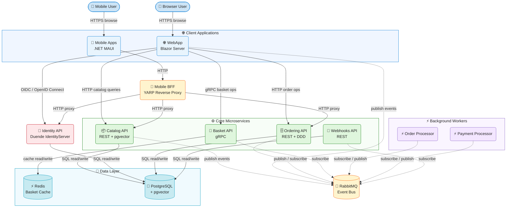

# eShop


**eShop** is a canonical reference sample application for cloud-native microservices built with .NET 10, ASP.NET Core, and .NET Aspire. It demonstrates production-ready patterns for building distributed e-commerce systems including service-to-service communication, event-driven integration, centralized identity, and multi-platform clients.

The application solves the challenge of showing how multiple cooperating microservices are composed into a coherent, deployable system. It provides a fully functional online store — with product browsing, a shopping basket, order management, webhook notifications, and an AI-assisted catalog search — implemented across a set of loosely-coupled services that communicate synchronously over HTTP/gRPC and asynchronously through a RabbitMQ event bus.

The technology stack is anchored on **.NET 10** and **.NET Aspire 13.2**, pairing Blazor Server for the interactive web front-end, .NET MAUI for cross-platform mobile apps, gRPC for the Basket API, PostgreSQL with pgvector for relational storage and vector similarity search, Redis for basket caching, Duende IdentityServer for OAuth2/OpenID Connect, YARP as the mobile Backend for Frontend, and OpenTelemetry for distributed observability — all deployable to **Azure Container Apps** via the Azure Developer CLI.

## Table of Contents

- [Features](#features)
- [Architecture](#architecture)
- [Technologies Used](#technologies-used)
- [Quick Start](#quick-start)
- [Configuration](#configuration)
- [Deployment](#deployment)
- [Usage](#usage)
- [Contributing](#contributing)
- [License](#license)

## Features

| Feature                            | Description                                                                                                                   |
| ---------------------------------- | ----------------------------------------------------------------------------------------------------------------------------- |
| 🌐 **Web Storefront**              | Blazor Server single-page application with interactive product browsing, basket management, and checkout                      |
| 📱 **Cross-Platform Mobile Apps**  | .NET MAUI apps (HybridApp with Blazor components and standalone ClientApp) targeting Android, iOS, macOS, and Windows         |
| 📦 **Product Catalog**             | Versioned REST API backed by PostgreSQL; supports pgvector-based AI semantic product search via Azure OpenAI or Ollama        |
| 🛒 **Shopping Basket**             | gRPC-based service that stores user cart state in Redis with low-latency reads and writes                                     |
| 🗄️ **Order Management**            | Domain-Driven Design order lifecycle with a versioned REST API and transactional EF Core persistence                          |
| 🔐 **Centralized Identity**        | Duende IdentityServer providing OAuth2 and OpenID Connect authentication for all services and clients                         |
| 🔔 **Webhook Notifications**       | Subscription-based webhook delivery system for order status change events                                                     |
| 🚌 **Asynchronous Event Bus**      | RabbitMQ-backed integration event bus for decoupled inter-service communication                                               |
| 🔀 **Mobile Backend for Frontend** | YARP reverse proxy that aggregates and routes requests from mobile clients to the appropriate microservices                   |
| 🤖 **Optional AI Integration**     | Azure OpenAI (`gpt-4.1-mini`, `text-embedding-3-small`) or Ollama integration for catalog search and recommendations          |
| 🔭 **Built-in Observability**      | OpenTelemetry distributed tracing, metrics, and structured logging wired into all services via shared `eShop.ServiceDefaults` |
| 🧪 **Comprehensive Tests**         | MSTest unit tests, Aspire-hosted functional tests (Docker-based), and Playwright end-to-end browser tests                     |

## Architecture

The diagram below shows the runtime topology of the system, actors, and the primary data and control flows.



**Solid arrows (`→`)** indicate synchronous HTTP, gRPC, or SQL calls. **Dashed arrows (`⇢`)** indicate asynchronous integration events published to or consumed from the RabbitMQ event bus.

## Technologies Used

| Technology                                                                                   | Type           | Purpose                                                                 |
| -------------------------------------------------------------------------------------------- | -------------- | ----------------------------------------------------------------------- |
| [.NET 10](https://dotnet.microsoft.com/)                                                     | Runtime        | Application platform for all services and workers                       |
| [ASP.NET Core 10](https://learn.microsoft.com/aspnet/core)                                   | Framework      | Web API hosting, Razor Components, and HTTP pipeline                    |
| [.NET Aspire 13.2](https://learn.microsoft.com/dotnet/aspire)                                | Orchestration  | Local multi-service orchestration, service discovery, and observability |
| [Blazor Server](https://learn.microsoft.com/aspnet/core/blazor)                              | Framework      | Interactive server-side rendered web UI                                 |
| [.NET MAUI](https://learn.microsoft.com/dotnet/maui)                                         | Framework      | Cross-platform native mobile and desktop apps                           |
| [Entity Framework Core 10](https://learn.microsoft.com/ef/core)                              | ORM            | Relational database access and schema migrations                        |
| [gRPC](https://grpc.io/)                                                                     | Protocol       | High-performance internal Basket API communication                      |
| [RabbitMQ](https://www.rabbitmq.com/)                                                        | Message broker | Asynchronous integration event bus                                      |
| [Redis](https://redis.io/)                                                                   | Cache          | Shopping basket distributed cache                                       |
| [PostgreSQL + pgvector](https://github.com/pgvector/pgvector)                                | Database       | Relational data storage with vector similarity search                   |
| [Duende IdentityServer 7](https://duendesoftware.com/products/identityserver)                | Auth server    | OAuth2 and OpenID Connect identity provider                             |
| [YARP](https://microsoft.github.io/reverse-proxy/)                                           | Reverse proxy  | Mobile Backend for Frontend request routing                             |
| [OpenTelemetry](https://opentelemetry.io/)                                                   | Observability  | Distributed tracing, metrics, and structured logging                    |
| [Azure Container Apps](https://learn.microsoft.com/azure/container-apps)                     | Cloud hosting  | Production container deployment target                                  |
| [Azure Developer CLI (azd)](https://learn.microsoft.com/azure/developer/azure-developer-cli) | DevOps tooling | Infrastructure provisioning and application deployment                  |
| [Playwright](https://playwright.dev/)                                                        | Testing        | End-to-end browser test automation                                      |
| [MSTest 4](https://learn.microsoft.com/dotnet/core/testing/unit-testing-mstest-runner-intro) | Testing        | Unit and functional test framework                                      |

## Quick Start

### Prerequisites

| Prerequisite                                                      | Minimum Version | Notes                                                                   |
| ----------------------------------------------------------------- | --------------- | ----------------------------------------------------------------------- |
| [.NET SDK](https://dotnet.microsoft.com/download)                 | 10.0.100        | Exact version is pinned in `global.json`                                |
| [Docker Desktop](https://www.docker.com/products/docker-desktop/) | Latest stable   | Required to run Aspire-managed containers (Redis, RabbitMQ, PostgreSQL) |
| .NET Aspire workload                                              | 13.2            | Install with `dotnet workload install aspire`                           |

### Installation

1. Clone the repository:

```bash
git clone https://github.com/Evilazaro/eShop.git
cd eShop
```

2. Install the .NET Aspire workload:

```bash
dotnet workload install aspire
```

3. Restore all solution dependencies:

```bash
dotnet restore eShop.Web.slnf
```

4. Start all services using the .NET Aspire AppHost:

```bash
dotnet run --project src/eShop.AppHost/eShop.AppHost.csproj
```

5. Open the Aspire dashboard URL printed in the console (default: `http://localhost:15888`). Click the **Online Store** endpoint link to open the web storefront.

> [!NOTE]
> The first run downloads container images for Redis, RabbitMQ, and PostgreSQL. Subsequent starts reuse persistent containers and are significantly faster.

> [!WARNING]
> Docker Desktop must be running before starting the AppHost. If Docker is not available, the container resources (Redis, RabbitMQ, PostgreSQL) will fail to start and the application will not function.

### Minimal Working Example

After the AppHost is running, query the Catalog API directly using the port shown on the Aspire dashboard:

```bash
# Retrieve the first page of catalog items
curl -s "http://localhost:<catalog-api-port>/api/catalog/items?pageIndex=0&pageSize=5"
```

Expected output:

```json
{
  "pageIndex": 0,
  "pageSize": 5,
  "count": 101,
  "data": [
    {
      "id": 1,
      "name": "Adventurer GPS Watch",
      "description": "...",
      "price": 220.0
    }
  ]
}
```

> [!TIP]
> All service endpoint URLs and port numbers are displayed as clickable links on the Aspire dashboard home page. Use the dashboard to find the correct port for each service.

## Configuration

Each service reads configuration from `appsettings.json` and environment variables injected by the Aspire AppHost at startup. In production, the AppHost injects connection strings, identity URLs, and secrets automatically. The table below documents the key settings.

| Option                                | Default            | Description                                                                                 |
| ------------------------------------- | ------------------ | ------------------------------------------------------------------------------------------- |
| `EventBus:SubscriptionClientName`     | Varies per service | Identifies the service queue on the RabbitMQ event bus. Each service defines a unique name. |
| `Identity:Url`                        | Injected by Aspire | Base URL of the Identity API. Set automatically in both local and Azure environments.       |
| `ConnectionStrings:CatalogDB`         | Injected by Aspire | PostgreSQL connection string for the Catalog service database (`catalogdb`).                |
| `ConnectionStrings:Redis`             | Injected by Aspire | Redis connection string used by the Basket API for cart storage.                            |
| `CatalogOptions:UseCustomizationData` | `false`            | Set to `true` to seed the catalog from custom data files instead of the default seed data.  |
| `SessionCookieLifetimeMinutes`        | `60`               | WebApp session cookie duration in minutes.                                                  |
| `TokenLifetimeMinutes`                | `120`              | OAuth2 access token lifetime issued by the Identity API.                                    |
| `EventBus:RetryCount`                 | `10`               | Number of RabbitMQ publish retry attempts before a message is considered failed.            |

### Example Overrides

To enable custom catalog seed data for local development, create or update `src/Catalog.API/appsettings.Development.json`:

```json
{
  "CatalogOptions": {
    "UseCustomizationData": true
  }
}
```

To enable AI-powered product search using Ollama locally, set `useOllama = true` inside `src/eShop.AppHost/Program.cs` before starting the AppHost:

```csharp
bool useOllama = true;
if (useOllama)
{
    builder.AddOllama(catalogApi, webApp);
}
```

> [!IMPORTANT]
> The Identity API is configured with `AddDeveloperSigningCredential()` by default, which is suitable only for development. Replace this with a production key management solution before exposing the application to the internet.

> [!NOTE]
> To use Azure OpenAI instead of Ollama, set `useOpenAI = true` in `src/eShop.AppHost/Program.cs` and set `OpenAITarget` to `OpenAITarget.AzureOpenAI`. Provide your Azure OpenAI endpoint and API key via `azd` environment parameters.

## Deployment

The application deploys to **Azure Container Apps** using the **Azure Developer CLI** (`azd`). The Bicep templates in `infra/` provision all required resources, including Container Apps, a PostgreSQL flexible server, Redis, and a RabbitMQ container.

1. Install the Azure Developer CLI:

```bash
# Windows
winget install microsoft.azd

# macOS
brew tap azure/azd && brew install azd

# Linux
curl -fsSL https://aka.ms/install-azd.sh | bash
```

2. Sign in to Azure:

```bash
azd auth login
```

3. Create a new deployment environment (run once per environment):

```bash
azd env new <environment-name>
```

4. Provision all Azure infrastructure and deploy every service in a single step:

```bash
azd up
```

5. To redeploy application code only without reprovisioning infrastructure:

```bash
azd deploy
```

> [!NOTE]
> `azd up` provisions Azure resources and deploys all container images. The first deployment takes approximately 10–15 minutes. Subsequent deployments reuse existing infrastructure and complete faster.

> [!CAUTION]
> Running `azd down` destroys all provisioned Azure resources and permanently deletes all data. Run this command only when you intend to remove the entire environment.

## Usage

### Browse the Product Catalog

Navigate to the web storefront URL displayed on the Aspire dashboard. The home page renders a grid of featured products.

```text
http://localhost:<webapp-port>/
```

Expected result: The storefront displays catalog items with product names, prices, and images. Select any product to open the product detail page.

### Add an Item to the Shopping Basket

1. Open the web storefront.
2. Select a product from the catalog.
3. Click **Add to shopping bag**.
4. Click the **shopping bag** icon in the navigation bar.

```text
http://localhost:<webapp-port>/basket
```

Expected result: The basket page lists all selected items, their quantities, and the total price.

### Place an Order

1. Click **Sign in** in the navigation bar. Default test credentials are seeded by the Identity API on first run.
2. Add at least one item to the basket.
3. Proceed to checkout and submit the order.

Expected result: The order is created and appears under **My orders**. The `OrderProcessor` and `PaymentProcessor` background workers process the order asynchronously through the RabbitMQ event bus.

### Run End-to-End Tests

End-to-end browser tests run against a live instance of the web storefront using Playwright:

```bash
# Install Node.js dependencies and Playwright browsers
npm install
npx playwright install --with-deps

# Run all end-to-end tests
npx playwright test
```

### Run Unit and Functional Tests

```bash
dotnet test tests/
```

> [!NOTE]
> Functional tests in `tests/` spin up Docker containers automatically using the Aspire test host. Docker Desktop must be running before executing functional tests.

## Contributing

Contributions are welcome. Read [CONTRIBUTING.md](CONTRIBUTING.md) for detailed guidelines covering contribution principles, how to suggest features, and what to expect during code review.

To contribute:

1. Fork the repository and create a feature branch from `main`.
2. Implement your change and include tests where applicable.
3. Open a pull request against the `main` branch with a clear title and description.

For bug reports or feature suggestions, open an issue using the **Issues** tab. Tag issues with `help wanted` or `good first issue` to signal community-friendly tasks.

Please read and follow the [CODE-OF-CONDUCT.md](CODE-OF-CONDUCT.md) to ensure a welcoming environment for all contributors.

## License

This project is licensed under the **MIT License** — copyright .NET Foundation and Contributors. See the [LICENSE](LICENSE) file for the full license text.
