# eShop

   

**eShop** is a cloud-native reference e-commerce application built with .NET 10 and .NET Aspire that demonstrates microservices architecture best practices for ASP.NET Core. It delivers a complete online retail experience—product catalog browsing, AI-powered semantic search, shopping basket management, and multi-step order processing—all wired together through an event-driven integration model.

The application solves the challenge of building maintainable, scalable distributed systems by providing a working reference implementation that spans Blazor Server web frontends, .NET MAUI mobile clients, gRPC and REST APIs, background worker services, and asynchronous messaging. It replaces the older [eShopOnContainers](https://github.com/dotnet-architecture/eShopOnContainers) sample with modern .NET 10 tooling and cloud-native deployment patterns.

The technology stack centers on **ASP.NET Core Blazor Server**, .NET MAUI, Entity Framework Core with PostgreSQL and pgvector for AI-powered semantic search, Redis, RabbitMQ, Duende IdentityServer, YARP, and .NET Aspire for local orchestration—deployable to Azure Container Apps via the Azure Developer CLI (`azd`).

## Table of Contents

- [Features](#features)
- [Architecture](#architecture)
- [Technologies Used](#technologies-used)
- [Quick Start](#quick-start)
- [Configuration](#configuration)
- [Deployment](#deployment)
- [Usage](#usage)
- [Contributing](#contributing)
- [License](#license)

## Features

| Feature              | Description                                                                                                        |
| -------------------- | ------------------------------------------------------------------------------------------------------------------ |
| 🛍️ Product Catalog   | Browse and filter products backed by a REST API with optional AI-powered semantic search using pgvector embeddings |
| 🛒 Shopping Basket   | Add, update, and remove items from a persistent Redis-backed basket managed over gRPC                              |
| 📋 Order Management  | Place and track orders through a full event-driven processing pipeline including validation and payment            |
| 🔐 Identity and Auth | OAuth2/OIDC single sign-on via Duende IdentityServer shared across all frontend and API clients                    |
| 📡 Webhooks          | Subscribe external consumers to order lifecycle events through a versioned webhook API                             |
| 📱 Mobile Clients    | Cross-platform shopping experience via a .NET MAUI native app and a .NET MAUI Blazor Hybrid app                    |
| 🤖 AI Integration    | Optional AI-powered catalog search using embedding generation via Azure OpenAI or a local Ollama model             |
| ☸️ Cloud-Native      | Service orchestration via .NET Aspire locally; single-command deployment to Azure Container Apps with `azd up`     |
| 🔭 Observability     | End-to-end distributed tracing, metrics, and structured logging via OpenTelemetry exported to the Aspire dashboard |
| 🌐 BFF Pattern       | YARP-based Mobile Backend-for-Frontend reverse proxy aggregating catalog and ordering API calls for mobile clients |

## Architecture

The architecture summary below describes the system. **eShop** exposes two actor groups—**Customers** using the Blazor web app and **Mobile Users** using native or hybrid MAUI clients—to a set of independent microservices. The web frontend communicates directly with Catalog, Basket, Ordering, and Webhooks APIs. Mobile clients route through a YARP-based Mobile BFF. All services authenticate through a shared Duende IdentityServer. Catalog, Ordering, and Webhooks APIs publish integration events asynchronously to RabbitMQ; Order Processor and Payment Processor worker services consume those events and apply state transitions. Each API owns its own PostgreSQL database, the Basket API caches data in Redis, and the Catalog API optionally delegates embedding generation to Azure OpenAI or Ollama.

```mermaid
---
config:
  description: "High-level architecture diagram for eShop — a cloud-native .NET microservices e-commerce reference application."
  theme: base
  themeVariables:
    htmlLabels: true
    fontFamily: "-apple-system, BlinkMacSystemFont, \"Segoe UI\", system-ui, \"Apple Color Emoji\", \"Segoe UI Emoji\", sans-serif"
    fontSize: 16
---
flowchart TB

  %% ── Class Definitions ──────────────────────────────────────────────────────
  classDef actor     fill:#0078d4,stroke:#004578,color:#ffffff,font-weight:bold
  classDef service   fill:#292929,stroke:#424242,color:#f5f5f5,font-weight:bold
  classDef gateway   fill:#00b7c3,stroke:#007b82,color:#ffffff,font-weight:bold
  classDef datastore fill:#107c10,stroke:#054b05,color:#ffffff,font-weight:bold
  classDef external  fill:#f7630c,stroke:#a93e00,color:#ffffff,font-weight:bold
  classDef worker    fill:#8764b8,stroke:#4f2b7a,color:#ffffff,font-weight:bold
  classDef identity  fill:#7c3aed,stroke:#4c1d8d,color:#ffffff,font-weight:bold
  classDef messaging fill:#d97706,stroke:#92400e,color:#ffffff,font-weight:bold

  %% ── Actors ──────────────────────────────────────────────────────────────────
  subgraph ACTORS["👥 Actors"]
    CUSTOMER(["👤 Customer"])
    MOBILEUSER(["👤 Mobile User"])
  end

  %% ── Frontend Layer ───────────────────────────────────────────────────────────
  subgraph FRONTEND["🌐 Frontend Layer"]
    WEBAPP("🌐 WebApp<br/>Blazor Server")
    HYBRIDAPP("📄 HybridApp<br/>.NET MAUI Blazor Hybrid")
    CLIENTAPP("🖥️ ClientApp<br/>.NET MAUI")
  end

  %% ── BFF Layer ────────────────────────────────────────────────────────────────
  subgraph BFF["🔀 Mobile Backend-for-Frontend"]
    MOBILEBFF("🔀 Mobile BFF<br/>YARP Reverse Proxy")
  end

  %% ── Identity Layer ───────────────────────────────────────────────────────────
  subgraph IDENTITY_LAYER["🔐 Identity Layer"]
    IDENTITYAPI("🔐 Identity API<br/>Duende IdentityServer")
  end

  %% ── API Layer ────────────────────────────────────────────────────────────────
  subgraph API_LAYER["⚙️ API Layer"]
    CATALOGAPI("📦 Catalog API<br/>REST + pgvector")
    BASKETAPI("🛒 Basket API<br/>gRPC")
    ORDERINGAPI("📋 Ordering API<br/>REST")
    WEBHOOKSAPI("📡 Webhooks API<br/>REST")
  end

  %% ── Messaging Layer ──────────────────────────────────────────────────────────
  subgraph MESSAGING_LAYER["🚌 Messaging Layer"]
    RABBITMQ("🚌 RabbitMQ<br/>Event Bus")
  end

  %% ── Background Workers ───────────────────────────────────────────────────────
  subgraph WORKERS["⚡ Background Workers"]
    ORDERPROCESSOR("⚡ Order Processor<br/>Worker Service")
    PAYMENTPROCESSOR("⚡ Payment Processor<br/>Worker Service")
    WEBHOOKCLIENT("📡 Webhook Client<br/>Consumer Demo")
  end

  %% ── Data Layer ───────────────────────────────────────────────────────────────
  subgraph DATA["🗄️ Data Layer"]
    CATALOGDB[("🐘 Catalog DB<br/>PostgreSQL + pgvector")]
    IDENTITYDB[("🐘 Identity DB<br/>PostgreSQL")]
    ORDERDB[("🐘 Order DB<br/>PostgreSQL")]
    WEBHOOKSDB[("🐘 Webhooks DB<br/>PostgreSQL")]
    REDIS[("⚡ Redis Cache")]
  end

  %% ── External AI — Optional ───────────────────────────────────────────────────
  subgraph EXT_AI["🤖 External AI — Optional"]
    AISERVICE(["🤖 Azure OpenAI / Ollama"])
  end

  %% ── Primary Flows ────────────────────────────────────────────────────────────
  CUSTOMER    -- "HTTPS / Browse Store"          --> WEBAPP
  MOBILEUSER  -- "HTTPS / Mobile Shopping"       --> HYBRIDAPP
  MOBILEUSER  -- "HTTPS / Native Shopping"       --> CLIENTAPP
  HYBRIDAPP   -- "HTTP / API Calls"              --> MOBILEBFF
  CLIENTAPP   -- "HTTP / API Calls"              --> MOBILEBFF
  WEBAPP      -- "OIDC / Authenticate"           --> IDENTITYAPI
  MOBILEBFF   -- "OIDC / Authenticate"           --> IDENTITYAPI
  WEBAPP      -- "REST / Browse Catalog"         --> CATALOGAPI
  WEBAPP      -- "gRPC / Basket Operations"      --> BASKETAPI
  WEBAPP      -- "REST / Place Order"            --> ORDERINGAPI
  WEBAPP      -- "REST / Webhook Subscriptions"  --> WEBHOOKSAPI
  MOBILEBFF   -- "REST / Proxy Catalog"          --> CATALOGAPI
  MOBILEBFF   -- "REST / Proxy Orders"           --> ORDERINGAPI
  CATALOGAPI  -. "AMQP / Publish Events"     .-> RABBITMQ
  ORDERINGAPI -. "AMQP / Publish Events"     .-> RABBITMQ
  WEBHOOKSAPI -. "AMQP / Subscribe Events"   .-> RABBITMQ
  RABBITMQ    -. "AMQP / OrderSubmitted"     .-> ORDERPROCESSOR
  RABBITMQ    -. "AMQP / StockConfirmed"     .-> PAYMENTPROCESSOR
  RABBITMQ    -. "AMQP / Webhook Events"     .-> WEBHOOKCLIENT
  RABBITMQ    -. "AMQP / OrderStatus"        .-> WEBAPP
  CATALOGAPI  -- "SQL / Read-Write"              --> CATALOGDB
  BASKETAPI   -- "Redis / Cache Basket"          --> REDIS
  ORDERINGAPI -- "SQL / Read-Write"              --> ORDERDB
  ORDERPROCESSOR -- "SQL / Update Orders"        --> ORDERDB
  IDENTITYAPI -- "SQL / User Auth Data"          --> IDENTITYDB
  WEBHOOKSAPI -- "SQL / Subscriptions"           --> WEBHOOKSDB
  CATALOGAPI  -. "HTTPS / Generate Embeddings"  .-> AISERVICE

  %% ── Class Assignments ────────────────────────────────────────────────────────
  class CUSTOMER,MOBILEUSER actor
  class WEBAPP,HYBRIDAPP,CLIENTAPP,CATALOGAPI,BASKETAPI,ORDERINGAPI,WEBHOOKSAPI,WEBHOOKCLIENT service
  class MOBILEBFF gateway
  class CATALOGDB,IDENTITYDB,ORDERDB,WEBHOOKSDB,REDIS datastore
  class AISERVICE external
  class ORDERPROCESSOR,PAYMENTPROCESSOR worker
  class IDENTITYAPI identity
  class RABBITMQ messaging

  %% ── Subgraph Styles ──────────────────────────────────────────────────────────
  style ACTORS          fill:#f5f5f5,stroke:#616161,color:#1e3a5f,stroke-width:2px
  style FRONTEND        fill:#f5f5f5,stroke:#616161,color:#1e3a5f,stroke-width:2px
  style BFF             fill:#f5f5f5,stroke:#616161,color:#1e3a5f,stroke-width:2px
  style IDENTITY_LAYER  fill:#f5f5f5,stroke:#616161,color:#1e3a5f,stroke-width:2px
  style API_LAYER       fill:#f5f5f5,stroke:#616161,color:#1e3a5f,stroke-width:2px
  style MESSAGING_LAYER fill:#f5f5f5,stroke:#616161,color:#1e3a5f,stroke-width:2px
  style WORKERS         fill:#f5f5f5,stroke:#616161,color:#1e3a5f,stroke-width:2px
  style DATA            fill:#f5f5f5,stroke:#616161,color:#1e3a5f,stroke-width:2px
  style EXT_AI          fill:#f5f5f5,stroke:#616161,color:#1e3a5f,stroke-width:2px
```



## Technologies Used

| Technology                  | Type                   | Purpose                                                                                                 |
| --------------------------- | ---------------------- | ------------------------------------------------------------------------------------------------------- |
| .NET 10                     | Runtime                | Target framework for all services and worker processes                                                  |
| ASP.NET Core Blazor Server  | Web Framework          | Interactive server-rendered UI for the main online store (`WebApp`)                                     |
| .NET MAUI                   | Mobile Framework       | Cross-platform native client (`ClientApp`) and Blazor Hybrid app (`HybridApp`)                          |
| .NET Aspire 13.2            | Orchestration          | Local multi-service orchestration, health checks, service discovery, and dashboard                      |
| Entity Framework Core 10    | ORM                    | Data access layer for all PostgreSQL-backed services                                                    |
| PostgreSQL + pgvector       | Database               | Persistent storage for catalog, identity, ordering, and webhook data; pgvector enables AI vector search |
| Redis                       | Cache                  | Fast in-memory shopping basket storage accessed via the Basket API                                      |
| RabbitMQ                    | Message Broker         | Asynchronous integration event bus connecting APIs to background workers                                |
| Duende IdentityServer 7     | Identity Provider      | OAuth2/OIDC token issuance and user authentication shared across all clients                            |
| gRPC                        | RPC Protocol           | High-performance communication between WebApp and Basket API                                            |
| YARP                        | Reverse Proxy          | Mobile Backend-for-Frontend routing catalog and ordering calls for MAUI clients                         |
| OpenTelemetry               | Observability          | Distributed tracing, metrics collection, and structured log export                                      |
| Azure OpenAI / Ollama       | AI Service             | Optional embedding generation for AI-powered catalog semantic search                                    |
| Azure Container Apps        | Hosting                | Production deployment target for all containerized services                                             |
| Azure Developer CLI (`azd`) | Deployment Tooling     | Single-command infrastructure provisioning and application deployment                                   |
| Bicep                       | Infrastructure as Code | Azure resource definitions under `infra/`                                                               |
| Playwright                  | End-to-End Testing     | Browser-based integration tests for the web storefront                                                  |

## Quick Start

### Prerequisites

| Prerequisite                                                      | Version           | Notes                                                                                         |
| ----------------------------------------------------------------- | ----------------- | --------------------------------------------------------------------------------------------- |
| [.NET SDK](https://dotnet.microsoft.com/download/dotnet/10.0)     | 10.0.100 or later | Defined in `global.json`; install with `dotnet-install` script or from the .NET download page |
| [Docker Desktop](https://www.docker.com/products/docker-desktop/) | Latest            | Required to start PostgreSQL, Redis, and RabbitMQ containers managed by .NET Aspire           |
| [Node.js](https://nodejs.org/)                                    | 18 or later       | Required only for running end-to-end Playwright tests                                         |

> [!NOTE]
> Docker Desktop must be running before you start the AppHost project. .NET Aspire automatically pulls and starts the required container images on first run.

### Installation

1. Clone the repository:

```bash
git clone https://github.com/Evilazaro/eShop.git
cd eShop
```

2. Restore .NET dependencies:

```bash
dotnet restore eShop.Web.slnf
```

3. Start the application using the .NET Aspire AppHost:

```bash
dotnet run --project src/eShop.AppHost
```

4. Open the .NET Aspire dashboard URL printed in the terminal (typically `http://localhost:15888`) to view all running services, logs, and traces.

5. Open the `WebApp` URL shown in the dashboard (labeled **Online Store**) to browse the store.

### Minimal Working Example

The following example shows how to query the Catalog API directly after the application is running:

```bash
# Retrieve the first page of catalog items (replace PORT with the port shown in the Aspire dashboard)
curl -s http://localhost:{PORT}/api/catalog/items?pageSize=5&pageIndex=0 | jq .
```

Expected output (abbreviated):

```json
{
  "pageIndex": 0,
  "pageSize": 5,
  "count": 101,
  "data": [
    {
      "id": 1,
      "name": ".NET Bot Black Hoodie",
      "price": 19.5,
      "pictureUrl": "http://localhost:{PORT}/api/catalog/items/1/pic"
    }
  ]
}
```

> [!TIP]
> Install the [.NET Aspire workload](https://learn.microsoft.com/dotnet/aspire/fundamentals/setup-tooling) to get full IDE integration and the Aspire project templates: `dotnet workload install aspire`.

## Configuration

All services use ASP.NET Core configuration (environment variables, `appsettings.json`, and user secrets). The table below lists the most important options.

| Option                                 | Default              | Description                                                                                         |
| -------------------------------------- | -------------------- | --------------------------------------------------------------------------------------------------- |
| `ConnectionStrings__EventBus`          | `amqp://localhost`   | AMQP connection string for the RabbitMQ event bus                                                   |
| `EventBus__SubscriptionClientName`     | Service-specific     | Queue name prefix used by each service when subscribing to integration events                       |
| `CatalogOptions__UseCustomizationData` | `false`              | When `true`, the Catalog API seeds products from a custom CSV file instead of the default seed data |
| `SessionCookieLifetimeMinutes`         | `60`                 | WebApp session cookie lifetime in minutes                                                           |
| `ConnectionStrings__OpenAi`            | _(empty)_            | Azure OpenAI connection string; set to enable AI-powered catalog search                             |
| `AZURE_ENV_NAME`                       | _(required for azd)_ | Azure environment name used by the Azure Developer CLI during deployment                            |
| `AZURE_LOCATION`                       | _(required for azd)_ | Azure region for resource provisioning (for example, `eastus`)                                      |

> [!IMPORTANT]
> Never commit secrets such as `ConnectionStrings__OpenAi` or `AZURE_POSTGRES_PASSWORD` to source control. Use [.NET user secrets](https://learn.microsoft.com/aspnet/core/security/app-secrets) locally and Azure Key Vault or environment-variable injection for production.

### Example: enabling AI-powered catalog search

```json
// src/eShop.AppHost/appsettings.json — local override only
{
  "ConnectionStrings": {
    "OpenAi": "Endpoint=https://<your-resource>.openai.azure.com/;Key=<your-key>"
  }
}
```

After adding the connection string, set `useOpenAI = true` in `src/eShop.AppHost/Program.cs` to wire the OpenAI client into the Catalog API and WebApp.

## Deployment

eShop deploys to Azure Container Apps using the Azure Developer CLI and the Bicep templates in `infra/`.

> [!WARNING]
> Running `azd up` creates billable Azure resources including Azure Container Apps, Azure Container Registry, Azure Database for PostgreSQL, Azure Cache for Redis, and Azure Service Bus. Review the Bicep templates in `infra/` before deploying to understand the resources and costs involved.

1. Install the [Azure Developer CLI](https://learn.microsoft.com/azure/developer/azure-developer-cli/install-azd):

```bash
winget install microsoft.azd   # Windows
brew tap azure/azd && brew install azd   # macOS / Linux
```

2. Authenticate with Azure:

```bash
azd auth login
```

3. Initialize the environment (first deployment only):

```bash
azd env new <environment-name>
azd env set AZURE_LOCATION eastus
```

4. Provision infrastructure and deploy all services in one step:

```bash
azd up
```

5. After deployment, retrieve the public URL for the WebApp from the `azd` output and open it in a browser to verify the deployment.

6. To redeploy only the application code without re-provisioning infrastructure:

```bash
azd deploy
```

## Usage

### Browse the catalog

Open the WebApp URL in a browser. The home page displays the product catalog. Use the search bar to perform keyword or AI-powered semantic search (when AI is configured).

### Add items to the basket and place an order

```
1. Click a product to open its detail page.
2. Click "Add to shopping bag" to add the item to the basket.
3. Click the basket icon in the top navigation to review cart contents.
4. Click "Checkout" and sign in when prompted.
5. Confirm the order. The Ordering API creates the order and publishes an
   OrderSubmitted integration event to RabbitMQ.
6. The Order Processor and Payment Processor workers consume the event and
   advance the order through validation and payment stages.
7. The WebApp receives live order status updates via the RabbitMQ event bus
   and displays them on the "My Orders" page.
```

### Query the Ordering API with a bearer token

```bash
# 1. Obtain an access token from Identity API (replace values with your environment URLs)
TOKEN=$(curl -s -X POST https://<identity-api>/connect/token \
  -d "grant_type=client_credentials&client_id=orderingswaggerui&client_secret=secret&scope=orders" \
  | jq -r .access_token)

# 2. List orders for the authenticated user
curl -s -H "Authorization: Bearer $TOKEN" \
  https://<ordering-api>/api/v1/orders | jq .
```

Expected output (abbreviated):

```json
[
  {
    "orderId": 1,
    "date": "2026-04-29T10:00:00Z",
    "status": "paid",
    "total": 59.98
  }
]
```

### Run end-to-end tests

```bash
# Install Playwright browser binaries (first run only)
npx playwright install --with-deps

# Run all e2e tests against a locally running eShop instance
npx playwright test
```

## Contributing

Contributions are welcome! Review the [CONTRIBUTING.md](CONTRIBUTING.md) guide before submitting a pull request.

- **Report bugs or request features** by [opening an issue](https://github.com/Evilazaro/eShop/issues) with a clear title, description, and reproduction steps.
- **Submit a pull request** by forking the repository, creating a branch from `main`, making your changes, and opening a PR that references the related issue.
- **Good first issues** are labeled [`good first issue`](https://github.com/Evilazaro/eShop/issues?q=is%3Aissue+label%3A%22good+first+issue%22) — a great place to start.
- **Large architectural changes** require a prior discussion in an issue; include a rationale and, where relevant, benchmark or metric data.

> [!NOTE]
> All contributors are expected to follow the project's [CODE-OF-CONDUCT.md](CODE-OF-CONDUCT.md). Respectful and constructive collaboration keeps eShop a welcoming community for everyone.

## License

This project is licensed under the **MIT License**. See the [LICENSE](LICENSE) file for the full license text.
