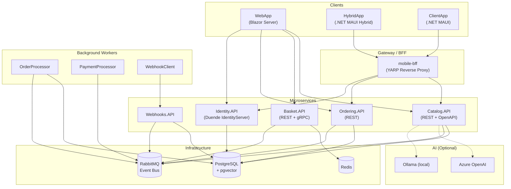

# eShop — Cloud-Native Microservices Reference Application

[](https://github.com/Evilazaro/eShop/actions)
[](LICENSE)
[](https://dotnet.microsoft.com)
[](https://learn.microsoft.com/dotnet/aspire)
[](https://azure.microsoft.com/products/container-apps)

**eShop** is a production-quality, cloud-native e-commerce reference application built on **.NET 10** and **.NET Aspire**. It demonstrates modern microservices architecture patterns including event-driven communication, distributed caching, identity federation, API versioning, and AI-powered catalog search — all orchestrated locally or deployed to Azure Container Apps with a single command.

This repository serves as the canonical example of how to build, operate, and scale a polyglot microservices system on the .NET platform. It covers the full application lifecycle: local development with Aspire, automated CI builds, and cloud deployment via the Azure Developer CLI (`azd`). It also ships a cross-platform client for iOS, Android, and Windows built with .NET MAUI.

---

## Table of Contents

- [Features](#features)
- [Architecture](#architecture)
- [Technologies Used](#technologies-used)
- [Quick Start](#quick-start)
- [Configuration](#configuration)
- [Deployment](#deployment)
- [Usage](#usage)
- [Contributing](#contributing)
- [License](#license)

---

## Features

> **Key highlights** are **bold** below.

- **Microservices architecture** — independent, deployable services communicating over HTTP/gRPC and async events
- **Blazor Server web storefront** — interactive product catalog, cart, and order management
- **.NET MAUI cross-platform clients** — native mobile (iOS/Android/Windows) and hybrid (WebView) apps sharing business logic
- **Event-driven integration** — loose coupling via RabbitMQ-backed event bus with the transactional outbox pattern
- **Distributed basket caching** — Redis-backed shopping cart with sub-millisecond read performance
- **Federated identity** — Duende IdentityServer issuing JWT tokens; all services validate via OpenID Connect/JWT Bearer
- **AI-powered catalog search** — optional pgvector semantic similarity search with Azure OpenAI or Ollama embeddings
- **API versioning & OpenAPI** — versioned REST APIs with auto-generated OpenAPI 3.x documentation
- **Observability** — structured logging, distributed tracing (OTLP), and metrics via OpenTelemetry
- **Webhook system** — external system notifications through a dedicated webhook service and client
- **Mobile BFF** — YARP reverse proxy aggregating catalog and ordering APIs for mobile clients
- **Playwright E2E tests** — automated browser tests for key user journeys
- **One-command local orchestration** — `.NET Aspire AppHost` starts all services, databases, and message broker in containers

---

## Architecture

The application is composed of loosely coupled microservices. The diagram below shows the main services, their dependencies, and communication paths.



### Communication Patterns

| Pattern                     | Used By                                    |
| --------------------------- | ------------------------------------------ |
| **REST / HTTP**             | WebApp → APIs, Mobile BFF → APIs           |
| **gRPC**                    | Basket.API internal service calls          |
| **Async events (RabbitMQ)** | All services for integration events        |
| **JWT Bearer**              | All APIs validate tokens from Identity.API |

---

## Technologies Used

| Category            | Technology                     | Version |
| ------------------- | ------------------------------ | ------- |
| **Platform**        | .NET                           | 10.0    |
| **Orchestration**   | .NET Aspire                    | 13.x    |
| **Web UI**          | ASP.NET Core Blazor Server     | 10.0    |
| **Mobile / Hybrid** | .NET MAUI                      | 10.0    |
| **Identity**        | Duende IdentityServer          | 7.x     |
| **Database**        | PostgreSQL + pgvector          | latest  |
| **ORM**             | Entity Framework Core (Npgsql) | 10.0    |
| **Cache**           | Redis (StackExchange.Redis)    | latest  |
| **Message Bus**     | RabbitMQ                       | latest  |
| **API Gateway**     | YARP                           | 2.x     |
| **gRPC**            | Grpc.Net                       | 2.76    |
| **Observability**   | OpenTelemetry (OTLP)           | 1.15    |
| **API Versioning**  | Asp.Versioning                 | 8.x     |
| **OpenAPI**         | Microsoft.AspNetCore.OpenApi   | 10.0    |
| **AI (optional)**   | Azure OpenAI / Ollama          | —       |
| **Testing**         | MSTest + Playwright            | 4.x     |
| **Deployment**      | Azure Container Apps via `azd` | —       |

---

## Quick Start

### Prerequisites

| Tool                            | Version   | Install                                                                                                                                |
| ------------------------------- | --------- | -------------------------------------------------------------------------------------------------------------------------------------- |
| **.NET SDK**                    | 10.0.100+ | [dotnet.microsoft.com](https://dotnet.microsoft.com/download)                                                                          |
| **Docker Desktop**              | latest    | [docker.com](https://www.docker.com/products/docker-desktop)                                                                           |
| **Azure Developer CLI** (`azd`) | latest    | [learn.microsoft.com/azure/developer/azure-developer-cli](https://learn.microsoft.com/azure/developer/azure-developer-cli/install-azd) |

### Run Locally

**1. Clone the repository**

```bash
git clone https://github.com/Evilazaro/eShop.git
cd eShop
```

**2. Start all services with .NET Aspire**

```bash
dotnet run --project src/eShop.AppHost/eShop.AppHost.csproj
```

Aspire will automatically pull and start Docker containers for PostgreSQL, Redis, and RabbitMQ, then launch all microservices. The **Aspire Dashboard** opens at `https://localhost:15888` and the **online store** at `https://localhost:5000` (or the URL shown in the dashboard).

**3. Build only (no run)**

```bash
dotnet build eShop.Web.slnf
```

**4. Run E2E tests**

```bash
npx playwright test
```

---

## Configuration

All service configuration is managed via `appsettings.json` / `appsettings.Development.json` files in each service project. The Aspire AppHost injects connection strings and endpoint URLs at startup — **no manual configuration is required for local development**.

### Key Settings

| Setting                       | Location                                  | Description                              |
| ----------------------------- | ----------------------------------------- | ---------------------------------------- |
| `Identity__Url`               | Environment variable (injected by Aspire) | URL of the Identity.API issuer           |
| `ConnectionStrings:catalogdb` | Injected by Aspire                        | PostgreSQL connection string for Catalog |
| `ConnectionStrings:OpenAi`    | `src/eShop.AppHost/appsettings.json`      | Azure OpenAI endpoint + key (optional)   |

### Enable AI Catalog Search

To enable AI-powered semantic search, edit `src/eShop.AppHost/Program.cs` and set:

```csharp
bool useOpenAI = true;  // Use Azure OpenAI
// or
bool useOllama = true;  // Use local Ollama
```

Then add your Azure OpenAI connection string in `src/eShop.AppHost/appsettings.json`:

```json
{
  "ConnectionStrings": {
    "OpenAi": "Endpoint=https://<your-resource>.openai.azure.com/;Key=<your-key>"
  }
}
```

---

## Deployment

eShop deploys to **Azure Container Apps** using the Azure Developer CLI.

### Prerequisites

- Azure subscription
- `azd` CLI installed and logged in (`azd auth login`)

### Deploy

```bash
# Provision infrastructure and deploy all services
azd up
```

`azd` uses `azure.yaml` and the Bicep templates in `infra/` to provision:

- Azure Container Apps Environment
- Azure Container Registry
- Azure Database for PostgreSQL Flexible Server
- Azure Cache for Redis
- Azure Service Bus (RabbitMQ replacement in Azure)

### Teardown

```bash
azd down
```

---

## Usage

Once running (locally or in Azure), the application exposes the following endpoints:

| Service              | Endpoint                  | Description                           |
| -------------------- | ------------------------- | ------------------------------------- |
| **Online Store**     | `https://localhost:5000`  | Blazor Server web storefront          |
| **Aspire Dashboard** | `https://localhost:15888` | Service health, logs, traces          |
| **Identity API**     | `https://localhost:5243`  | OpenID Connect / token endpoint       |
| **Catalog API**      | `https://localhost:5222`  | Product catalog REST API + Swagger UI |
| **Basket API**       | `https://localhost:5221`  | Shopping basket REST/gRPC API         |
| **Ordering API**     | `https://localhost:5224`  | Order management REST API             |
| **Webhooks API**     | `https://localhost:5227`  | Webhook registration and delivery     |

> Ports are assigned dynamically by Aspire in development. Check the **Aspire Dashboard** for actual URLs.

### Default Credentials

The Identity seed creates the following test user:

| Field    | Value               |
| -------- | ------------------- |
| Email    | `alice@example.com` |
| Password | `Pass123$`          |

---

## Contributing

Contributions are welcome! Please read [CONTRIBUTING.md](CONTRIBUTING.md) and [CODE-OF-CONDUCT.md](CODE-OF-CONDUCT.md) before submitting a pull request.

1. Fork the repository
2. Create a feature branch: `git checkout -b feature/my-feature`
3. Commit your changes following the existing code style
4. Push and open a pull request against `main`

The CI pipeline (Azure DevOps, `ci.yml`) runs on every PR and validates the full `eShop.Web.slnf` solution build.

---

## License

This project is licensed under the **MIT License** — see [LICENSE](LICENSE) for details.

Copyright © .NET Foundation and Contributors
