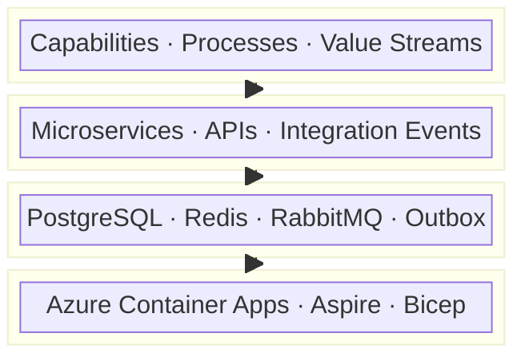

# eShop Architecture Documentation

This folder contains the TOGAF 10-aligned architecture documentation for the **eShop** reference application — a cloud-native, microservices-based digital commerce platform built on .NET 10 and .NET Aspire 13.x, deployed to Azure Container Apps.

## Contents

| Document                                                | Description                                                                                                                                                    |
| ------------------------------------------------------- | -------------------------------------------------------------------------------------------------------------------------------------------------------------- |
| [Business Architecture](business-architecture.md)       | Six commerce capabilities, value streams, business processes, and domain events. **67 components** · Maturity Level 2.                                         |
| [Application Architecture](application-architecture.md) | Microservice inventory, service contracts (gRPC/OpenAPI), integration patterns, and AI semantic search. **48 components** · Maturity Level 4 — Measured.       |
| [Data Architecture](data-architecture.md)               | Polyglot persistence (PostgreSQL, Redis, RabbitMQ), DDD aggregate models, outbox pattern, and data governance. **74 components** · Maturity Level 3 — Defined. |
| [Technology Architecture](technology-architecture.md)   | Azure Container Apps deployment, .NET Aspire orchestration, Bicep IaC, security posture, and observability. **46 components** · Average confidence 0.97.       |

## Architecture at a Glance

## Key Design Decisions

- **Database-per-Service** — `catalogdb`, `identitydb`, `orderingdb`, and `webhooksdb` are provisioned as separate PostgreSQL instances; cross-domain access is performed exclusively through integration events or synchronous API calls.
- **Event-Driven Integration** — All cross-service communication uses a RabbitMQ-backed event bus with a transactional outbox (`IntegrationEventLogEF`) for at-least-once delivery guarantees.
- **AI-Powered Search** — The Catalog service stores 384-dimensional `pgvector` embeddings on `CatalogItem`, enabling semantic product search via Azure OpenAI or Ollama.
- **Infrastructure as Code** — Two-layer IaC: Bicep (`infra/`) for Azure PaaS scaffolding and ACA YAML templates (`src/eShop.AppHost/infra/`) per container, deployed with `azd`.
- **Zero-Trust Security** — External HTTPS ingress enforces `allowInsecure: false`; a User-Assigned Managed Identity handles ACR image pull; secrets are stored in the ACA secret store.

## Framework & Standards

| Concern                | Standard / Tool                            |
| ---------------------- | ------------------------------------------ |
| Architecture framework | TOGAF 10                                   |
| Orchestration          | .NET Aspire 13.1.0                         |
| Deployment target      | Azure Container Apps (Consumption profile) |
| Observability          | OpenTelemetry → OTLP → Aspire Dashboard    |
| IaC language           | Bicep + `azd`                              |
| Service contracts      | gRPC (protobuf) · OpenAPI/Scalar (REST)    |

## Related Documentation

- [Business Architecture](../../README.md) — Repository root with setup and quickstart instructions.
- [`infra/`](../../infra/) — Bicep templates for Azure infrastructure provisioning.
- [`src/eShop.AppHost/`](../../src/eShop.AppHost/) — .NET Aspire host that wires all services together for local development and ACA deployment.
