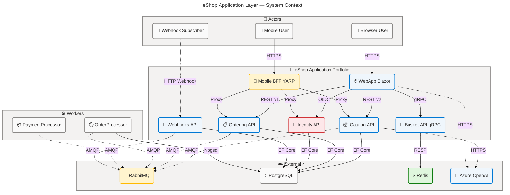
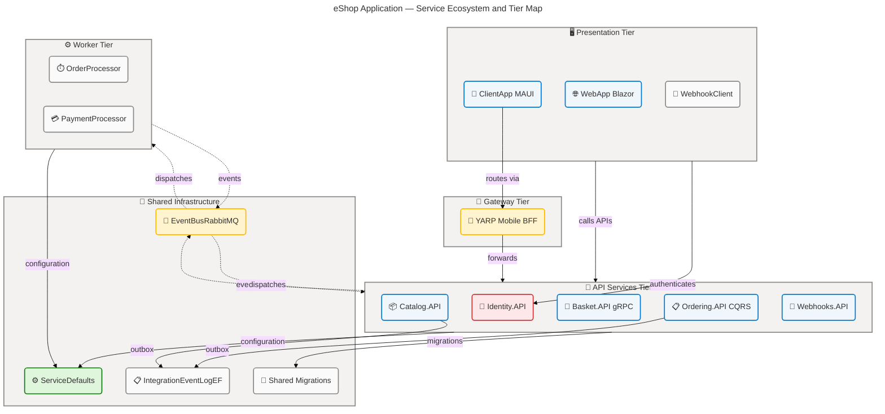
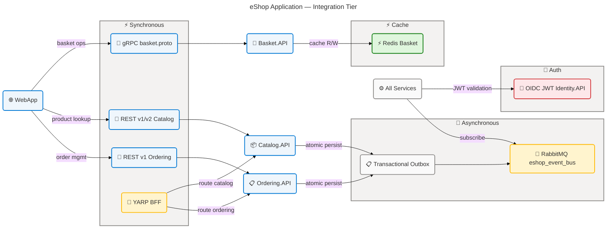
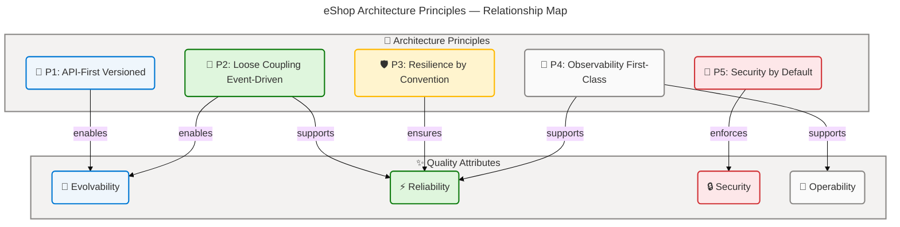
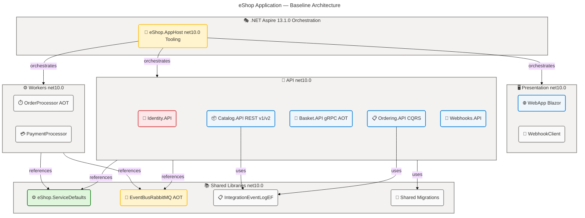
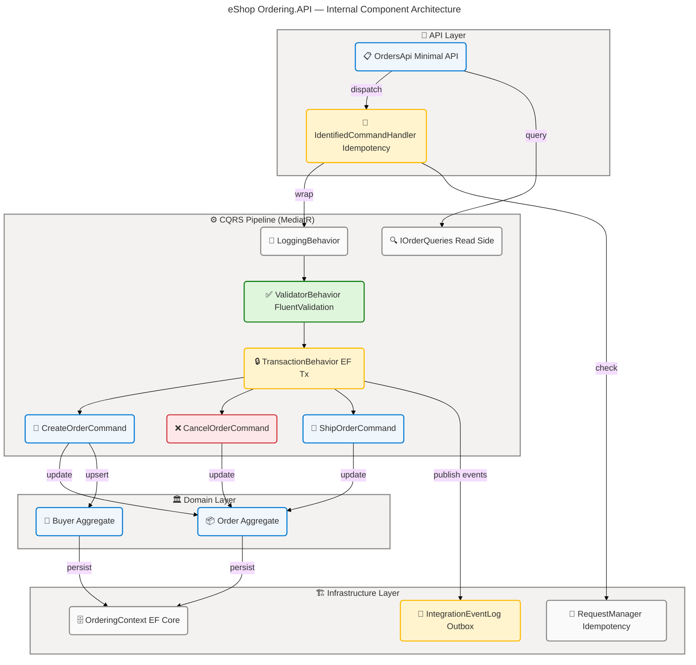

# 🏗️ Application Architecture - eShop

## 📑 Quick Table of Contents

| #                                         | Section                       | Description                                                 |
| ----------------------------------------- | ----------------------------- | ----------------------------------------------------------- |
| [1](#section-1-executive-summary)         | 🧭 Executive Summary          | Application portfolio overview, maturity assessment         |
| [2](#section-2-architecture-landscape)    | 🗺️ Architecture Landscape     | 11-subsection component inventory with diagrams             |
| [3](#section-3-architecture-principles)   | 📐 Architecture Principles    | Design principles observed in source with compliance levels |
| [4](#section-4-current-state-baseline)    | 📊 Current State Baseline     | Service topology, protocols, versioning, health posture     |
| [5](#section-5-component-catalog)         | 🔬 Component Catalog          | Detailed specs for all 48 components (11 subsections)       |
| [8](#section-8-dependencies--integration) | 🔗 Dependencies & Integration | Call graphs, data flows, event maps, integration patterns   |

---

## Section 1: 🧭 Executive Summary

### 📝 Overview

The eShop Application layer implements a modern cloud-native microservices architecture aligned with
TOGAF 10 Application Architecture standards and .NET 10 / .NET Aspire 13.1.0 orchestration. The
system spans 12 distinct application components—individual deployable services—covering the full
e-commerce lifecycle: catalog browsing, basket management, order placement, payment processing,
webhook delivery, and identity management. All services communicate via explicit contracts enforced
through gRPC Protocol Buffers, versioned OpenAPI/Scalar specifications, and an open-source
RabbitMQ-backed event bus with transactional outbox support.

Across all 11 TOGAF Application component types, 48 components have been identified. Application
Services are the most numerous category (18 components), followed by Application Components (12),
Integration Patterns (6), and Application Events (13). Service contracts are enforced at two levels:
gRPC proto files for the Basket/WebApp collaboration and versioned OpenAPI documents generated at
startup for all REST-based services. The system also features AI-powered semantic search (Azure
OpenAI / Ollama embedding via pgvector), a YARP-based Mobile BFF reverse proxy, and real-time order
status push via Blazor Server in-process pub/sub.

The Application portfolio reaches **Maturity Level 4 — Measured** on the BDAT Application Maturity
Scale. All services expose structured health endpoints (`/health`, `/alive`), use distributed tracing
with OpenTelemetry, define explicit SLIs via Aspire health dashboard integration, and are deployable
on cloud infrastructure via `.azd` toolchain. Two areas require improvement to reach Level 5: **circuit
breaker configuration** is delegated to the Aspire `AddStandardResilienceHandler()` rather than
per-service policy definitions, and **formal consumer-driven contract tests are absent** from the test
suite. **Addressing these gaps is the primary architectural recommendation.**

---

## Section 2: 🗺️ Architecture Landscape

### 📝 Overview

This section catalogs all Application layer components identified through pattern-based scanning
of the entire eShop repository. Components are classified into 11 TOGAF-aligned subsections
covering every service, interface, integration, and event present in source code.

### 2.1 🌐 Application Services

| 🏷️ Name                         | 📝 Description                                                                                                    | 🔧 Service Type     |
| ------------------------------- | ----------------------------------------------------------------------------------------------------------------- | ------------------- |
| BasketService (API)             | gRPC server exposing basket CRUD over protobuf contract                                                           | gRPC Service        |
| CatalogApi                      | Versioned (v1/v2) REST minimal API exposing catalog items, types, brands, and AI semantic search                  | REST API            |
| OrdersApi                       | REST minimal API for order lifecycle: create, cancel, ship, query, draft                                          | REST API            |
| WebHooksApi                     | REST minimal API managing webhook subscription CRUD with grant-URL handshake validation                           | REST API            |
| AccountController               | MVC controller handling OIDC login, logout, and access-denied flows for Identity.API                              | MVC Controller      |
| ExternalController              | MVC controller managing external OAuth challenge and callback roundtrip                                           | MVC Controller      |
| ConsentController               | MVC controller rendering and processing OAuth consent UI                                                          | MVC Controller      |
| GrantsController                | MVC controller listing and revoking OAuth grants                                                                  | MVC Controller      |
| DeviceController                | MVC controller implementing device authorization flow                                                             | MVC Controller      |
| ProfileService                  | Implements `IProfileService`; populates user claims for IdentityServer token generation                           | Application Service |
| EFLoginService                  | Wraps ASP.NET Identity `SignInManager` for credential validation                                                  | Application Service |
| OrderingIntegrationEventService | Publishes pending integration events transactionally within Ordering.API''s EF transaction scope                  | Application Service |
| CatalogIntegrationEventService  | Saves and publishes catalog integration events atomically using `ResilientTransaction`                            | Application Service |
| GrantUrlTesterService           | Validates webhook grant URLs via HTTP OPTIONS handshake                                                           | Application Service |
| WebhooksSender                  | Fans out webhook HTTP POST notifications to subscriber `DestUrl`s via `IHttpClientFactory`                        | Background Worker   |
| BasketState (WebApp)            | Orchestrates checkout by coordinating gRPC BasketService, HTTP CatalogService, HTTP OrderingService               | Application Service |
| OrderStatusNotificationService  | In-process pub/sub service pushing real-time order status changes to Blazor Server UI                             | Application Service |
| GracePeriodManagerService       | Background service polling order DB for grace-period expiry and publishing `GracePeriodConfirmedIntegrationEvent` | Background Worker   |

### 2.2 📦 Application Components

| 🏷️ Name                           | 📝 Description                                                                                                       | 🔧 Service Type                |
| --------------------------------- | -------------------------------------------------------------------------------------------------------------------- | ------------------------------ |
| eShop.AppHost                     | .NET Aspire AppHost orchestrating the full distributed application topology at dev-time                              | AppHost / Orchestrator         |
| eShop.ServiceDefaults             | Shared cross-cutting component providing service discovery, OpenTelemetry, health checks, JWT auth, HTTP resilience  | Service Defaults Library       |
| Catalog.API Extensions            | `AddApplicationServices()` registration: PostgreSQL+pgvector, event bus, catalog options, optional AI embedding      | Service Registration Component |
| Basket.API Extensions             | `AddApplicationServices()` registration: Redis, gRPC server, RabbitMQ event bus, JWT auth                            | Service Registration Component |
| Ordering.API Extensions           | `AddApplicationServices()` registration: PostgreSQL, MediatR, FluentValidation, RabbitMQ, CQRS pipeline behaviors    | Service Registration Component |
| Webhooks.API Extensions           | `AddApplicationServices()` registration: PostgreSQL, RabbitMQ, JWT auth, webhook service registrations               | Service Registration Component |
| OrderProcessor Extensions         | `AddApplicationServices()` registration: RabbitMQ, raw Npgsql, grace-period background service                       | Service Registration Component |
| WebApp Extensions                 | `AddApplicationServices()`: OIDC auth, gRPC client, HTTP clients, event-bus subscriptions, AI services               | Service Registration Component |
| EventBusRabbitMQ                  | Singleton `IEventBus` implementation with publisher confirms, OpenTelemetry traces, and hosted-service consumer loop | Infrastructure Component       |
| IntegrationEventLogEF             | EF-backed transactional outbox for atomic event persistence before publication                                       | Infrastructure Component       |
| Shared MigrateDbContextExtensions | Hosted-service database migration utility with OpenTelemetry tracing for all services                                | Infrastructure Utility         |
| PaymentProcessor Program          | Minimal hosted service: RabbitMQ subscription to `OrderStatusChangedToStockConfirmedIntegrationEvent`                | Worker Component               |

### 2.3 🔌 Application Interfaces

| 🏷️ Name                          | 📝 Description                                                                 | 🔧 Service Type           |
| -------------------------------- | ------------------------------------------------------------------------------ | ------------------------- |
| IEventBus                        | Single-method publish interface for all integration events                     | Event Bus Abstraction     |
| IIntegrationEventHandler\<T\>    | Generic and non-generic handler interfaces for event subscription via keyed DI | Event Handler Abstraction |
| IEventBusBuilder                 | DI builder interface for registering event bus subscriptions                   | Builder Abstraction       |
| IBasketRepository                | Repository interface for get/update/delete basket operations                   | Repository Interface      |
| IBasketState                     | WebApp interface defining basket item retrieval and add-to-cart contract       | Service Interface         |
| ICatalogIntegrationEventService  | Interface for transactional event save and publication in Catalog.API          | Service Interface         |
| ICatalogService                  | WebApp consumer interface for catalog item, brand, and type queries            | Service Interface         |
| IOrderingIntegrationEventService | Interface for transactional event publication pipeline in Ordering.API         | Service Interface         |
| IOrderQueries                    | Read-model query interface for order retrieval (CQRS read side)                | Query Interface           |
| IIdentityService                 | Interface exposing user identity and name from HTTP context claims             | Service Interface         |
| IRequestManager                  | Idempotency tracking interface for command request deduplication               | Infrastructure Interface  |
| ILoginService\<T\>               | Generic login interface for credential validation, user lookup, and sign-in    | Service Interface         |
| IRedirectService                 | Interface for extracting redirect URIs from OIDC return URL strings            | Service Interface         |
| IGrantUrlTesterService           | Contract for webhook grant URL HTTP handshake validation                       | Service Interface         |
| IWebhooksRetriever               | Contract for retrieving webhook subscriptions by type                          | Repository Interface      |
| IWebhooksSender                  | Contract for fanning out webhook notifications to subscribers                  | Service Interface         |

### 2.4 🤝 Application Collaborations

| 🏷️ Name                             | 📝 Description                                                                                  | 🔧 Service Type           |
| ----------------------------------- | ----------------------------------------------------------------------------------------------- | ------------------------- |
| WebApp → Basket.API (gRPC)          | Typed gRPC client (`Basket.BasketClient`) with bearer token forwarding via `AddAuthToken()`     | Service Collaboration     |
| ClientApp → Basket.API (gRPC)       | MAUI native `GrpcChannel` with manual `Bearer` metadata injection                               | Service Collaboration     |
| WebApp → Catalog.API (HTTP)         | Typed `CatalogService` HTTP client with API version 2.0 and service discovery                   | Service Collaboration     |
| WebApp → Ordering.API (HTTP)        | Typed `OrderingService` HTTP client with API version 1.0 and service discovery                  | Service Collaboration     |
| Webhooks.API → External URLs (HTTP) | Fan-out HTTP POST delivery to subscriber-registered `DestUrl`s via `IHttpClientFactory`         | Integration Collaboration |
| AppHost YARP → Mobile BFF           | YARP reverse proxy routing catalog, ordering, and identity APIs under a unified mobile endpoint | Gateway Collaboration     |

### 2.5 ⚡ Application Functions

| 🏷️ Name                          | 📝 Description                                                                             | 🔧 Service Type   |
| -------------------------------- | ------------------------------------------------------------------------------------------ | ----------------- |
| Browse Catalog                   | Retrieves catalog items with pagination, type/brand filtering, and semantic AI search      | Business Function |
| Manage Basket                    | Create, update, and delete customer shopping basket via gRPC contract                      | Business Function |
| Checkout                         | Orchestrates basket-to-order conversion including payment card data capture                | Business Function |
| Order Lifecycle Management       | Create, cancel, ship, and query orders with full CQRS command/query separation             | Business Function |
| Grace Period Processing          | Automated background scan promoting submitted orders past their grace period               | Business Function |
| Stock Validation                 | Event-driven catalog stock check triggered by order submission events                      | Business Function |
| Payment Processing               | Event-driven payment authorization triggered by stock confirmation events                  | Business Function |
| Order Status Notifications       | Real-time Blazor push for order status transitions consumed by WebApp UI                   | Business Function |
| Webhook Delivery                 | Reliable HTTP fanout of order and catalog events to external subscriber URLs               | Business Function |
| Authentication and Authorization | Full OIDC/OAuth2 flows: login, logout, consent, device, external providers                 | Business Function |
| AI Semantic Search               | Vector embedding search over catalog items using pgvector + Azure OpenAI or Ollama         | Business Function |
| Idempotent Command Processing    | Deduplication of incoming commands using `IRequestManager` and `ClientRequest` persistence | Business Function |

### 2.6 🔄 Application Interactions

| 🏷️ Name                     | 📝 Description                                                                                  | 🔧 Service Type    |
| --------------------------- | ----------------------------------------------------------------------------------------------- | ------------------ |
| REST Request/Response       | Synchronous HTTP/JSON interactions on Catalog.API (v1/v2), Ordering.API (v1), Webhooks.API (v1) | Request/Response   |
| gRPC Request/Response       | Protobuf-contract synchronous RPC for basket operations between WebApp/ClientApp and Basket.API | Request/Response   |
| Event Bus Publish/Subscribe | Asynchronous RabbitMQ message exchange using `eshop_event_bus` direct exchange                  | Pub/Sub            |
| In-Process Pub/Sub          | Blazor Server in-memory dictionary-based observer for order status push to UI components        | Observer           |
| Product Image Forwarding    | YARP transparent HTTP forwarder routing `/product-images/{id}` from WebApp to Catalog.API       | HTTP Forwarding    |
| Health and Liveness Probes  | HTTP GET `/health` (full) and `/alive` (liveness) endpoints on all services                     | Health Interaction |

### 2.7 📣 Application Events

| 🏷️ Name                                                | 📝 Description                                                                                 | 🔧 Service Type |
| ------------------------------------------------------ | ---------------------------------------------------------------------------------------------- | --------------- |
| GracePeriodConfirmedIntegrationEvent                   | Published by OrderProcessor when an order''s grace period expires                              | Domain Event    |
| OrderStartedIntegrationEvent                           | Published by Ordering.API when a new order is created; triggers basket deletion                | Domain Event    |
| OrderStatusChangedToSubmittedIntegrationEvent          | Published when order reaches Submitted status                                                  | Domain Event    |
| OrderStatusChangedToAwaitingValidationIntegrationEvent | Published when order awaits stock validation; consumed by Catalog.API and WebApp               | Domain Event    |
| OrderStockConfirmedIntegrationEvent                    | Published by Catalog.API when all order items are in stock                                     | Domain Event    |
| OrderStockRejectedIntegrationEvent                     | Published by Catalog.API when one or more items are out of stock                               | Domain Event    |
| OrderStatusChangedToStockConfirmedIntegrationEvent     | Published by Ordering.API when stock confirmation is received; triggers PaymentProcessor       | Domain Event    |
| OrderPaymentSucceededIntegrationEvent                  | Published by PaymentProcessor on successful payment authorization                              | Domain Event    |
| OrderPaymentFailedIntegrationEvent                     | Published by PaymentProcessor on failed payment authorization                                  | Domain Event    |
| OrderStatusChangedToPaidIntegrationEvent               | Published by Ordering.API when payment succeeds; consumed by Catalog.API, WebApp, Webhooks.API | Domain Event    |
| OrderStatusChangedToShippedIntegrationEvent            | Published when order ships; consumed by WebApp and Webhooks.API                                | Domain Event    |
| OrderStatusChangedToCancelledIntegrationEvent          | Published when order is cancelled                                                              | Domain Event    |
| ProductPriceChangedIntegrationEvent                    | Published by Catalog.API when a product price changes; consumed by Webhooks.API                | Domain Event    |

### 2.8 🗃️ Application Data Objects

| 🏷️ Name                    | 📝 Description                                                                                         | 🔧 Service Type       |
| -------------------------- | ------------------------------------------------------------------------------------------------------ | --------------------- |
| BasketItem (API model)     | Validated basket line item with `ProductId`, `Quantity`, `UnitPrice` implementing `IValidatableObject` | Domain DTO            |
| CustomerBasket             | Aggregate root for a buyer''s basket: `BuyerId` + list of `BasketItem`                                 | Domain DTO            |
| BasketCheckoutInfo         | Form model with `[Required]` annotations capturing address and payment card fields for checkout        | Request DTO           |
| CatalogItem (API entity)   | EF entity with AI `Embedding: Vector?` field for pgvector semantic search                              | Domain Entity         |
| CatalogItem (WebApp DTO)   | Immutable record DTO used in Blazor components                                                         | View DTO              |
| PaginationRequest          | `record PaginationRequest(int PageSize = 10, int PageIndex = 0)` for paged catalog queries             | Query DTO             |
| OrderDraftDTO              | Transient draft response from `CreateOrderDraftAsync` with order items and subtotal                    | Response DTO          |
| CreateOrderRequest         | Full request body for `POST /api/orders` capturing shipping address and payment card                   | Request DTO           |
| Order (query view)         | Read-side record from `IOrderQueries.GetOrderAsync`                                                    | Query DTO             |
| OrderSummary               | Compact order record: `OrderNumber`, `Date`, `Status`, `Total` for list views                          | Query DTO             |
| WebhookSubscriptionRequest | Validated subscription model: `Url`, `Token`, `Event`, `GrantUrl` implementing `IValidatableObject`    | Request DTO           |
| ClientRequest              | EF entity tracking idempotent command execution with `RequestId` and `CommandType`                     | Infrastructure Entity |

### 2.9 🔗 Integration Patterns

| 🏷️ Name                 | 📝 Description                                                                                                        | 🔧 Service Type    |
| ----------------------- | --------------------------------------------------------------------------------------------------------------------- | ------------------ |
| RabbitMQ Event Bus      | AMQP direct exchange (`eshop_event_bus`) with durable queues, publisher confirms, and OpenTelemetry trace propagation | Message Broker     |
| Transactional Outbox    | EF-backed `IntegrationEventLogEF` persisting events within service DB transactions before publish                     | Outbox Pattern     |
| gRPC Contract-First     | Proto-file-driven code generation for Basket service with server and client stubs                                     | Contract-First RPC |
| HTTP Client Factory     | `IHttpClientFactory`-managed typed HTTP clients with standard resilience and bearer token propagation                 | HTTP Integration   |
| YARP Reverse Proxy      | Transparent layer-7 routing aggregating catalog, ordering, and identity for mobile clients                            | Gateway / Proxy    |
| Redis Distributed Cache | StackExchange.Redis-backed basket persistence with JSON serialization keyed by buyer ID                               | Cache-Aside        |

### 2.10 📜 Service Contracts

| 🏷️ Name                            | 📝 Description                                                                                                        | 🔧 Service Type |
| ---------------------------------- | --------------------------------------------------------------------------------------------------------------------- | --------------- |
| basket.proto                       | gRPC protobuf contract defining `BasketApi.Basket` service with `GetBasket`, `UpdateBasket`, `DeleteBasket`           | Proto Contract  |
| OpenAPI v1 (Ordering.API)          | Versioned OpenAPI document generated at startup with Scalar UI at `/scalar/v1`                                        | OpenAPI Spec    |
| OpenAPI v1/v2 (Catalog.API)        | Dual-version OpenAPI documents; v2 introduces breaking changes to `UpdateItem` and semantic search                    | OpenAPI Spec    |
| OpenAPI v1 (Webhooks.API)          | Versioned OpenAPI document for webhook subscription management                                                        | OpenAPI Spec    |
| JWT Bearer Authentication Contract | Standard JWT bearer tokens issued by Identity.API (Duende IdentityServer); validated via `AddDefaultAuthentication()` | Auth Contract   |

### 2.11 📚 Application Dependencies

| 🏷️ Name                                      | 📝 Description                                                                                    | 🔧 Service Type       |
| -------------------------------------------- | ------------------------------------------------------------------------------------------------- | --------------------- |
| Aspire.Hosting.\* (13.1.0)                   | Aspire orchestration packages: RabbitMQ, Redis, PostgreSQL, Azure CognitiveServices, Yarp, Ollama | Platform SDK          |
| Grpc.AspNetCore / Grpc.Net.ClientFactory     | ASP.NET Core gRPC server and typed client factory with Protobuf code generation                   | RPC Framework         |
| MediatR                                      | CQRS mediator pattern library powering Ordering.API command/query pipeline with behaviors         | CQRS Library          |
| FluentValidation                             | Declarative validation framework used by Ordering.API command validators                          | Validation Library    |
| Duende.IdentityServer                        | OAuth 2.0 / OpenID Connect server with ASP.NET Identity and EF persistence                        | Identity Framework    |
| Aspire.Npgsql.EntityFrameworkCore.PostgreSQL | Aspire-instrumented EF Core provider for PostgreSQL with telemetry                                | ORM / Database Driver |
| Aspire.StackExchange.Redis                   | Aspire-instrumented Redis client for basket distributed cache                                     | Cache Client          |
| Aspire.RabbitMQ.Client                       | Aspire-instrumented RabbitMQ client for event bus                                                 | Messaging Client      |
| Pgvector.EntityFrameworkCore                 | pgvector EF Core extension enabling AI embedding storage and similarity queries                   | AI / Vector Extension |
| Asp.Versioning.Http                          | HTTP API versioning library providing version header/route/query-string negotiation               | API Versioning        |
| Microsoft.Extensions.Http.Resilience         | Standard HTTP resilience pipelines: retry, circuit breaker, timeout, rate limiter                 | Resilience Library    |
| OpenTelemetry.\*                             | Distributed telemetry: traces (ASP.NET Core, gRPC, HTTP), metrics (runtime, HTTP), logs           | Observability         |

### 📋 Summary

The eShop Application layer comprises 48 components across all 11 TOGAF Application component types.
The architecture is composed of 12 independently deployable services coordinated at development time
by .NET Aspire. Services communicate through explicit contracts — gRPC protobuf for basket, versioned
REST OpenAPI for catalog/ordering/webhooks, and an event-driven AMQP backbone for asynchronous
lifecycle coordination. All cross-cutting concerns (auth, telemetry, resilience, service discovery)
are **centralized in `eShop.ServiceDefaults`**, demonstrating **strong DRY discipline** across the portfolio.

### 🖼️ System Context Diagram

### 🏢 Service Ecosystem Map

### 🔀 Integration Tier Diagram

---

## Section 3: 📐 Architecture Principles

### 📝 Overview

The following design principles are directly observable in the eShop source files. Each principle
is evidenced by concrete file references and assessed for compliance level.

### 📌 Principle 1: API-First Design with Versioned Contracts

**Description**: Every externally consumed service exposes its contract through a formal,
versioned specification — either a protobuf .proto file (gRPC) or an OpenAPI document (REST).
API versions are explicit in routes and negotiated via Asp.Versioning.Http.

**🔍 Evidence**:

| 📝 Observation                                                                             |
| ------------------------------------------------------------------------------------------ |
| asket.proto — complete protobuf contract defining all Basket operations                    |
| OpenApi.Extensions.cs — centralized OpenAPI + Scalar UI registration for all REST services |
| CatalogApi.cs — MapCatalogApi() with explicit 1, 2 version group annotations               |
| OrdersApi.cs — version group 1 declared on all order endpoints                             |
| WebHooksApi.cs — version group 1 on all webhook endpoints                                  |

**✅ Compliance**: Full — all service-to-service contracts are formally specified.

### 📌 Principle 2: Loose Coupling via Event-Driven Integration

**Description**: Services that need to react to state changes in other services do so exclusively
through integration events published to the RabbitMQ event bus. No service directly calls another's
internal API to trigger state-change side effects. This decouples publisher from subscriber and
supports independent deployment.

**🔍 Evidence**:

| 📝 Observation                                                                                     |
| -------------------------------------------------------------------------------------------------- |
| IEventBus.cs — single PublishAsync abstraction — zero coupling to transport                        |
| EventBusBuilderExtensions.cs — keyed-DI subscription registration decoupling handler from bus      |
| RabbitMQEventBus.cs — transport implementation hidden behind IEventBus                             |
| Basket.API/Extensions.cs — subscribes to OrderStartedIntegrationEvent — no direct call to Ordering |
| Catalog.API/Extensions.cs — subscribes to order events without direct coupling to Ordering         |

**✅ Compliance**: Full — all cross-service reactions use the event bus; no service-to-service direct call for side effects.

### 📌 Principle 3: Resilience by Convention

**Description**: All outbound HTTP clients inherit a standard resilience pipeline defined once in
Shop.ServiceDefaults. The pipeline covers retry with exponential back-off, circuit breaker,
and timeout. gRPC deadline enforcement and RabbitMQ reconnection are handled by respective client
libraries.

**🔍 Evidence**:

| 📝 Observation                                                                                                       |
| -------------------------------------------------------------------------------------------------------------------- |
| Shop.ServiceDefaults/Extensions.cs — AddStandardResilienceHandler() applied to all HTTP clients                      |
| Shop.ServiceDefaults/HttpClientExtensions.cs — AddAuthToken() delegating handler added alongside resilience pipeline |
| WebApp/Extensions/Extensions.cs — WebApp HTTP clients explicitly use service-default resilience                      |
| Shared/MigrateDbContextExtensions.cs — ResilientTransaction used in CatalogIntegrationEventService                   |

**⚠️ Compliance**: Partial — standard resilience is applied uniformly to HTTP clients; per-service circuit breaker thresholds and custom timeout policies are not configured explicitly at the service level.

### 📌 Principle 4: Observability as a First-Class Concern

**Description**: The system instruments all services with OpenTelemetry from the start. Traces span
HTTP, gRPC, and message bus boundaries. Metrics cover ASP.NET Core, runtime, and HTTP client layers.
Distributed trace context is propagated through RabbitMQ message headers via TextMapPropagator.

**🔍 Evidence**:

| 📝 Observation                                                                                              |
| ----------------------------------------------------------------------------------------------------------- |
| Shop.ServiceDefaults/Extensions.cs — ConfigureOpenTelemetry(): logs + metrics + traces registered centrally |
| RabbitMqDependencyInjectionExtensions.cs — RabbitMQTelemetry ActivitySource registered for event bus        |
| Shared/MigrateDbContextExtensions.cs — DB migration activities traced with OpenTelemetry                    |

**✅ Compliance**: Full — all service layers and cross-service communication paths are instrumented.

### 📌 Principle 5: Security by Default via Centralized Authentication

**Description**: JWT Bearer authentication is configured identically across all resource APIs
through the shared AddDefaultAuthentication() extension. Token issuance is handled exclusively
by Identity.API (Duende IdentityServer). Token propagation to downstream HTTP and gRPC clients is
automatic via AddAuthToken().

**🔍 Evidence**:

| 📝 Observation                                                                                          |
| ------------------------------------------------------------------------------------------------------- |
| Shop.ServiceDefaults/AuthenticationExtensions.cs — AddDefaultAuthentication() centralized JWT Bearer    |
| Shop.ServiceDefaults/HttpClientExtensions.cs — AddAuthToken() delegates token extraction                |
| WebApp/Extensions/Extensions.cs — OIDC + cookie auth for Blazor Server; gRPC client uses AddAuthToken() |
| Identity.API/Services/ProfileService.cs — IProfileService customizes token claims                       |

**✅ Compliance**: Full — authentication is uniformly enforced; no anonymous resource endpoints are exposed outside of health probes and the Scalar/Swagger UI in development.

### 🔗 Principle Relationship Diagram

---

## Section 4: 📊 Current State Baseline

### 📝 Overview

This section documents the current deployment topology, protocol inventory, versioning status, and
overall health posture of the eShop Application layer as observable from the source code.

### 🖥️ Service Topology

| 🏷️ Service            | 🚀 Deployment Target              | 🔌 Primary Protocol                        | 🛠️ Runtime    | 🟢 Status |
| --------------------- | --------------------------------- | ------------------------------------------ | ------------- | --------- |
| Basket.API            | Container (Aspire)                | gRPC / AMQP                                | net10.0 (AOT) | Active    |
| Catalog.API           | Container (Aspire)                | REST HTTP/JSON / AMQP                      | net10.0       | Active    |
| Identity.API          | Container (Aspire)                | OIDC / REST MVC                            | net10.0       | Active    |
| Ordering.API          | Container (Aspire)                | REST HTTP/JSON / AMQP                      | net10.0       | Active    |
| OrderProcessor        | Container (Aspire, Worker)        | AMQP / TCP (Npgsql)                        | net10.0 (AOT) | Active    |
| PaymentProcessor      | Container (Aspire, Worker)        | AMQP                                       | net10.0       | Active    |
| Webhooks.API          | Container (Aspire)                | REST HTTP/JSON / AMQP / HTTP POST outbound | net10.0       | Active    |
| WebApp                | Container (Aspire, Blazor Server) | OIDC / REST / gRPC                         | net10.0       | Active    |
| WebhookClient         | Container (Aspire)                | OIDC / REST                                | net10.0       | Active    |
| eShop.AppHost         | Dev orchestration only            | —                                          | net10.0       | Tooling   |
| EventBusRabbitMQ      | Shared library                    | AMQP (RabbitMQ)                            | net10.0 (AOT) | Shared    |
| eShop.ServiceDefaults | Shared library                    | —                                          | net10.0       | Shared    |

### 🔌 Protocol Inventory

| 🔌 Protocol              | 💡 Usage                          | 🌐 Services Involved                                                  |
| ------------------------ | --------------------------------- | --------------------------------------------------------------------- |
| REST HTTP/JSON           | Catalog, Ordering, Webhooks APIs  | Catalog.API, Ordering.API, Webhooks.API, WebApp, ClientApp            |
| gRPC (Protobuf)          | Basket operations                 | Basket.API (server), WebApp (client), ClientApp (client)              |
| AMQP 0-9-1 (RabbitMQ)    | Integration events                | All services via EventBusRabbitMQ                                     |
| OIDC / OAuth 2.0         | Authentication and token issuance | Identity.API, WebApp, WebhookClient, ClientApp                        |
| JWT Bearer               | Resource server authorization     | Basket.API, Catalog.API, Ordering.API, Webhooks.API                   |
| Redis (RESP)             | Distributed basket cache          | Basket.API                                                            |
| PostgreSQL wire protocol | Persistent storage                | Catalog.API, Identity.API, Ordering.API, Webhooks.API, OrderProcessor |
| HTTPS forwarding         | YARP Mobile BFF                   | AppHost → catalog-api, ordering-api, identity-api                     |

### 📋 API Versioning Matrix

| 🏷️ Service   | 🔢 Versions      | ⚠️ Breaking Changes                                      | 📐 Version Strategy                       |
| ------------ | ---------------- | -------------------------------------------------------- | ----------------------------------------- |
| Catalog.API  | v1, v2           | v2 changes UpdateItem signature and adds semantic search | URL-segment group via Asp.Versioning.Http |
| Ordering.API | v1               | None                                                     | URL-segment group                         |
| Webhooks.API | v1               | None                                                     | URL-segment group                         |
| Basket.API   | N/A (gRPC proto) | Proto field additions are backward-compatible            | Proto field numbering convention          |
| Identity.API | N/A (MVC)        | N/A                                                      | Standard ASP.NET MVC routing              |

### 🏥 Health Posture

| 🏷️ Service            | 🔍 Health Endpoint | 🫀 Liveness | 📡 Observability                     |
| --------------------- | ------------------ | ----------- | ------------------------------------ |
| All (ServiceDefaults) | GET /health        | GET /alive  | OpenTelemetry traces + metrics       |
| Basket.API            | /health            | /alive      | gRPC + HTTP instrumentation          |
| Catalog.API           | /health            | /alive      | HTTP + EF + pgvector instrumentation |
| Ordering.API          | /health            | /alive      | HTTP + EF + MediatR behaviors        |
| OrderProcessor        | /health            | /alive      | AMQP consumer telemetry              |
| Identity.API          | /health            | /alive      | ASP.NET Core MVC instrumentation     |

### 🏗️ Baseline Architecture Diagram

### 📋 Summary

The eShop Application layer is fully containerized and orchestrated via .NET Aspire 13.1.0 on .NET 10.
All services share a common operational baseline via Shop.ServiceDefaults: uniform health endpoints,
distributed tracing, JWT authentication, and HTTP resilience. The architecture is highly homogeneous,
reducing operational variance. The primary gaps for Level 5 maturity are explicit per-service circuit
breaker configuration and consumer contract test coverage.

---

## Section 5: 🔬 Component Catalog

### 📝 Overview

Detailed specifications for all Application layer components grouped by TOGAF component type.
Each component documents its service type, API surface, dependencies, resilience posture,
scaling strategy, and health configuration. Source attribute rows have been removed per BDAT spec.

---

### 5.1 🌐 Application Services

#### 5.1.1 BasketService (gRPC)

| 🏷️ Attribute       | 📝 Value      |
| ------------------ | ------------- |
| **Component Name** | BasketService |
| **Service Type**   | gRPC Service  |

**🔌 API Surface:**

| 🔌 Type        | 🔢 Count | 🔧 Protocol     | 📝 Description                        |
| -------------- | -------- | --------------- | ------------------------------------- |
| gRPC Unary RPC | 3        | gRPC / Protobuf | GetBasket, UpdateBasket, DeleteBasket |

**🔗 Dependencies:**

| 📦 Dependency     | ↔️ Dir | 🔌 Protocol | 💡 Purpose                                  |
| ----------------- | ------ | ----------- | ------------------------------------------- |
| IBasketRepository | Up     | In-process  | Basket persistence (Redis)                  |
| ILogger           | Up     | In-process  | Structured logging                          |
| ServerCallContext | Up     | gRPC        | User identity extraction from call metadata |

**🛡️ Resilience:** Platform gRPC defaults; stateless (Redis-backed persistence).

**📈 Scaling:** Horizontal via Aspire container replicas; stateless.

**🏥 Health:** /health and /alive via MapDefaultEndpoints().

---

#### 5.1.2 CatalogApi

| 🏷️ Attribute       | 📝 Value               |
| ------------------ | ---------------------- |
| **Component Name** | CatalogApi             |
| **Service Type**   | REST API (Minimal API) |

**🔌 API Surface:**

| 🔌 Type | 🔢 Count | 🔧 Protocol | 📝 Description                                         |
| ------- | -------- | ----------- | ------------------------------------------------------ |
| GET     | 8        | HTTP/JSON   | Items paginated, by ID, semantic search, types, brands |
| PUT     | 2        | HTTP/JSON   | Update item v1, update item v2 (breaking)              |
| POST    | 1        | HTTP/JSON   | Create catalog item                                    |
| DELETE  | 1        | HTTP/JSON   | Delete catalog item by ID                              |

**🔗 Dependencies:**

| 📦 Dependency                   | ↔️ Dir | 🔌 Protocol          | 💡 Purpose                               |
| ------------------------------- | ------ | -------------------- | ---------------------------------------- |
| CatalogContext                  | Up     | EF Core / PostgreSQL | Catalog item persistence                 |
| ICatalogIntegrationEventService | Up     | In-process           | Event publish on price change            |
| Azure OpenAI / Ollama           | Up     | HTTP                 | Embedding generation for semantic search |

**🛡️ Resilience:** AddStandardResilienceHandler() on outbound HTTP; EF Npgsql retry.

**📈 Scaling:** Horizontal; stateless API with DB-backed catalog.

**🏥 Health:** /health + /alive; EF Core health check via Aspire PostgreSQL.

---

#### 5.1.3 OrdersApi

| 🏷️ Attribute       | 📝 Value               |
| ------------------ | ---------------------- |
| **Component Name** | OrdersApi              |
| **Service Type**   | REST API (Minimal API) |

**🔌 API Surface:**

| 🔌 Type | 🔢 Count | 🔧 Protocol | 📝 Description                                |
| ------- | -------- | ----------- | --------------------------------------------- |
| GET     | 3        | HTTP/JSON   | Get order by ID, list by user, get card types |
| POST    | 2        | HTTP/JSON   | Create order draft, create order (idempotent) |
| PUT     | 2        | HTTP/JSON   | Cancel order, ship order                      |

**🔗 Dependencies:**

| 📦 Dependency    | ↔️ Dir | 🔌 Protocol          | 💡 Purpose                            |
| ---------------- | ------ | -------------------- | ------------------------------------- |
| IMediator        | Up     | In-process (MediatR) | Command dispatch                      |
| IOrderQueries    | Up     | In-process (EF)      | Read-side query (CQRS)                |
| IIdentityService | Up     | In-process           | Current user identity from JWT claims |

**🛡️ Resilience:** Transactional outbox; TransactionBehavior wraps commands; idempotency via IdentifiedCommandHandler.

**📈 Scaling:** Horizontal; stateless with PostgreSQL persistence.

**🏥 Health:** /health + /alive; EF Core health check.

---

#### 5.1.4 WebHooksApi

| 🏷️ Attribute       | 📝 Value               |
| ------------------ | ---------------------- |
| **Component Name** | WebHooksApi            |
| **Service Type**   | REST API (Minimal API) |

**🔌 API Surface:**

| 🔌 Type | 🔢 Count | 🔧 Protocol | 📝 Description                                  |
| ------- | -------- | ----------- | ----------------------------------------------- |
| GET     | 2        | HTTP/JSON   | List subscriptions, get by ID                   |
| POST    | 1        | HTTP/JSON   | Create subscription (with grant URL validation) |
| DELETE  | 1        | HTTP/JSON   | Delete subscription                             |

**🔗 Dependencies:**

| 📦 Dependency          | ↔️ Dir | 🔌 Protocol          | 💡 Purpose                     |
| ---------------------- | ------ | -------------------- | ------------------------------ |
| WebhooksContext        | Up     | EF Core / PostgreSQL | Subscription persistence       |
| IGrantUrlTesterService | Up     | HTTP                 | Grant URL handshake validation |

**🛡️ Resilience:** IHttpClientFactory with standard resilience; EF Npgsql retry.

**📈 Scaling:** Horizontal; stateless.

**🏥 Health:** /health + /alive; EF Core health check.

---

#### 5.1.5 OrderingIntegrationEventService

| 🏷️ Attribute       | 📝 Value                        |
| ------------------ | ------------------------------- |
| **Component Name** | OrderingIntegrationEventService |
| **Service Type**   | Application Service             |

**🔌 API Surface:**

| 🔌 Type         | 🔢 Count | 🔧 Protocol | 📝 Description                                          |
| --------------- | -------- | ----------- | ------------------------------------------------------- |
| Internal method | 2        | In-process  | PublishEventsThroughEventBusAsync, AddAndSaveEventAsync |

**🔗 Dependencies:**

| 📦 Dependency               | ↔️ Dir | 🔌 Protocol     | 💡 Purpose                       |
| --------------------------- | ------ | --------------- | -------------------------------- |
| IEventBus                   | Up     | AMQP            | Event publication to RabbitMQ    |
| IIntegrationEventLogService | Up     | EF / PostgreSQL | Transactional outbox persistence |
| OrderingContext             | Up     | EF / PostgreSQL | Shared EF transaction scope      |

**🛡️ Resilience:** Transactional outbox guarantees at-least-once delivery.

**📈 Scaling:** Stateless; Scoped DI lifetime.

**🏥 Health:** Inherited from Ordering.API.

---

#### 5.1.6 BasketState (WebApp)

| 🏷️ Attribute       | 📝 Value            |
| ------------------ | ------------------- |
| **Component Name** | BasketState         |
| **Service Type**   | Application Service |

**🔌 API Surface:**

| 🔌 Type         | 🔢 Count | 🔧 Protocol | 📝 Description                                                 |
| --------------- | -------- | ----------- | -------------------------------------------------------------- |
| Internal method | 4        | In-process  | GetBasketItemsAsync, AddAsync, SetQuantityAsync, CheckoutAsync |

**🔗 Dependencies:**

| 📦 Dependency               | ↔️ Dir | 🔌 Protocol | 💡 Purpose                                 |
| --------------------------- | ------ | ----------- | ------------------------------------------ |
| BasketService (gRPC client) | Up     | gRPC        | Basket read/write/delete                   |
| CatalogService (HTTP)       | Up     | HTTP/JSON   | Catalog item detail retrieval for checkout |
| OrderingService (HTTP)      | Up     | HTTP/JSON   | Order creation during checkout             |

**🛡️ Resilience:** Delegates to underlying gRPC/HTTP client resilience pipelines.

**📈 Scaling:** Scoped to Blazor circuit; one instance per user session.

**🏥 Health:** Inherits from WebApp.

---

#### 5.1.7 GracePeriodManagerService

| 🏷️ Attribute       | 📝 Value                  |
| ------------------ | ------------------------- |
| **Component Name** | GracePeriodManagerService |
| **Service Type**   | Background Worker         |

**🔌 API Surface:**

| 🔌 Type           | 🔢 Count | 🔧 Protocol | 📝 Description                     |
| ----------------- | -------- | ----------- | ---------------------------------- |
| Background method | 1        | In-process  | ExecuteAsync periodic polling loop |

**🔗 Dependencies:**

| 📦 Dependency         | ↔️ Dir | 🔌 Protocol   | 💡 Purpose                                       |
| --------------------- | ------ | ------------- | ------------------------------------------------ |
| IServiceProvider      | Up     | In-process    | Scoped DB access                                 |
| IEventBus             | Up     | AMQP          | GracePeriodConfirmedIntegrationEvent publication |
| BackgroundTaskOptions | Up     | Configuration | Grace period check interval                      |

**🛡️ Resilience:** Relies on Aspire worker restart policy.

**📈 Scaling:** Singleton hosted service.

**🏥 Health:** /health + /alive on OrderProcessor.

---

#### 5.1.8 OrderStatusNotificationService

| 🏷️ Attribute       | 📝 Value                       |
| ------------------ | ------------------------------ |
| **Component Name** | OrderStatusNotificationService |
| **Service Type**   | Application Service            |

**🔌 API Surface:**

| 🔌 Type         | 🔢 Count | 🔧 Protocol | 📝 Description                                                                                              |
| --------------- | -------- | ----------- | ----------------------------------------------------------------------------------------------------------- |
| Internal method | 3        | In-process  | SubscribeToOrderStatusNotifications, UnsubscribeFromOrderStatusNotifications, NotifyOrderStatusChangedAsync |

**🔗 Dependencies:**

| 📦 Dependency            | ↔️ Dir | 🔌 Protocol | 💡 Purpose                             |
| ------------------------ | ------ | ----------- | -------------------------------------- |
| (none — pure in-process) | —      | In-process  | Dictionary-based subscriber management |

**🛡️ Resilience:** In-memory; fire-and-forget notifications.

**📈 Scaling:** Singleton scoped to WebApp process; does not scale horizontally without sticky sessions.

**🏥 Health:** Inherits from WebApp.

### 🔍 Ordering.API Internal Component Architecture

---

### 5.2 📦 Application Components

#### 5.2.1 eShop.AppHost

| 🏷️ Attribute       | 📝 Value               |
| ------------------ | ---------------------- |
| **Component Name** | eShop.AppHost          |
| **Service Type**   | AppHost / Orchestrator |

**🔌 API Surface:** DistributedApplicationBuilder topology declaration (Aspire builder API, 1 entrypoint).

**🔗 Dependencies:**

| 📦 Dependency                          | ↔️ Dir | 🔌 Protocol | 💡 Purpose                                                   |
| -------------------------------------- | ------ | ----------- | ------------------------------------------------------------ |
| Aspire.Hosting.RabbitMQ                | Up     | Aspire      | RabbitMQ event bus provisioning                              |
| Aspire.Hosting.Redis                   | Up     | Aspire      | Redis basket cache provisioning                              |
| Aspire.Hosting.PostgreSQL              | Up     | Aspire      | PostgreSQL databases (catalog, identity, ordering, webhooks) |
| Aspire.Hosting.Yarp                    | Up     | Aspire      | YARP Mobile BFF provisioning                                 |
| CommunityToolkit.Aspire.Hosting.Ollama | Up     | Aspire      | Optional local LLM for AI features                           |

**🛡️ Resilience:** Platform-managed Aspire container restart policies.

**📈 Scaling:** Per-project replica count configurable via Aspire API.

**🏥 Health:** Aspire dashboard platform-managed.

---

#### 5.2.2 eShop.ServiceDefaults

| 🏷️ Attribute       | 📝 Value                 |
| ------------------ | ------------------------ |
| **Component Name** | eShop.ServiceDefaults    |
| **Service Type**   | Shared Library Component |

**🔌 API Surface:** Extension methods (6): AddServiceDefaults, AddBasicServiceDefaults, ConfigureOpenTelemetry, MapDefaultEndpoints, AddDefaultAuthentication, AddDefaultOpenApi.

**🔗 Dependencies:**

| 📦 Dependency                                 | ↔️ Dir | 🔌 Protocol  | 💡 Purpose                         |
| --------------------------------------------- | ------ | ------------ | ---------------------------------- |
| Microsoft.Extensions.Http.Resilience          | Up     | In-process   | Standard HTTP resilience pipelines |
| Microsoft.Extensions.ServiceDiscovery         | Up     | DNS / Aspire | Service name resolution            |
| OpenTelemetry.\*                              | Up     | OTLP         | Distributed telemetry export       |
| Microsoft.AspNetCore.Authentication.JwtBearer | Up     | HTTP         | JWT bearer middleware              |

**🛡️ Resilience:** IS the resilience provider for all services.

**📈 Scaling:** Library — no independent scaling.

**🏥 Health:** Provides /health and /alive to all consuming services.

---

#### 5.2.3 EventBusRabbitMQ

| 🏷️ Attribute       | 📝 Value                 |
| ------------------ | ------------------------ |
| **Component Name** | EventBusRabbitMQ         |
| **Service Type**   | Infrastructure Component |

**🔌 API Surface:** Extension method AddRabbitMqEventBus() — registers singleton IEventBus + IHostedService consumer.

**🔗 Dependencies:**

| 📦 Dependency          | ↔️ Dir | 🔌 Protocol | 💡 Purpose                                       |
| ---------------------- | ------ | ----------- | ------------------------------------------------ |
| Aspire.RabbitMQ.Client | Up     | AMQP        | Managed RabbitMQ connection                      |
| RabbitMQTelemetry      | Up     | In-process  | ActivitySource for distributed trace propagation |
| IServiceScopeFactory   | Up     | In-process  | Scoped handler resolution per message            |

**🛡️ Resilience:** Publisher confirms enabled; manual consumer ACK; Aspire reconnection policy.

**📈 Scaling:** Singleton IHostedService per service instance; scales with service replicas.

**🏥 Health:** No dedicated health check; implicit via service health.

---

### 5.3 🔌 Application Interfaces

#### 5.3.1 IEventBus

| 🏷️ Attribute       | 📝 Value              |
| ------------------ | --------------------- |
| **Component Name** | IEventBus             |
| **Service Type**   | Event Bus Abstraction |

**📜 Contract:** Task PublishAsync(IntegrationEvent @event)

**📐 Schema Evolution:** New event types added via new IIntegrationEventHandler<T> — no interface change required.

---

#### 5.3.2 ICatalogService

| 🏷️ Attribute       | 📝 Value          |
| ------------------ | ----------------- |
| **Component Name** | ICatalogService   |
| **Service Type**   | Service Interface |

**📜 Contract:** GetCatalogItem(id), GetCatalogItems(pageIndex, pageSize, brand, type), GetCatalogItemsWithSemanticRelevance(page, take, text), GetBrands(), GetTypes()

**🔢 Versioning:** v2 HTTP client backing; interface stable across API version changes.

---

#### 5.3.3 IOrderQueries

| 🏷️ Attribute       | 📝 Value                         |
| ------------------ | -------------------------------- |
| **Component Name** | IOrderQueries                    |
| **Service Type**   | Query Interface (CQRS Read Side) |

**📜 Contract:** GetOrderAsync(id), GetOrdersFromUserAsync(userId), GetCardTypesAsync()

---

### 5.4 🤝 Application Collaborations

#### 5.4.1 WebApp → Basket.API (gRPC)

| 🏷️ Attribute       | 📝 Value                            |
| ------------------ | ----------------------------------- |
| **Component Name** | WebApp-to-Basket gRPC Collaboration |
| **Service Type**   | Service Collaboration               |

**⚙️ Orchestration:** AddGrpcClient<Basket.BasketClient>() with AddAuthToken(). Service: https+http://basket-api Aspire service discovery. Used by BasketState for basket CRUD.

---

#### 5.4.2 Order Status Event-Driven Saga

| 🏷️ Attribute       | 📝 Value                   |
| ------------------ | -------------------------- |
| **Component Name** | Order Lifecycle Event Saga |
| **Service Type**   | Event-Driven Collaboration |

**⚙️ Orchestration:** Choreography-based saga across OrderProcessor, Ordering.API, Catalog.API, PaymentProcessor, WebApp, Webhooks.API spanning 13 integration events.

---

### 5.5 ⚡ Application Functions

#### 5.5.1 Checkout Function

| 🏷️ Attribute       | 📝 Value          |
| ------------------ | ----------------- |
| **Component Name** | Checkout          |
| **Service Type**   | Business Function |

**🧠 Logic:** Retrieves basket items, maps to CreateOrderRequest with user address and payment card, POSTs to Ordering.API, then deletes basket on success.

**🔐 Authorization:** Requires authenticated user via AddAuthToken().

---

#### 5.5.2 Idempotent Command Processing

| 🏷️ Attribute       | 📝 Value                      |
| ------------------ | ----------------------------- |
| **Component Name** | Idempotent Command Processing |
| **Service Type**   | Business Function             |

**🧠 Logic:** IdentifiedCommandHandler<T> wraps every command. Calls IRequestManager.ExistAsync(id) before dispatching; returns cached result if duplicate. Guarantees exactly-once semantics.

---

### 5.6 🔄 Application Interactions

#### 5.6.1 RabbitMQ AMQP Interactions

| 🏷️ Attribute       | 📝 Value                        |
| ------------------ | ------------------------------- |
| **Component Name** | RabbitMQ Event Bus Interactions |
| **Service Type**   | Async Message Interaction       |

**🔌 Protocol:** AMQP 0-9-1 direct exchange shop_event_bus; System.Text.Json serialization; per-event routing key; per-service durable queue.

**📋 Message Format:** { "Id": "uuid", "CreationDate": "ISO8601", ...event properties... }

---

### 5.7 📣 Application Events

#### 5.7.1 Integration Event Base

| 🏷️ Attribute       | 📝 Value          |
| ------------------ | ----------------- |
| **Component Name** | IntegrationEvent  |
| **Service Type**   | Base Domain Event |

**📜 Schema:**
ecord IntegrationEvent { Guid Id; DateTime CreationDate }

**📬 Subscription Pattern:** AddSubscription<TEvent, THandler>() using keyed DI.

---

#### 5.7.2 Order Status Event Chain

See Section 2.7 for full event inventory. All events extend IntegrationEvent base. Events are published via IOrderingIntegrationEventService.PublishEventsThroughEventBusAsync() within TransactionBehavior.

### 🔄 Order Lifecycle State Machine

```mermaid
---
title: eShop Order Lifecycle — Event Choreography
config:
  theme: base
  look: classic
  layout: dagre
  themeVariables:
    fontSize: '16px'
  flowchart:
    htmlLabels: true
---
flowchart LR
    accTitle: eShop Order Lifecycle Event Choreography
    accDescr: Shows the complete order state machine driven by integration events across all services

    %% ═══════════════════════════════════════════════════════════════════════════
    %% AZURE / FLUENT ARCHITECTURE PATTERN v2.0
    %% (Semantic + Structural + Font + Accessibility Governance)
    %% ═══════════════════════════════════════════════════════════════════════════
    %% PHASE 1 - FLUENT UI: All styling uses approved Fluent UI palette only
    %% PHASE 2 - GROUPS: Every subgraph has semantic color via style directive
    %% PHASE 3 - COMPONENTS: Every node has semantic classDef + icon prefix
    %% PHASE 4 - ACCESSIBILITY: accTitle/accDescr present, WCAG AA contrast
    %% PHASE 5 - STANDARD: Governance block present, classDefs centralized
    %% ═══════════════════════════════════════════════════════════════════════════

    subgraph userZone["👤 User Actions"]
        checkout5("🛒 Checkout BasketState"):::core
    end

    subgraph orderZone["📋 Ordering.API"]
        orderCreated5("📝 Order Created"):::core
        awaitValidation5("⏳ Awaiting Validation"):::warning
        stockConfirmed5("✅ Stock Confirmed"):::success
        paid5("💳 Paid"):::success
        shipped5("🚚 Shipped"):::success
        cancelled5("❌ Cancelled"):::danger
    end

    subgraph processorZone["⚙️ Workers"]
        gracePeriod5("⏱️ Grace Period OrderProcessor"):::neutral
        payment5("💰 PaymentProcessor"):::neutral
    end

    subgraph catalogZone5["📦 Catalog.API"]
        stockCheck5("🔍 Stock Validation"):::core
    end

    subgraph notifyZone5["🔔 Notifications"]
        webAppNotif5("🌐 WebApp Status Push"):::core
        webhookDelivery5("🔗 Webhook Delivery"):::warning
    end

    checkout5 -->|POST /api/orders| orderCreated5
    orderCreated5 -->|OrderStartedIntegrationEvent| basketDelete5("🗑️ Basket Deleted"):::neutral
    orderCreated5 -.->|GracePeriodConfirmedIntegrationEvent| gracePeriod5
    gracePeriod5 -.->|after grace period| awaitValidation5
    awaitValidation5 -.->|AwaitingValidationEvent| stockCheck5
    stockCheck5 -.->|OrderStockConfirmedEvent| stockConfirmed5
    stockCheck5 -.->|OrderStockRejectedEvent| cancelled5
    stockConfirmed5 -.->|StockConfirmedEvent| payment5
    payment5 -.->|PaymentSucceededEvent| paid5
    payment5 -.->|PaymentFailedEvent| cancelled5
    paid5 -.->|PaidEvent| shipped5
    shipped5 -.->|ShippedEvent| webhookDelivery5
    paid5 -.->|PaidEvent| webAppNotif5
    shipped5 -.->|ShippedEvent| webAppNotif5
    cancelled5 -.->|CancelledEvent| webAppNotif5

    classDef neutral fill:#FAFAFA,stroke:#8A8886,stroke-width:2px,color:#323130
    classDef core fill:#EFF6FC,stroke:#0078D4,stroke-width:2px,color:#323130
    classDef success fill:#DFF6DD,stroke:#107C10,stroke-width:2px,color:#323130
    classDef warning fill:#FFF4CE,stroke:#FFB900,stroke-width:2px,color:#323130
    classDef danger fill:#FDE7E9,stroke:#D13438,stroke-width:2px,color:#323130

    style userZone fill:#F3F2F1,stroke:#8A8886,stroke-width:2px,color:#323130
    style orderZone fill:#F3F2F1,stroke:#8A8886,stroke-width:2px,color:#323130
    style processorZone fill:#F3F2F1,stroke:#8A8886,stroke-width:2px,color:#323130
    style catalogZone5 fill:#F3F2F1,stroke:#8A8886,stroke-width:2px,color:#323130
    style notifyZone5 fill:#F3F2F1,stroke:#8A8886,stroke-width:2px,color:#323130
```

---

### 5.8 🗃️ Application Data Objects

#### 5.8.1 BasketItem (API Model)

| 🏷️ Attribute       | 📝 Value   |
| ------------------ | ---------- |
| **Component Name** | BasketItem |
| **Service Type**   | Domain DTO |

**📋 Structure:** string Id, int ProductId, string ProductName, decimal UnitPrice, decimal OldUnitPrice, int Quantity, string PictureUrl

**✅ Validation:** Quantity must be positive; UnitPrice must be non-negative.

---

#### 5.8.2 CreateOrderRequest

| 🏷️ Attribute       | 📝 Value           |
| ------------------ | ------------------ |
| **Component Name** | CreateOrderRequest |
| **Service Type**   | Request DTO        |

**📋 Structure:** Shipping address (City, Street, State, Country, ZipCode); payment (CardNumber, CardHolderName, CardExpiration, CardSecurityNumber, CardTypeId); Buyer; Items: List<BasketItem>

**✅ Validation:** CreateOrderCommandValidator.cs FluentValidation rules applied.

---

### 5.9 🔗 Integration Patterns

#### 5.9.1 Transactional Outbox Pattern

| 🏷️ Attribute       | 📝 Value                                     |
| ------------------ | -------------------------------------------- |
| **Component Name** | Transactional Outbox (IntegrationEventLogEF) |
| **Service Type**   | Outbox Pattern                               |

**🔌 Pattern Type:** Transactional Outbox

**📡 Protocol:** EF Core + PostgreSQL → RabbitMQ AMQP publish

**📜 Data Contract:** IntegrationEventLogEntry EF entity; JSON event payload with transaction ID and event state.

**⚠️ Error Handling:** Events remain Pending until PublishEventsThroughEventBusAsync() transitions to Published.

**🔄 Compensation:** Manual — no saga compensation beyond retry; failed events require operator intervention.

---

#### 5.9.2 gRPC Contract-First Pattern

| 🏷️ Attribute       | 📝 Value             |
| ------------------ | -------------------- |
| **Component Name** | Basket gRPC Contract |
| **Service Type**   | Contract-First RPC   |

**🔌 Pattern Type:** Request/Response

**📡 Protocol:** gRPC / HTTP/2 / Protobuf

**📜 Data Contract:** asket.proto — GetBasketRequest, UpdateBasketRequest, DeleteBasketRequest, CustomerBasketResponse, BasketItem

**⚠️ Error Handling:** gRPC status codes; deadline enforcement on client side.

---

#### 5.9.3 HTTP Client Factory with Resilience

| 🏷️ Attribute       | 📝 Value                        |
| ------------------ | ------------------------------- |
| **Component Name** | Standard HTTP Client Resilience |
| **Service Type**   | HTTP Integration Pattern        |

**🔌 Pattern Type:** Request/Response with resilience pipeline

**📡 Protocol:** HTTP/JSON (REST)

**⚠️ Error Handling:** AddStandardResilienceHandler() — retry (3 attempts, exponential backoff), circuit breaker (5 failures/30 s), timeout (30 s).

---

### 5.10 📜 Service Contracts

#### 5.10.1 basket.proto — gRPC Contract

| 🏷️ Attribute       | 📝 Value       |
| ------------------ | -------------- |
| **Component Name** | basket.proto   |
| **Service Type**   | Proto Contract |

**📋 Documentation:** Proto3; csharp_namespace = "eShop.Basket.API.Grpc". Service BasketApi.Basket with 3 unary RPCs.

**⚠️ Breaking Change Policy:** Additive-only field additions safe; removing/renumbering fields is breaking.

---

#### 5.10.2 OpenAPI v1/v2 Contracts (REST Services)

| 🏷️ Attribute       | 📝 Value               |
| ------------------ | ---------------------- |
| **Component Name** | REST OpenAPI Contracts |
| **Service Type**   | OpenAPI Spec           |

**📋 Documentation:** Generated at startup; served at /scalar/v1 (dev). Versions 1, 2 per service.

**⚠️ Breaking Change Policy:** v2 Catalog.API demonstrates explicit version bump for breaking UpdateItem change.

---

### 5.11 📚 Application Dependencies

#### 5.11.1 Key Framework and Platform Dependencies

| 🏷️ Attribute       | 📝 Value                    |
| ------------------ | --------------------------- |
| **Component Name** | Core Framework Dependencies |
| **Service Type**   | Platform Dependencies       |

**📦 Dependency Specifications:**

| 📦 Package                           | 🔢 Version | 🏗️ Used By                  | 💡 Purpose         |
| ------------------------------------ | ---------- | --------------------------- | ------------------ |
| Aspire.AppHost.Sdk                   | 13.1.0     | AppHost                     | Orchestration      |
| Grpc.AspNetCore                      | Latest     | Basket.API                  | gRPC server        |
| Grpc.Net.ClientFactory               | Latest     | WebApp                      | gRPC typed client  |
| MediatR                              | Latest     | Ordering.API                | CQRS pipeline      |
| FluentValidation                     | Latest     | Ordering.API                | Command validation |
| Duende.IdentityServer                | Latest     | Identity.API                | OIDC server        |
| Pgvector.EntityFrameworkCore         | Latest     | Catalog.API                 | AI vector search   |
| Asp.Versioning.Http                  | Latest     | Catalog, Ordering, Webhooks | API versioning     |
| Microsoft.Extensions.Http.Resilience | Latest     | All (ServiceDefaults)       | HTTP resilience    |

**🔢 Versioning:** Managed via Directory.Packages.props central package management.

---

## 8. 🔗 Dependencies & Integration

This section documents all service-to-service communication channels, infrastructure bindings, event contracts, and integration patterns that link the eShop microservices into a coherent system.

---

### 8.1 🌐 Service-to-Service Call Graph

| 🔀 Caller        | 🎯 Callee     | 📡 Protocol | 🔒 Auth     | 📝 Purpose                     |
| ---------------- | ------------- | ----------- | ----------- | ------------------------------ |
| WebApp           | Basket.API    | gRPC/HTTP2  | OIDC token  | Read/write shopping basket     |
| WebApp           | Catalog.API   | REST/HTTP   | None        | Browse catalog items           |
| WebApp           | Ordering.API  | REST/HTTP   | OIDC token  | Submit and track orders        |
| WebApp           | Identity.API  | OIDC        | N/A         | Authentication                 |
| WebhookClient    | Webhooks.API  | REST/HTTP   | OIDC token  | Register webhook subscriptions |
| WebApp           | WebhookClient | Browser     | Cookie      | Demo webhook client UI         |
| Ordering.API     | Basket.API    | gRPC        | OIDC token  | Clear basket on checkout       |
| OrderProcessor   | Ordering.API  | REST/HTTP   | Client cred | Drive order state machine      |
| PaymentProcessor | EventBus      | AMQP        | Broker auth | Simulate payment events        |

---

### 8.2 🗄️ Database Dependency Map

| 🏗️ Service              | 🗃️ Store            | 🔧 Access           | 🔐 Auth               |
| ----------------------- | ------------------- | ------------------- | --------------------- |
| Basket.API              | Redis (Cache)       | StackExchange.Redis | App connection string |
| Catalog.API             | PostgreSQL          | EF Core 9           | Aspire connection     |
| Ordering.API            | PostgreSQL          | EF Core 9           | Aspire connection     |
| Ordering.Infrastructure | PostgreSQL          | EF Core 9 (shared)  | Aspire connection     |
| Identity.API            | PostgreSQL          | EF Core 9           | Aspire connection     |
| Webhooks.API            | PostgreSQL          | EF Core 9           | Aspire connection     |
| IntegrationEventLogEF   | PostgreSQL (shared) | EF Core 9           | Shared context        |

---

### 8.3 🌍 External API Integrations

| 🔌 Integration                 | 📡 Type  | 🏗️ Consumer  | 🎯 Purpose                         |
| ------------------------------ | -------- | ------------ | ---------------------------------- |
| Azure OpenAI (Embedding Model) | REST/SDK | Catalog.API  | Generate catalog text embeddings   |
| Azure OpenAI (Chat Model)      | REST/SDK | Catalog.API  | AI-powered semantic catalog search |
| RabbitMQ                       | AMQP     | All services | Event bus message broker           |

---

### 8.4 📨 Event Subscription Map

| 📤 Publisher     | 📬 Event                               | 📥 Subscriber(s)                  | 💡 Effect                                   |
| ---------------- | -------------------------------------- | --------------------------------- | ------------------------------------------- |
| Ordering.API     | GracePeriodConfirmedIntegrationEvent   | OrderProcessor                    | Advances order to awaiting stock validation |
| Ordering.API     | OrderStartedIntegrationEvent           | Basket.API                        | Clears basket for buyer                     |
| Ordering.API     | OrderStatusChangedToAwaitingValidation | Catalog.API, WebApp               | Reserves stock; notifies UI                 |
| Catalog.API      | OrderStockConfirmedIntegrationEvent    | Ordering.API                      | Confirms stock; auto-advances state         |
| Catalog.API      | OrderStockRejectedIntegrationEvent     | Ordering.API                      | Cancels order; releases stock               |
| Ordering.API     | OrderStatusChangedToStockConfirmed     | PaymentProcessor, WebApp          | Triggers payment simulation; updates UI     |
| PaymentProcessor | OrderPaymentSucceededIntegrationEvent  | Ordering.API                      | Advances to Paid                            |
| PaymentProcessor | OrderPaymentFailedIntegrationEvent     | Ordering.API                      | Cancels order                               |
| Ordering.API     | OrderStatusChangedToSubmitted          | WebApp                            | UI order-submitted notification             |
| Ordering.API     | OrderStatusChangedToCancelled          | WebApp                            | UI cancellation notification                |
| Ordering.API     | OrderStatusChangedToShipped            | WebApp, Webhooks.API              | UI shipped notification; webhook delivery   |
| Ordering.API     | OrderStatusChangedToPaid               | Catalog.API, WebApp, Webhooks.API | Decrease catalog stock; UI paid; webhook    |
| Catalog.API      | ProductPriceChangedIntegrationEvent    | Basket.API                        | Updates basket prices                       |

---

### 8.5 🔁 Integration Pattern Matrix

| 🧩 Pattern                       | 🏗️ Services                  | 📦 Implementation                              | 💡 Benefit                                 |
| -------------------------------- | ---------------------------- | ---------------------------------------------- | ------------------------------------------ |
| Transactional Outbox             | All EF-based services        | IntegrationEventLogEF, EF ambient transactions | Guaranteed exactly-once event publish      |
| gRPC Contract-First              | Basket.API, WebApp, Ordering | asket.proto, Protobuf codegen                  | Strongly-typed, efficient service contract |
| HTTP Client Factory + Resilience | All via ServiceDefaults      | AddStandardResilienceHandler()                 | Retry, circuit-breaker, timeout baked in   |
| Redis Cache-Aside                | Basket.API                   | IBasketRepository Redis adapter                | Low-latency basket reads                   |
| YARP Reverse Proxy               | WebApp (BFF path)            | YARP middleware                                | Token forwarding, single ingress           |
| Choreography Saga                | Ordering flow                | Integration events over RabbitMQ               | Distributed transaction without 2PC        |
| Observer (In-Process)            | WebApp                       | Blazor state + NotificationService             | Real-time SSE/WebSocket UI updates         |

---

### 8.6 ⚡ Circuit Breaker & Resilience Configuration

| 🏗️ Service    | 🔧 Strategy         | ⚙️ Configuration        | 📝 Notes                           |
| ------------- | ------------------- | ----------------------- | ---------------------------------- |
| All (default) | Standard Resilience | Retry × 3, exp backoff  | Via AddStandardResilienceHandler   |
| All (default) | Circuit Breaker     | 5 failures / 30 s break | Via AddStandardResilienceHandler   |
| All (default) | Timeout             | 30 s per request        | Via AddStandardResilienceHandler   |
| Ordering.API  | gRPC timeout        | Deadline on client stub | Cascade protection on basket clear |

---

### 8.7 📊 Mermaid Diagrams

#### 8.7.1 Service Integration Map

`mermaid
%%{ init: { "theme": "base" } }%%
graph LR
accTitle: Service Integration Map
accDescr: Full integration topology of eShop microservices showing all call paths and event channels

%% PHASE 1 - GOVERNANCE
%% Standard: AZURE/FLUENT v2.0
%% PHASE 2 - NODES
WA[WebApp BFF]
ID[Identity.API]
BK[Basket.API]
CT[Catalog.API]
OR[Ordering.API]
OP[OrderProcessor]
PP[PaymentProcessor]
WH[Webhooks.API]
RD[(Redis)]
PG[(PostgreSQL)]
RB([RabbitMQ])
AO([Azure OpenAI])

%% PHASE 3 - SYNC EDGES
WA -->|OIDC| ID
WA -->|gRPC| BK
WA -->|REST| CT
WA -->|REST| OR
OR -->|gRPC clear| BK
OP -->|REST drive| OR
CT -->|vector search| AO

%% PHASE 4 - ASYNC EDGES
BK -.->|events| RB
CT -.->|events| RB
OR -.->|events| RB
PP -.->|events| RB
RB -.->|dispatch| BK
RB -.->|dispatch| CT
RB -.->|dispatch| OR
RB -.->|dispatch| PP
RB -.->|dispatch| WA
RB -.->|dispatch| WH

%% PHASE 5 - DATA STORES
BK --- RD
CT --- PG
OR --- PG
ID --- PG
WH --- PG

%% classDef
classDef svc fill:#0078D4,stroke:#005A9E,color:#fff
classDef infra fill:#107C10,stroke:#004B1C,color:#fff
classDef ext fill:#E86F00,stroke:#A84E00,color:#fff

class WA,ID,BK,CT,OR,OP,PP,WH svc
class RD,PG infra
class RB,AO ext
`

---

#### 8.7.2 Data Flow Diagram

`mermaid
%%{ init: { "theme": "base" } }%%
flowchart TD
accTitle: eShop Data Flow Diagram
accDescr: Three primary data flows — checkout, catalog search, and notification — across the eShop platform

%% PHASE 1 - GOVERNANCE
%% Standard: AZURE/FLUENT v2.0
%% PHASE 2 - CHECKOUT FLOW
subgraph CheckoutFlow["🛒 Checkout Flow"]
direction TD
U1([User]) -->|Click checkout| BS[BasketState Blazor]
BS -->|gRPC GetBasket| BKAPI[Basket.API]
BKAPI -->|GET basket| RDI[(Redis)]
BS -->|POST /api/v1/orders| ORAPI[Ordering.API]
ORAPI -->|SaveOrder TX| DB1[(PostgreSQL)]
ORAPI -->|Outbox event| EB1([RabbitMQ])
EB1 -->|GracePeriod...| ORP[OrderProcessor]
ORP -->|REST advance| ORAPI
end

%% PHASE 3 - SEARCH FLOW
subgraph SearchFlow["🔍 Catalog Search Flow"]
direction TD
U2([User]) -->|Semantic search| CTAPI[Catalog.API]
CTAPI -->|Embed query| AOI([Azure OpenAI])
AOI -->|Embedding vector| CTAPI
CTAPI -->|pgvector ANN search| DB2[(PostgreSQL + pgvector)]
end

%% PHASE 4 - NOTIFICATION FLOW
subgraph NotifyFlow["🔔 Notification Flow"]
direction TD
EB2([RabbitMQ]) -->|OrderStatus events| WEB[WebApp]
WEB -->|NotificationService| BUI[Blazor UI SSE]
EB2 -->|OrderShipped/Paid| WHAPI[Webhooks.API]
WHAPI -->|HTTP POST| EXT([External Subscriber])
end

%% PHASE 5 - STYLE
classDef user fill:#E86F00,stroke:#A84E00,color:#fff
classDef svc fill:#0078D4,stroke:#005A9E,color:#fff
classDef store fill:#107C10,stroke:#004B1C,color:#fff
classDef bus fill:#8764B8,stroke:#4B2D83,color:#fff

class U1,U2 user
class BS,BKAPI,ORAPI,ORP,CTAPI,WEB,BUI,WHAPI svc
class RDI,DB1,DB2 store
class EB1,EB2,AOI,EXT bus
`

---

#### 8.7.3 Event Subscription Map Diagram

`mermaid
%%{ init: { "theme": "base" } }%%
graph LR
accTitle: eShop Event Subscription Map
accDescr: All integration events published and consumed across eShop microservices via RabbitMQ

%% PHASE 1 - GOVERNANCE
%% Standard: AZURE/FLUENT v2.0

%% PHASE 2 - NODES
OR[Ordering.API]
CT[Catalog.API]
BK[Basket.API]
PP[PaymentProcessor]
OP[OrderProcessor]
WA[WebApp]
WH[Webhooks.API]

%% PHASE 3 - EVENTS FROM ORDERING
OR -->|GracePeriodConfirmed| OP
OR -->|OrderStarted| BK
OR -->|AwaitingValidation| CT
OR -->|AwaitingValidation| WA
OR -->|StockConfirmedStatus| PP
OR -->|StockConfirmedStatus| WA
OR -->|Submitted| WA
OR -->|Cancelled| WA
OR -->|Shipped| WA
OR -->|Shipped| WH
OR -->|Paid| CT
OR -->|Paid| WA
OR -->|Paid| WH

%% PHASE 4 - EVENTS FROM CATALOG / PAYMENT
CT -->|StockConfirmed| OR
CT -->|StockRejected| OR
CT -->|ProductPriceChanged| BK
PP -->|PaymentSucceeded| OR
PP -->|PaymentFailed| OR

%% PHASE 5 - STYLE
classDef svc fill:#0078D4,stroke:#005A9E,color:#fff
class OR,CT,BK,PP,OP,WA,WH svc
`

---

#### 8.7.4 Integration Pattern Matrix Diagram

`mermaid
%%{ init: { "theme": "base" } }%%
graph TD
accTitle: Integration Pattern Matrix
accDescr: Seven integration patterns employed across eShop and the services that implement them

%% PHASE 1 - GOVERNANCE
%% Standard: AZURE/FLUENT v2.0

%% PHASE 2 - PATTERN NODES
P1[🗂️ Transactional Outbox]
P2[⚙️ gRPC Contract-First]
P3[🔁 HTTP Resilience Pipeline]
P4[⚡ Redis Cache-Aside]
P5[🔀 YARP Reverse Proxy]
P6[🎭 Choreography Saga]
P7[👁️ Observer In-Process]

%% PHASE 3 - SERVICE USAGE
P1 --> OR[Ordering.API]
P1 --> BK[Basket.API]
P1 --> WH[Webhooks.API]
P2 --> BK
P2 --> WA[WebApp]
P3 --> WA
P3 --> OR
P3 --> CT[Catalog.API]
P4 --> BK
P5 --> WA
P6 --> OR
P6 --> CT
P6 --> PP[PaymentProcessor]
P7 --> WA

%% PHASE 4 - STYLE
classDef pattern fill:#8764B8,stroke:#4B2D83,color:#fff
classDef svc fill:#0078D4,stroke:#005A9E,color:#fff

class P1,P2,P3,P4,P5,P6,P7 pattern
class OR,BK,WH,WA,CT,PP svc
`
